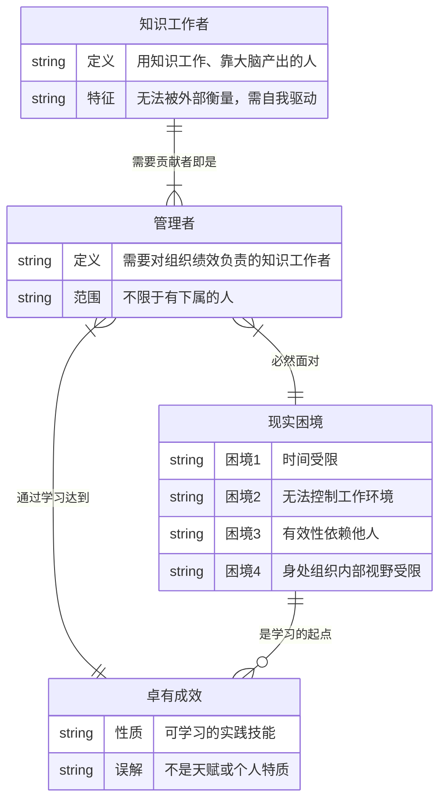
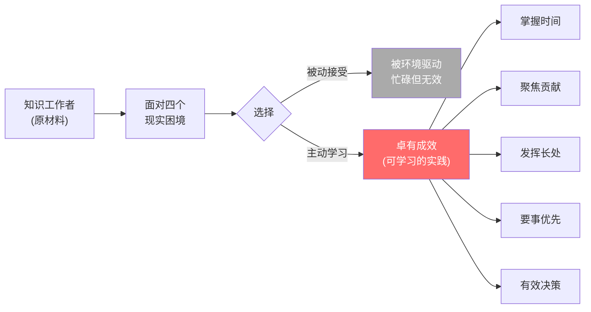

# 第1章：卓有成效是可以学到的

## 第零步：ER图（本章骨架）



---

## 第一步：概念清单与自评

| 概念 | 自评（0-3） | 说明 |
|------|------------|------|
| 卓有成效（Effectiveness） | 2 | 能说出是"做对的事并做出成果"，但还不能稳定判断新例子 |
| 知识工作者 | 2 | 能描述，但边界模糊（蓝领中的技能工人算不算？） |
| 管理者（德鲁克定义） | 1 | 常把它误读为"有下属的人" |
| 现实困境（四个） | 1 | 能背出来，但不能推导为什么刚好是这四个 |

**需要裁判循环的概念**：卓有成效、管理者（德鲁克定义）、现实困境

---

## 第二步：实例裁判循环

### 概念1：卓有成效（Effectiveness）

**正例**：
- 德鲁克本人：不做太多决策，专注写几本真正改变管理实践的书。产出少但每一个都有真实影响。
- 林肯：南北战争中，核心决策只有两个——不让南方独立、废除奴隶制。其他事情授权或放弃。

**边界例（争议区）**：
- 一个每天工作16小时、执行力极强的CEO，公司却在错误的方向上快速扩张。
  - 裁判：**不算卓有成效**。高效率（Efficiency）≠ 有效性。德鲁克的原话是"没有什么比高效地做根本不该做的事更无用的了"。
- 一个研究员发表了50篇论文，但没有一篇被引用或应用。
  - 裁判：**不算**。知识工作的有效性必须在组织外部产生成果，不能自我评价。

**反例伪装（看起来像但不是）**：
- "我这季度完成了所有KPI"——完成指标 ≠ 卓有成效，如果KPI本身设错了。
- "我很忙，日历排满了"——忙碌是最常见的有效性幻觉。

**边界定义**：
卓有成效 = 在正确方向上产生真实的外部成果。
三个必要条件：①正确的方向（贡献导向）②真实成果（可被组织/社会感受到）③持续性（不是偶发）。
缺少任何一个，都不是德鲁克意义上的卓有成效。

---

### 概念2：管理者（德鲁克定义）

**正例**：
- 一个没有任何下属的首席分析师，他的分析报告直接影响CEO的战略决策。→ 是管理者。
- 医院里的主治医生，他的诊断决定整个医疗团队的行动方向。→ 是管理者。

**边界例（争议区）**：
- 一个有20个下属的行政主管，所有决定都需要层层审批，他的判断从未被执行。
  - 裁判：**名义管理者，实质上不是**。德鲁克的定义是基于"对组织绩效的贡献责任"，不是职级。
- 一个独立顾问，单打独斗，无组织归属。
  - 裁判：**边界情况**。如果他的工作影响客户组织的绩效，德鲁克会算作管理者。

**反例伪装**：
- "我管着一个团队，所以我是管理者"——有下属不等于是管理者，关键在于贡献责任。

**边界定义**：
德鲁克意义上的管理者 = 其工作和决策影响组织整体绩效的知识工作者，不以职级和下属数量为判断标准。

---

### 概念3：现实困境（四个）

**正例（四个困境同时存在的典型场景）**：
- 一个大公司中层：时间被会议切碎（困境1），无法决定自己接哪些项目（困境2），成果依赖上下游团队（困境3），只看得到自己部门（困境4）。

**边界例**：
- 自由职业者：困境2（工作环境控制）解决了，但困境3（依赖客户）和困境4（市场信息不全）依然存在。
  - 裁判：德鲁克的四个困境是对知识工作者处境的**结构性描述**，不是全部条件，部分缺失不影响其余的约束力。

**关键洞见**：
这四个困境不是"问题"，是知识工作的**结构性常数**。
德鲁克设计这个列表的用意是：让你停止抱怨，开始在约束内设计行为。就像引力是常数，不是障碍。

---

## 第三步：结构可视化



---

## 第四步：可执行结构

```
IF 你是知识工作者（靠大脑产出）
THEN 你就是管理者，四个困境是你的永久约束条件，不是借口

IF 感到忙碌但成果模糊
THEN 你在做Efficiency（效率），不是Effectiveness（有效性）——立刻问"这件事贡献什么？"

IF 认为自己没有管理权力所以无法有效
THEN 这是德鲁克定义的最大误读——有效性是个人行为，不依赖职级
```

---

## 第五步：接入已有体系

**同构关系**：
- 斯多葛学派的"控制二分法"：区分你能控制的（内部）和不能控制的（外部）。德鲁克的四个困境 = 外部不可控，卓有成效 = 内部可控的实践。结构完全同构。

**互补关系**：
- 彼得原理（劳伦斯·彼得）：人会被提升到无能级别。互补——德鲁克告诉你在任何级别如何有效，彼得原理告诉你职级系统本身会破坏有效性。
- 刻意练习理论（艾利克森）：技能是练出来的，不是天生的。互补——卓有成效作为可学习的实践，需要刻意练习的方法论支撑。

**矛盾关系**：
- 领导力特质论（领导者是天生的）：与"卓有成效可以学到"直接矛盾。德鲁克的立场更实用主义，但放弃了"某些人天然更容易有效"的可能性，这里存在张力。
