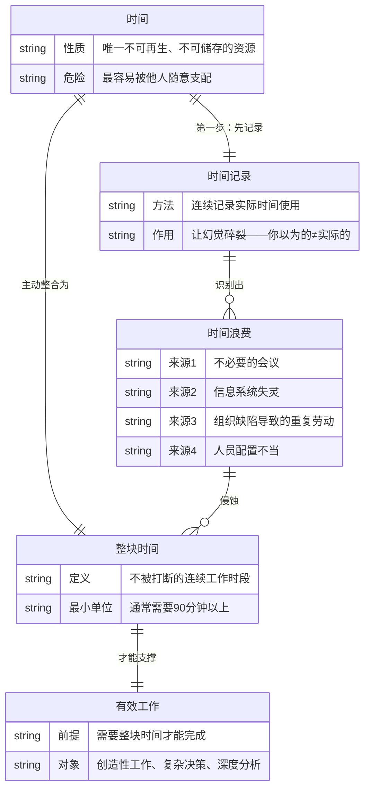
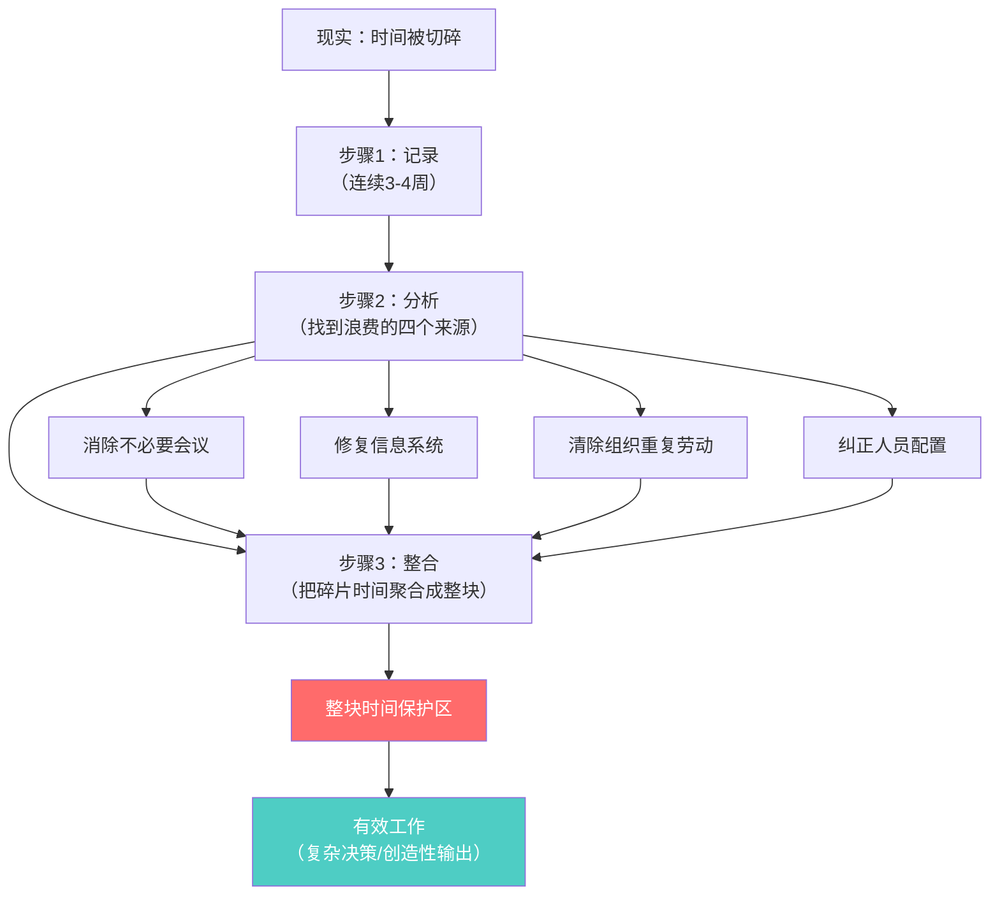

# 第2章：掌握自己的时间

## 第零步：ER图（本章骨架）



---

## 第一步：概念清单与自评

| 概念 | 自评（0-3） | 说明 |
|------|------------|------|
| 时间记录 | 1 | 知道要做，但没做过，不知道做后会发现什么 |
| 时间浪费的四个来源 | 1 | 能背，但不能诊断自己的哪种情况更严重 |
| 整块时间 | 2 | 有直觉理解，但对"最小单位"和"如何获得"不清晰 |
| 时间≠精力 | 0 | 德鲁克没有深谈，但这是此章的隐含假设 |

**需要裁判循环**：时间记录、整块时间、时间浪费识别

---

## 第二步：实例裁判循环

### 概念1：时间记录

**正例**：
- 德鲁克建议：连续3-4周，每30分钟记录一次实际在做什么。不是计划，是记录事实。
- 彼得·德鲁克本人据说每隔数年做一次完整时间审计，发现自己时间使用与自我认知的巨大偏差。

**边界例（争议区）**：
- "我用日历管理时间，上面记着每天的安排。"
  - 裁判：**不算时间记录**。日历是计划，不是记录。计划是你希望发生的，记录是实际发生的。两者的差距就是时间浪费的来源。
- "我用番茄钟，25分钟专注+5分钟休息。"
  - 裁判：**部分算**。番茄钟是时间保护工具，不是时间记录工具。德鲁克要的是诊断现状，番茄钟是改变现状，顺序不对。

**反例伪装**：
- "我感觉自己很忙，肯定没有时间浪费。"——忙碌感是最大的时间幻觉，正是需要记录来打破的。

**边界定义**：
时间记录 = 对实际时间使用的客观追踪（不是计划，不是感受），目的是建立基准数据，让后续的分析有根据。

---

### 概念2：整块时间

**正例**：
- 卡尔·纽波特（Deep Work）描述的深度工作状态：每天4小时不被打断的写作/编程时间，产出的质量与数量远超碎片时间的8小时。
- 德鲁克建议：把整块时间集中到一天中，或集中到周中某几天，而非每天都碎片化。

**边界例（争议区）**：
- "我把两个30分钟会议之间的1小时用来写报告，算整块时间吗？"
  - 裁判：**勉强算，但有问题**。会议前的焦虑和会议后的情绪残留各占约20分钟，实际可用不足30分钟。整块时间需要心理上的连续性，不只是日历上的空白。
- "我每天早上5点-7点在家写作。"
  - 裁判：**是**。只要不被打断且心理状态完整，时段本身不重要。

**反例伪装**：
- "我有两个小时的空档"——空档≠整块时间，如果心理上还在处理上一个任务的余震。

**边界定义**：
整块时间 = 足够长（≥90分钟）+ 物理不被打断 + 心理不被污染的工作时段。
三个条件缺一不可。

---

### 概念3：时间浪费的四个来源

**核心洞见**：德鲁克列的四个来源有一个共同结构——**都是组织问题伪装成个人问题**。

| 来源 | 伪装形式 | 实质 |
|------|---------|------|
| 不必要的会议 | "我们需要对齐" | 组织信任或授权缺失 |
| 信息系统失灵 | "我需要问一下" | 信息流设计有缺陷 |
| 重复劳动 | "这个上周做过了" | 组织结构冲突或职责不清 |
| 人员配置不当 | "我得替他做" | 招聘或培训失败 |

**裁判**：如果一个时间浪费可以通过"个人更努力"消除，它不在德鲁克的列表里。他的四个来源全部需要组织层面的修复，不是个人意志力的问题。

---

## 第三步：结构可视化



---

## 第四步：可执行结构

```
IF 从未记录过自己的时间使用
THEN 先做1周的时间日志（每小时记录一次），不改变任何行为，只观察

IF 发现自己每天深度工作时间 < 2小时
THEN 找到时间浪费来源：是会议？信息不畅？还是替别人填坑？——针对来源修复，而非靠意志力撑

IF 需要做一项复杂工作（报告/决策/设计）
THEN 必须在日历上预留整块时间（≥90分钟），碎片时间只做可以随时中断的事
```

---

## 第五步：接入已有体系

**同构关系**：
- 格雷厄姆（Paul Graham）的"创造者日程 vs 管理者日程"：创造者需要半天整块时间，管理者用1小时为单位。这是对德鲁克整块时间理论的精确化，结构完全同构，颗粒度更细。

**互补关系**：
- GTD（Getting Things Done，大卫·艾伦）：GTD解决"任务清单"问题（什么要做），德鲁克解决"时间分配"问题（什么时候用整块时间做哪类事）。两者互补，GTD是战术，德鲁克是战略。
- 精力管理（吉姆·洛尔）：德鲁克讲时间，洛尔讲精力。时间是客观的，精力是主观的。整块时间的真正限制不只是日历，还是精力状态。两书互补才完整。

**矛盾/张力**：
- 现代"永远在线"的工作文化：Slack、即时消息的普及与整块时间的需求直接冲突。德鲁克的方案在1960年代是可行的（关上门、不接电话），在今天需要更大的组织层面的制度支持。德鲁克没有给出在信息爆炸环境下的解法。

**与highlights.md的连接**：
德鲁克在高亮里讲的"决策的推行必须尽可能接近工作层面，必须力求简单"——这需要管理者有整块时间把决策转化为具体操作指令，碎片时间做不了这个转化。时间管理是决策有效性的前置条件。
