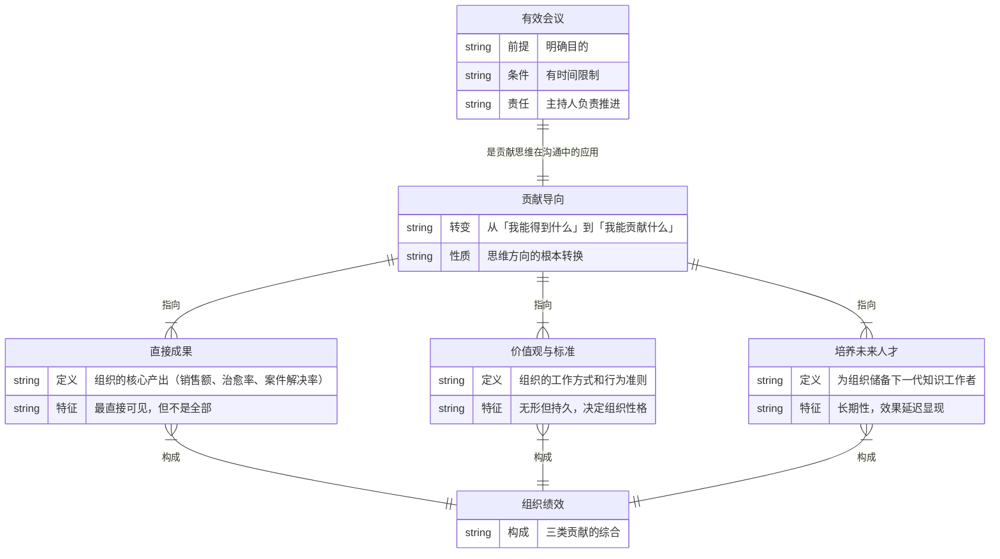
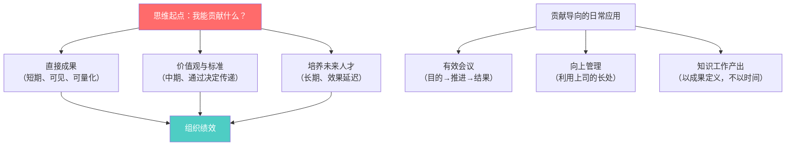

# 第3章：我能贡献什么

## 第零步：ER图（本章骨架）



---

## 第一步：概念清单与自评

| 概念 | 自评（0-3） | 说明 |
|------|------------|------|
| 贡献导向（思维转换） | 1 | 能说出"从得到转向贡献"，但在压力下会自动退回"得到"模式 |
| 直接成果 | 2 | 直觉清晰，但容易被量化指标绑架（指标≠直接成果）|
| 价值观与标准的建立 | 0 | 完全模糊，不知道管理者如何通过日常行为建立标准 |
| 培养未来人才 | 1 | 知道重要，但不知道操作层面的具体动作 |
| 有效会议的三要素 | 2 | 知道，但"主持人负责推进"这条执行不了 |

**需要裁判循环**：贡献导向、价值观与标准、有效会议

---

## 第二步：实例裁判循环

### 概念1：贡献导向（思维转换）

**正例**：
- 一个IT工程师，不问"这个需求合理吗？为什么让我做？"，而是问"我这个功能上线后，用户能得到什么？销售团队会怎么用它？"——他把自己的工作锚定在组织外部成果上。
- 德鲁克书中的例子：医院清洁工人被问到工作是什么，回答"我的工作是帮助病人康复"而非"我负责清洁地板"——贡献导向让低职级工作者也能找到自己工作的意义结构。

**边界例（争议区）**：
- "我贡献了100个小时加班，帮团队赶完了这个项目。"
  - 裁判：**投入不是贡献**。贡献是成果，不是努力。德鲁克非常明确：知识工作不能用投入时间衡量，只能用成果衡量。这是工业时代思维的残余。
- "我这个月写了50篇文章。"
  - 裁判：**看成果对象**。如果50篇文章没有读者、没有影响，产出量 ≠ 贡献。贡献必须在组织外部或对组织整体产生可见效果。

**反例伪装**：
- "我完成了所有交代给我的任务。"——任务完成是服从，不是贡献。贡献是主动定义自己工作的价值方向。

**边界定义**：
贡献导向 = 以组织外部成果（或组织整体绩效）为坐标系，主动定义自己工作的价值方向，而非以"完成任务"为终点。

---

### 概念2：价值观与标准的建立

**这是本书最被低估的一条。**

**正例**：
- 贝尔电话公司费尔："为社会提供服务是公司根本目标"——这不是PR口号，是实际的决策约束条件。每次遇到商业利益与服务质量的冲突，这条标准强迫决策倒向服务。（见highlights.md）
- 一个团队负责人，每次代码review都亲自把关可读性，不允许"能跑就行"的代码合并。6个月后，整个团队的代码风格自动靠拢，他不需要再督促。——这是通过行为建立标准，而非通过通知。

**边界例（争议区）**：
- "我在团队群里发了一条消息：'我们要追求高质量'"
  - 裁判：**不算**。价值观和标准不是宣言，是通过管理者的**具体决定**传递的。你接受了一个质量差的交付，标准就被降低了一次，无论你说了什么。

**关键结构**：
```
管理者的每一个具体决定 → 向下传递一个信号 → 信号累积 = 实际标准
（说的标准）-（做的标准）= 伪君子税，组织每天都在收
```

**边界定义**：
价值观与标准的建立 = 管理者通过日常的具体决定（接受什么、拒绝什么、奖励什么、容忍什么）传递给组织的行为规范。言行不一时，行胜于言。

---

### 概念3：有效会议

**正例**：
- 会议开始前有书面agenda（目的+预期输出），会议结束时有指定负责人和截止日期的action items。→ 是有效会议。
- 亚马逊的"六页纸会议"：所有参会者先沉默阅读备忘录，再讨论。强迫所有人带着准备来，不允许口头汇报占用时间。→ 典型的贡献导向会议设计。

**边界例（争议区）**：
- "我们只是来对齐一下信息。"
  - 裁判：**危险区**。对齐信息是合理目的，但极容易退化为社交聚会。判断标准：如果这次会议不开，会有什么信息不对齐导致什么具体问题？说不出来的，不开。
- "老板召集的会，我没法控制。"
  - 裁判：**作为参与者，可以在自己的权限范围内实践贡献导向**。比如：提前问清楚自己的参会目的，贡献完就申请离场。

**反例伪装**：
- "我们每周例会，这是惯例。"——惯例会议是组织时间浪费的头号来源，因为它不需要理由存在。

**边界定义**：
有效会议 = 在会议开始前能明确回答"这次会议结束时，什么东西会因此存在/改变"，并有人为这个结果负责推进。

---

## 第三步：结构可视化



---

## 第四步：可执行结构

```
IF 开始任何工作之前
THEN 先问：这件事完成后，组织外部（客户/用户/社会）会有什么不同？说不清楚则重新定义工作

IF 作为管理者做出一个与宣称标准相反的决定（比如接受了低质量交付）
THEN 意识到：你刚刚更新了组织的实际标准，不是说的那个

IF 要开一个会
THEN 先写一句话：这次会议结束时，[什么结果]将会[存在/改变]，否则不开
```

---

## 第五步：接入已有体系

**同构关系**：
- 西蒙·斯涅克的"黄金圈"（Start With Why）：Why驱动How驱动What。德鲁克的贡献导向就是在知识工作中操作化的"Why"——贡献什么 = 你的工作存在的理由。结构同构，德鲁克更具体可操作。

**互补关系**：
- OKR（目标与关键结果）：OKR是贡献导向的制度化工具。德鲁克给出了思维框架，OKR给出了落地机制。德鲁克没有说明如何把"贡献"转化为可追踪的指标，OKR补了这个缺口。
- 心理安全感研究（艾美·埃德蒙森）：要让团队成员问"我能贡献什么"而不是"我怎么不犯错"，需要心理安全感作为前提。德鲁克假设人是理性的贡献者，忽略了恐惧对贡献导向的阻断。

**矛盾关系**：
- 绩效考核系统的普遍设计：大多数KPI考核系统实际上在奖励"完成任务"（"我能得到什么"的量化），而不是"贡献成果"（"我能贡献什么"的实现）。德鲁克的贡献导向与大多数组织的实际激励机制存在结构性矛盾。

**与highlights.md的连接**：
贡献导向在highlights里体现最充分的是百果园案例（虽非书中原文，是读者笔记）：把"口碑优先于短期盈利"翻译成"三无退货"——这正是德鲁克所说的"决策的推行必须力求简单，接近工作层面"。抽象的贡献方向必须转化为具体的可执行动作。
