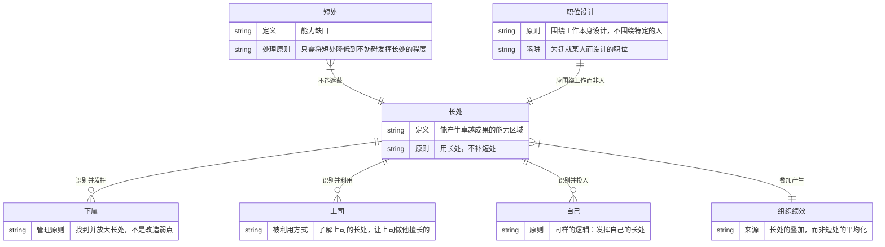
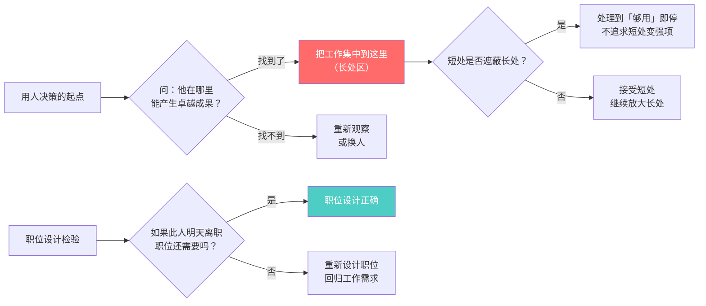

# 第4章：如何发挥人的长处

## 第零步：ER图（本章骨架）



---

## 第一步：概念清单与自评

| 概念 | 自评（0-3） | 说明 |
|------|------------|------|
| 长处优先原则 | 2 | 能说出，但在实际用人决策中会退回"补短处"模式 |
| 职位设计原则 | 1 | 知道"不围绕人"，但不知道如何判断一个职位是否"为迁就某人而设计" |
| 利用上司长处 | 0 | 完全没有操作概念，只知道"向上管理"这个词 |
| 短处的正确处理方式 | 1 | 有模糊认知，但没有清晰的"足够好"标准 |

**需要裁判循环**：长处优先原则、职位设计、利用上司长处

---

## 第二步：实例裁判循环

### 概念1：长处优先原则

**核心主张**：用人应用其长处，而非补其短处。一个人能做什么决定了他能贡献什么，他不能做什么只是限制条件，不是管理任务。

**正例**：
- 林肯任命格兰特将军：格兰特酗酒是人尽皆知的短处，但没有人比他更擅长打赢战役。林肯的回应："告诉我他喝哪种酒，我要给其他将军也送一瓶。"——短处降到不妨碍长处的程度就够了。
- 斯隆设计通用汽车的分权组织：不是找到一个全能的总经理，而是设计一个系统，让每个部门负责人发挥各自专长。长处叠加而非短处平均。

**边界例（争议区）**：
- 一个技术能力极强的工程师，但沟通能力极差，经常在会议上与人冲突。是否要花时间改造他的沟通能力？
  - 裁判：**要看短处是否妨碍了长处的发挥**。如果冲突导致他的技术方案无法被团队采纳（长处被遮蔽），则需要处理，但目标不是让他变成社交达人，而是达到"够用"的最低通过线。
- 一个销售能力很强但数据分析能力为零的销售总监。要不要让他学数据分析？
  - 裁判：**配助手比培训更有效**。为他的短处配上补充资源（数据分析师），比花6个月把他训练成平庸的分析师更符合长处优先原则。

**反例伪装**：
- "我们要全面发展，每个人都要补齐短板。"——这是工业时代对知识工作者的误用。知识工作的成果来自深度专精，不是全面均衡。

**边界定义**：
长处优先原则 = 识别一个人能在哪里产生卓越成果，把工作分配集中到这里；对短处的管理，目标只是"不妨碍长处"，而非"变成强项"。

---

### 概念2：职位设计

**核心主张**：职位应围绕工作本身的要求来设计，不应为迁就某个特定的人而设计。

**正例**：
- 一家公司设立"首席创新官"职位，职责清晰：领导新产品孵化，对3年后的营收增量负责。这个职位的存在逻辑来自工作需要，任何具备该能力的人都可以担任。

**边界例（争议区）**：
- "我们给王总创建了一个「战略顾问」的职位，专门为了留住他。"
  - 裁判：**这是职位设计的反面教材**。为迁就特定人而设的职位有两个问题：①职责模糊，没有真实工作（导致该人无法贡献长处）；②当此人离开，职位变成空洞。
- "这个职位的要求是这样的，只有李明符合。"
  - 裁判：**要小心**。如果职位要求是从工作需求逆向推导出来的，没问题；如果是从"李明的能力特点"正向推导出来的，这个职位就是为迁就人而设计的。

**判断标准**：
```
问题：如果这个人明天离职，这个职位还需要存在吗？
→ YES：职位设计正确，是围绕工作的
→ NO：职位是为人设计的，需要重新审视
```

**边界定义**：
正确的职位设计 = 从工作需求出发定义职责，任何符合条件的人均可担任，不依赖特定个人的存在。

---

### 概念3：利用上司的长处

**这是本章最反直觉的一条，通常被完全忽视。**

**德鲁克的主张**：上司也是人，也有长处和短处。下属的有效性部分取决于能否让上司的长处得到发挥，并回避上司的短处。

**正例**：
- 上司擅长对外谈判，不擅长内部沟通。下属的做法：把所有对外的机会推给上司，自己负责内部的协调沟通，形成互补而非对抗。
- 上司是阅读型（看书面材料）而非听汇报型。下属提前准备书面摘要，而非在会议上口头汇报。——这是在利用上司的长处（深度阅读后的判断力），回避上司的短处（即时口头信息处理）。

**边界例（争议区）**：
- "我的上司有明显的决策缺陷，我应该利用他的什么长处？"
  - 裁判：**每个上司都有至少一个长处让他坐到现在的位置**。问题不是"他有没有长处"，是"我有没有认真观察并找到它"。如果真的找不到，可能需要换组织，但在那之前先穷尽分析。

**反例伪装**：
- "我只要做好自己的事就行，上司怎么样跟我没关系。"——这是把上司当成环境而不是资源。德鲁克认为这是对自身有效性的主动放弃。

**边界定义**：
利用上司长处 = 主动观察上司在哪里能产生最好的判断和决策，调整自己的工作方式和信息传递方式，使上司的长处被激活，而不是与上司的短处对抗。

---

## 第三步：结构可视化



---

## 第四步：可执行结构

```
IF 要给人分配工作
THEN 先问"他在哪里能产生卓越成果？"而不是"这个任务谁还没做过？"

IF 下属有明显短处影响工作
THEN 判断：短处是否遮蔽了长处？是→处理到「不妨碍」；否→接受并绕过

IF 要创建或填充一个职位
THEN 先写清楚职位的工作要求，再找匹配的人；不能先有人再设计职位

IF 需要从上司那里获得好的决策
THEN 先观察：上司是读者还是听者？擅长什么判断？然后以上司最顺畅的方式呈现信息
```

---

## 第五步：接入已有体系

**同构关系**：
- 盖洛普优势识别器（StrengthsFinder）：将德鲁克的"长处"操作化为可测量的34种才干主题。结构同构，工具化程度更高。德鲁克给出原则，盖洛普给出诊断工具。
- 比较优势原理（大卫·李嘉图）：即使一个人在所有方面都比另一个人弱，也应该专注于自己相对优势最大的领域。这是长处优先原则在经济学中的同构版本。

**互补关系**：
- 彼得原理（劳伦斯·彼得）：人被提升到不能胜任的职位。德鲁克的职位设计原则 + 长处优先，能预防彼得原理：如果职位围绕工作设计，且用人用其长处，则晋升不应发生在人与职位不匹配时。两者互补，共同解释为何组织会让无效的人占据职位。
- 心理学中的成长型思维（卡罗尔·德韦克）：德鲁克没有讨论长处是否可以培养。固定型/成长型思维框架补充了这个维度——长处可以通过刻意练习延伸，但德鲁克的核心洞见（先找到当前长处）仍然成立。

**矛盾/张力**：
- 全面素质教育模型：大多数教育和培训体系以"补短板"为基本逻辑（英语不好多学英语，数学不好补数学）。与德鲁克的长处优先直接冲突。这不只是理论矛盾，是两种不同的人才观。
- 团队多样性需求：在团队层面，"每个人都发挥长处"可能导致整个团队没有人有某些必要的短处补充。德鲁克的答案是通过团队组合而非个人全能来解决，但操作层面仍有张力。
