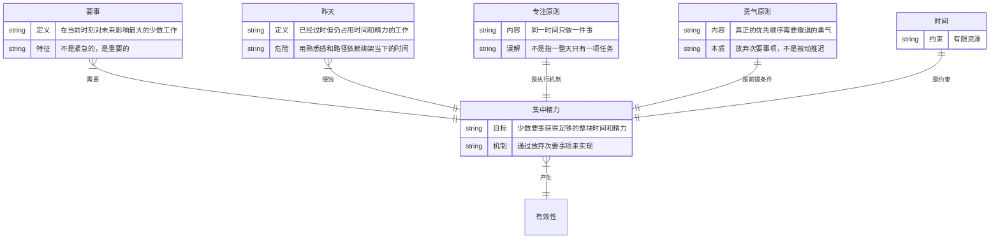
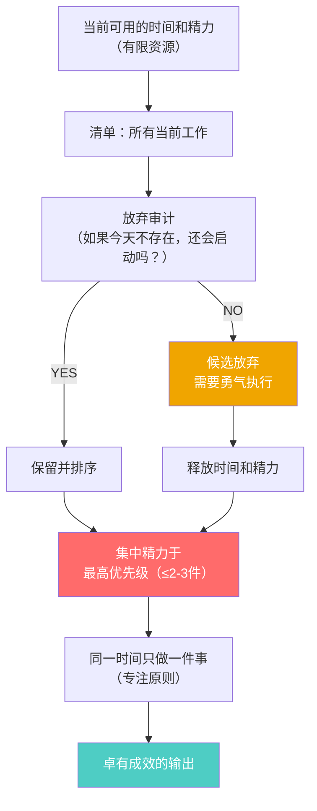

# 第5章：要事优先

## 第零步：ER图（本章骨架）



---

## 第一步：概念清单与自评

| 概念 | 自评（0-3） | 说明 |
|------|------------|------|
| 要事优先的判断标准 | 1 | 知道要优先，但判断标准模糊，容易被紧急感劫持 |
| 放弃昨天（摆脱过时工作） | 0 | 完全没有操作框架，只有模糊的"不要恋旧"感受 |
| 专注原则（同一时间只做一件事） | 2 | 有认知，但"一件事"的边界不清楚 |
| 勇气原则（放弃需要勇气） | 1 | 知道放弃重要但不知道为什么"勇气"是核心词 |

**需要裁判循环**：要事判断、放弃昨天、勇气原则

---

## 第二步：实例裁判循环

### 概念1：要事的判断标准

**核心问题**：什么叫"要事"？不是重要紧急矩阵，德鲁克没用这个框架。

**德鲁克的判断逻辑**：
要事不是最紧急的，是**当前时刻对未来最重要的**。而且，要事的判断需要勇气，因为真正的要事往往不是别人要求你做的，而是你认为必须做的。

**正例**：
- 德鲁克建议的典型"要事"：定义组织未来方向的决策（斯隆设计通用汽车分权架构）、建立能让组织自我更新的系统（费尔创建贝尔研究所）。这些事情都不紧急，但一旦放弃就无可挽回。
- 一个创业公司创始人，把每周5小时用于与潜在关键合伙人的深度对话，而不是处理运营邮件。当时没有直接产出，6个月后引入了改变公司轨迹的核心团队。

**边界例（争议区）**：
- "客户投诉非常紧急，我必须优先处理。"
  - 裁判：**紧急但未必是要事**。如果客户投诉是经常性问题（不是例外），真正的要事是修复产生投诉的系统，而不是处理这次投诉。处理这次投诉是紧急事项，建立反馈机制是要事。（与第6章的经常性/例外性问题直接衔接）
- "公司所有事都很重要，我没法分优先级。"
  - 裁判：**这是放弃判断的借口，也是最危险的状态**。当一切都重要，实际上等于什么都不重要。德鲁克的立场：真正的要事不会超过两三件，如果你列了十件要事，说明你还没有真正做出选择。

**边界定义**：
要事 = 当前时刻，如果不做将在未来产生不可逆损失的少数工作（通常不超过2-3件）。
排除标准：①任何别人可以做的；②不做只有短期影响的；③停下来也会自然消失的。

---

### 概念2：放弃昨天（摆脱过时工作）

**这是本章最被忽视但最有操作价值的一条。**

**德鲁克的主张**：组织和个人会积累大量"昨天的工作"——曾经重要、现在过时但仍占用资源的工作。卓有成效的管理者需要主动、定期地放弃这些工作。

**正例**：
- 一个产品团队，每季度进行一次"放弃会议"：列出所有当前项目，问"如果这个项目今天不存在，我们会启动它吗？"→ NO = 候选放弃项目。
- 英特尔格鲁夫的"战略转折点"思维：当他和诺伊斯走到窗边讨论"如果我们被炒鱿鱼，新来的CEO会做什么？"——答案是放弃存储芯片，专注微处理器。这是对"昨天"最彻底的放弃。

**边界例（争议区）**：
- "我们已经在这个项目上投了200万，不能就这么放弃。"
  - 裁判：**这是沉没成本谬误，是放弃昨天最大的心理阻碍**。已经投入的资源不能成为继续投入的理由。德鲁克会问：如果今天才遇到这个项目，你还会启动它吗？
- "这个流程我们做了10年了，改起来阻力很大。"
  - 裁判：**这正是需要放弃的"昨天"**。阻力大不是不放弃的理由，是需要被面对的摩擦，这就是为什么需要"勇气"。

**关键操作**：
```
每半年做一次"放弃审计"：
列出所有你正在做的工作 →
问：如果这件事今天不存在，我会主动启动它吗？
→ NO → 候选放弃，找人接手或直接终止
→ YES → 保留并确认为当前要事
```

---

### 概念3：勇气原则（为什么放弃需要勇气）

**德鲁克说"真正的优先顺序需要撤退的勇气"——为什么是勇气？**

**分析**：
设定优先顺序意味着同时设定了"非优先顺序"。而放弃次要事项的代价是真实的：
- 让等待你的人失望
- 承认过去的判断是错的（放弃昨天）
- 在当下看起来不作为或不尽职
- 组织内部的政治摩擦

这些代价不需要智力，需要心理承受力。这就是为什么德鲁克用"勇气"这个词，而不是"技巧"。

**正例**：
- 乔布斯1997年回归苹果后，把产品线从400多个削减到4个。这不是战略技能问题（他知道要怎么做），是勇气问题（他面对了来自全公司的反弹和外界的质疑）。

**边界定义**：
勇气原则 = 在设定优先级时，承担放弃次要事项所带来的真实社会代价（失望、摩擦、被批评），而不因社会压力退回"什么都做、面面俱到"的幻觉。

---

## 第三步：结构可视化



---

## 第四步：可执行结构

```
IF 工作清单超过5项且感到分散
THEN 做放弃审计：问"如果今天不存在这项工作，我会启动它吗？" NO则放弃

IF 要设定下一个时期的优先级
THEN 先决定放弃什么，再列要做什么；真正的优先级清单不超过3项

IF 面对"全都很重要，我没法选"的感受
THEN 这是放弃的恐惧在伪装成判断困难——直接问：如果只能做一件，哪件损失最不可逆？
```

---

## 第五步：接入已有体系

**同构关系**：
- 沃伦·巴菲特的"20个目标"方法：写下25个目标，圈出最重要的5个，剩下20个列为"不惜一切代价回避"清单——这是放弃昨天 + 要事集中的极端版本，结构完全同构。
- 乔布斯的"聚焦"哲学：创新不是说YES，而是对一千件好主意说NO。与专注原则和勇气原则同构。

**互补关系**：
- 艾森豪威尔矩阵（重要-紧急四象限）：提供了判断"要事"的工具（重要但不紧急）。德鲁克没有给出操作性框架，矩阵补了这个工具层缺口。但注意：矩阵只能告诉你哪里放精力，不能替你做放弃的决定（勇气问题无法被工具解决）。
- 断舍离（近藤麻理惠）：物理空间的"放弃昨天"，结构同构，适用领域不同。判断标准也相近："不会让你心动的东西"≈"今天不会启动的项目"。

**矛盾/张力**：
- 机会主义策略：某些管理理论鼓励保持灵活性、抓住一切机会（蓝海战略等）。与德鲁克的集中原则存在张力。德鲁克的反驳是：机会主义的前提是有充足的资源，而知识工作者的时间是绝对稀缺的，不能同时抓所有机会。
- 东亚职场文化中的"全力以赴"期待：在许多组织文化中，说"我不做这件事"是不被接受的，与勇气原则直接冲突。德鲁克的框架在文化上并非普适，需要组织层面的支撑。
