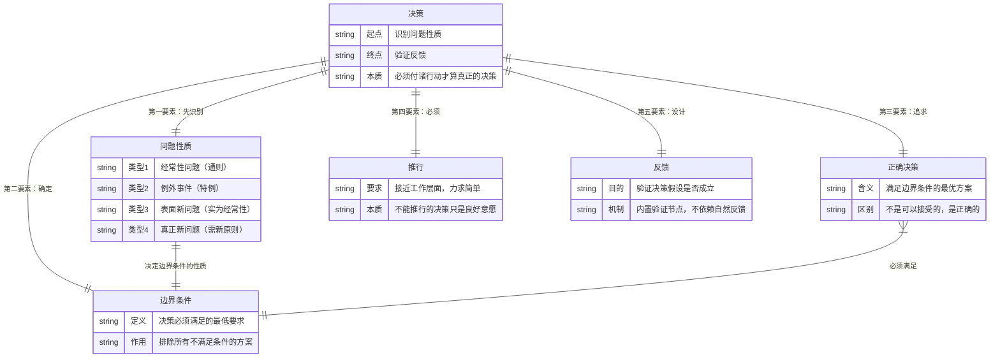
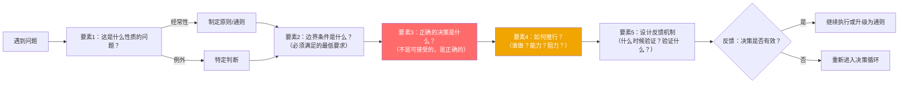

# 第6章：决策的要素

## 第零步：ER图（本章骨架）



---

## 第一步：概念清单与自评

| 概念 | 自评（0-3） | 说明 |
|------|------------|------|
| 经常性问题vs例外事件 | 2 | 有直觉，但在"表面是例外的经常性问题"上容易误判 |
| 边界条件 | 1 | 知道"必须满足的条件"，但不知道如何操作性地定义它 |
| 正确决策vs可接受决策 | 1 | 能说出区别，但在压力下会滑向"可接受" |
| 推行（最被忽视的要素） | 0 | 把决策和推行当成两件事，没有意识到推行是决策的一部分 |
| 反馈机制的设计 | 0 | 完全被动，等别人反馈而非主动设计验证 |

**需要裁判循环**：经常性/例外问题、边界条件、推行

---

## 第二步：实例裁判循环

### 概念1：经常性问题 vs 例外事件

**这是德鲁克五要素中的第一要素，也是最被低估的。**

highlights.md中读者笔记的核心洞见在这里：
> "一个人面对一个让他不舒服的信号，他要做一个动作。对着信号动作——信号消失，停下来。对着结构动作——结构改变，信号不再出现。"

这个洞见的精确翻译就是：经常性问题需要原则性决策，例外事件需要特定决策。

**四种类型**：
1. **经常性问题**（多数情况）：需要通则，而非每次独立决策
2. **表面是例外、实为经常性**（最危险的误判）：第一次发生，看起来独特，实则之后还会反复出现
3. **真正只在这个组织独特的经常性问题**：其他地方有通则，但这里特殊
4. **真正的例外事件**（极少）：只发生一次，需要特定判断

**正例**：
- 某公司的IT系统每周崩溃一次，技术团队每次都把它当"意外"处理。→ **误判**：这是经常性问题，需要的不是每次的应急修复，而是一个架构决策（重写还是迁移）。
- 2008年金融危机对某家特定对冲基金的冲击。→ **真正的例外事件**：这家基金在那个特定时刻的特定处境无法归纳为通则。

**边界例（争议区）**：
- "这个客户投诉是特殊的，他的情况很独特。"
  - 裁判：**绝大多数时候是误判**。德鲁克的立场：经验丰富的管理者会假设第一次遇到的"特殊情况"，是经常性问题的第一次显现。除非有强证据，否则按经常性处理。
- "这是我们行业从未见过的监管变化。"
  - 裁判：**可能是真正的例外事件，但也可能是新的经常性模式的开端**。处理方式：作为例外处理，同时设计一个"如果再次发生同类监管变化，我们的原则是什么"的预案。

**关键操作**：
```
遇到任何问题，先问：
Q1: 我以前或其他地方见过类似的情况吗？
→ YES → 经常性问题，需要原则性决策
→ NO → 继续问
Q2: 如果不处理，这种情况会再次出现吗？
→ YES → 经常性问题（还没积累足够的案例）
→ NO → 例外事件，特定处理
```

---

### 概念2：边界条件

**边界条件 = 这项决策必须满足的最低要求，满足不了则方案无效。**

**正例**：
- 费尔的决策案例（highlights.md）："贝尔电话公司必须预测并满足社会大众的服务需求"——这是他设定的边界条件。任何不满足这个条件的商业决策，无论多盈利，都不在考虑范围内。
- 一家医院的手术排班决策，边界条件：①不得增加医疗事故风险；②值班医生不得超过连续12小时。任何满足不了这两条的排班方案自动淘汰，不管人力成本多低。

**边界例（争议区）**：
- "我们的边界条件是不亏钱。"
  - 裁判：**太宽泛**。真正有用的边界条件需要是**可以直接判断方案是否满足**的具体条件。"不亏钱"是结果，不是边界条件。边界条件的形式应该是："如果选择这个方案，必须做到X，否则不可接受。"

**实际操作**：
```
定义边界条件的格式：
"这项决策必须实现[最低目标]，同时不能损害[受保护的价值/利益]"

例：
"招聘这个职位必须在3个月内完成（最低目标），
同时不能降低技术团队的整体代码质量标准（受保护的价值）"
```

---

### 概念3：推行（第四要素）

**这是德鲁克原文高亮的核心主张：**
> "一项决策如果不能付诸行动，就称不上是真正的决策，最多只是一种良好的意愿。"

**关键洞见**：大多数组织的决策失败不是因为决策本身错了，而是因为没有人认真考虑推行问题——谁来执行？谁会遇到阻力？需要什么能力？需要通知谁？

**正例**：
- 德鲁克强调推行决策时要问：
  1. 谁需要知道这个决策？
  2. 谁需要采取行动？
  3. 这些人能做到吗？
  4. 这个决策和他们日常工作的距离多远？
- 贝尔费尔的"为社会大众服务"不是停在口号层面，而是具体落实为：AT&T普通股（金融工具）+ 贝尔研究所（创新机制）+ 价格体系（服务可及性）——每一个都是推行层面的具体行动。

**反例伪装**：
- "我们做了这个战略决策，发了通知，让各部门执行。"——发通知不是推行，是传递信息。推行需要确认：接收者有能力、有意愿、有资源执行，且有人对推行的结果负责。

---

## 第三步：结构可视化



---

## 第四步：可执行结构

```
IF 遇到任何需要决策的问题
THEN 先问：这是第几次发生类似情况？超过一次→经常性问题→需要原则，不是应急处理

IF 开始设计解决方案
THEN 先写出边界条件（"这个决策必须满足X，不能损害Y"），再评估方案

IF 形成了一个决策
THEN 必须能回答：谁执行？他有能力和资源吗？如果不能，决策无效，需要重新设计推行方案

IF 决策开始执行
THEN 预设反馈节点（30/90/180天后检查什么指标），而不是等结果自己浮现
```

---

## 第五步：接入已有体系

**同构关系**：
- 系统思考（彼得·圣吉）中的"解决症状 vs 解决根因"：与德鲁克的经常性/例外性判断完全同构。德鲁克是从决策者角度描述，圣吉是从系统角度描述，但结构相同。
- highlights.md中读者的"对着信号动作 vs 对着结构动作"笔记：这是对第一要素最精准的现代语言表达。

**互补关系**：
- PDCA循环（戴明）：Plan-Do-Check-Act与德鲁克的五要素互补。德鲁克的五要素是决策前的结构设计（What to decide），PDCA是执行后的迭代机制（How to improve）。
- 第一原理思考（马斯克的实践方法）：在确定边界条件时，第一原理帮助去除假设，找到真正的约束。两者互补——德鲁克给出"要定义边界条件"，第一原理给出"如何找到真实的边界条件"。

**矛盾/张力**：
- 快速决策文化（"Done is better than perfect"）：与德鲁克的五步骤框架有张力。德鲁克会说：快速决策只适用于真正的例外事件，但大多数问题是经常性的，值得花时间建立通则。速度崇拜会导致永远在处理症状。
- 数据驱动决策（"从数据开始"）：与德鲁克第7章的"从意见开始"有直接矛盾。这个矛盾在下一章深入展开。

**与highlights.md的直接连接**：
原文高亮："有效的管理者知道最骗人的决策，是正反两面折中的决策"——这对应第三要素（追求正确的决策，不是可接受的）。折中往往是放弃了边界条件，用模糊的妥协掩盖了真正的问题性质判断。
