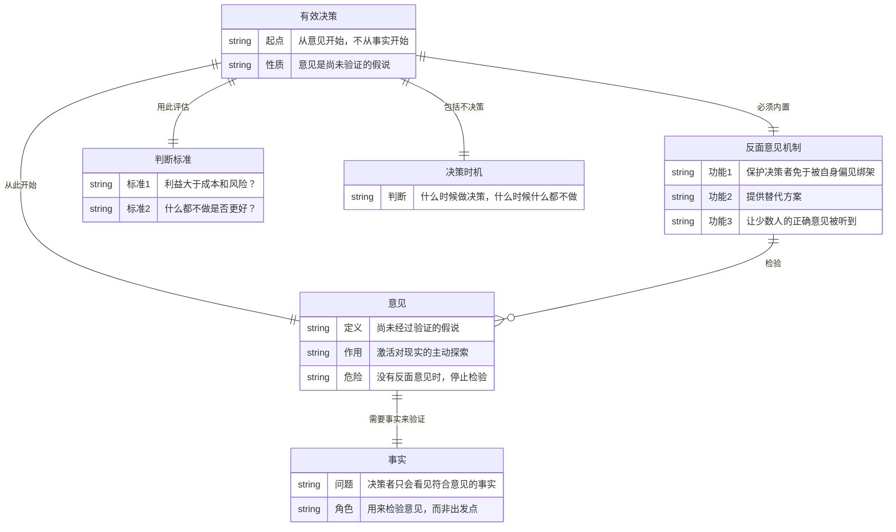
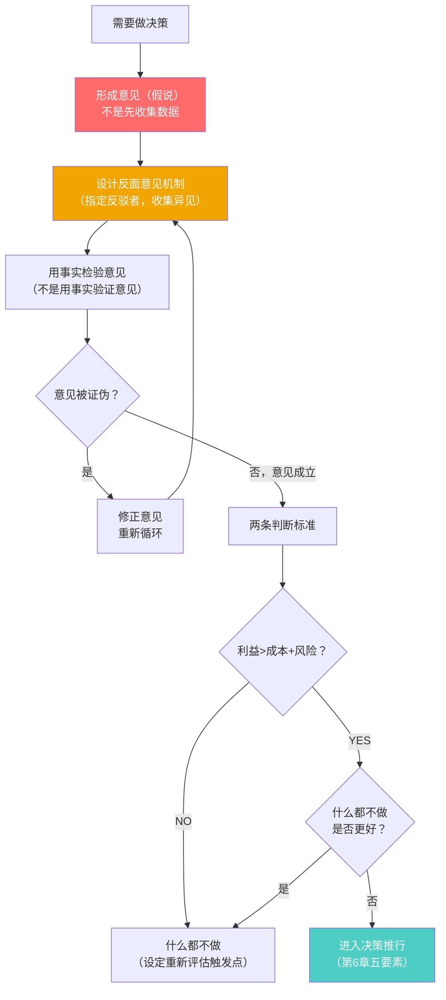

# 第7章：有效的决策

## 第零步：ER图（本章骨架）



---

## 第一步：概念清单与自评

| 概念 | 自评（0-3） | 说明 |
|------|------------|------|
| 从意见开始（而非从事实）| 0 | 完全反直觉，需要裁判循环才能建立正确理解 |
| 意见是尚未验证的假说 | 1 | 有理解，但不知道操作上如何"假说化" |
| 反面意见机制 | 1 | 知道重要，但不知道如何在实际组织中建立 |
| 两条判断标准 | 1 | 能背出，但第二条（什么都不做）几乎从未真正用过 |
| "什么都不做"也是决策 | 0 | 这个选项在大多数决策思维中完全缺席 |

**需要裁判循环**：从意见开始、反面意见机制、什么都不做的决策

---

## 第二步：实例裁判循环

### 概念1：从意见开始（而非从事实开始）

**这是本章最反直觉的主张，也是最深刻的。**

**为什么不能从事实开始？**

德鲁克的核心洞见：
1. 你不知道应该收集哪些事实，除非你已经有了某种假说（意见）告诉你什么是相关的。
2. 人只会看见符合自己预设框架的事实。没有意见的"客观收集事实"是幻觉——你其实在被隐藏的假设引导，只是没有意识到。
3. 从意见开始，把意见明确化，才能设计对的事实检验来推翻或证实它。

**正例**：
- 斯隆在通用汽车的决策：他不是"先收集所有市场数据再得出结论"，而是从"一个分权组织可以解决通用的管理危机"这个意见出发，然后用事实来检验这个假说。
- 医学诊断的正确做法：好医生先形成几个假说（这可能是A病或B病），再用检查来区分；而不是先做所有检查，再看结果说明了什么。

**边界例（争议区）**：
- "我做数据分析，我应该让数据说话，没有先入为主的观点。"
  - 裁判：**这是自我欺骗**。选择分析什么数据、用什么维度切分、什么叫"显著"——这些选择背后都有隐含假设。德鲁克的主张是：把这些假设显式化（变成意见/假说），然后用数据来检验，而不是假装自己没有假设。
- "我有一个很强烈的意见，我担心从意见开始会让我无法被事实改变。"
  - 裁判：**恰恰相反**。从意见（假说）开始，意味着你明确了"什么样的证据会让我改变这个意见"——这实际上比模糊地"收集数据"更容易被事实改变。卡尔·波普尔的"可证伪性"与此完全同构。

**操作化**：
```
不是：先收集数据，再得出结论
而是：
1. 形成意见（假说）："我认为问题的根本原因是X"
2. 问：什么事实能证明这个意见是错的？
3. 去收集那些证伪性事实
4. 意见被证伪 → 修正意见
   意见未被证伪 → 以此为基础决策（但保持反面意见通道开放）
```

---

### 概念2：反面意见机制

**德鲁克的主张**：有效的决策需要制度性的"反面意见"，不是偶尔有人唱反调，而是系统性地组织反驳。

**为什么需要机制而不是个人自觉**？
- 组织内部的权力结构天然压制反面意见（下级不敢反驳上级）
- 确认偏误（Confirmation Bias）是人类认知的默认设置
- 一个正确的少数派意见，没有制度保护，会在组织内自然消亡

**正例**：
- 斯隆在通用汽车的做法（highlights.md提到）：每次重要决策前，他要求委员会成员先不讨论，各自独立形成意见，然后提交。他寻找的不是共识，而是分歧——分歧是隐藏的重要信息。
- 美国总统林肯的"竞争对手内阁"：他把曾经的竞选对手放进内阁，确保有足够强的反面声音。这是反面意见机制的组织化版本。
- 天主教封圣程序中的"魔鬼代言人"（devil's advocate）：专门指定一个人为候选圣人找缺点——这是制度化的反面意见，已存在数百年。

**边界例（争议区）**：
- "我们公司有一个开放的文化，任何人都可以发表意见。"
  - 裁判：**不等于反面意见机制**。机制的关键是：在决策之前，有人的职责是系统性地提出反对意见，而且这个反对意见会被认真对待并记录。"任何人可以发言"在实际上等于"没有人有责任说不好听的话"。
- "这个决策是领导定的，提反面意见也没用。"
  - 裁判：**这正是需要机制而非个人自觉的原因**。斯隆的规则是：如果没有反面意见，就延迟决策，而不是在没有充分检验的情况下推进。

**操作层面的最小反面意见机制**：
```
在任何重要决策前，指定一个人（可以轮换）负责：
1. 整理所有支持该决策的理由和证据
2. 制造最强力的反驳版本
3. 决策者必须书面回应这个反驳
（不需要推翻反驳，但必须明确说明为什么在存在这些反驳的情况下仍然选择该决策）
```

---

### 概念3："什么都不做"也是决策

**德鲁克的两条判断标准**：
1. 利益是否大于成本和风险？
2. 什么都不做是否比做决策更好？

**第二条标准极少被认真使用，但它是真实的选项。**

**正例**：
- 一家公司面对竞争对手的激进扩张，选择不跟进，继续专注既有市场。两年后竞争对手因过度扩张破产。——"什么都不做"是一个主动的战略决策，不是被动的无作为。
- 巴菲特的"不作为偏好"：他多次描述自己在别人都在行动时选择等待，直到找到真正合适的机会。

**边界例（争议区）**：
- "我们在讨论是否进入这个新市场，'什么都不做'就是放弃机会。"
  - 裁判：**这是常见误读**。"什么都不做"不等于放弃，而是选择把资源用在更确定的地方。判断的关键是：现在行动的风险和成本，是否小于等待更清晰信号的机会成本？

**完整决策判断树**：
```
这个决策值得做吗？
├── Q1: 利益 > 成本 + 风险？
│   └── NO → 什么都不做（但需设定"什么情况下重新评估"的触发条件）
│   └── YES → 继续
└── Q2: 什么都不做的代价 vs 行动的风险？
    └── 什么都不做代价更高 → 做决策，进入五要素流程
    └── 行动风险更高 → 什么都不做，设定监控点
```

---

## 第三步：结构可视化



---

## 第四步：可执行结构

```
IF 需要做任何重大决策
THEN 先写下自己的意见（假说），再问：什么证据会证明这个意见是错的？——去找那个证据

IF 在重要决策会议中只听到赞成声音
THEN 主动问：谁能给出最强力的反驳？如果没人，指定一个人承担此角色

IF 形成了一个决策方案
THEN 先用第二标准检验：如果什么都不做，后果是什么？后果可以接受则不做

IF 已经通过意见检验、决定行动
THEN 进入第6章的推行流程：谁执行？能力够吗？30/90天验证点在哪里？
```

---

## 第五步：接入已有体系

**同构关系**：
- 卡尔·波普尔的证伪主义：意见=假说，事实检验=证伪尝试。德鲁克在管理决策中实践了波普尔的科学哲学，结构完全同构。两者都认为：无法被证伪的命题不是知识。
- 查理·芒格的"反转思维"（Invert, Always Invert）：总是先考虑什么情况下你会是错的。这是反面意见机制的个人版本，结构同构。

**互补关系**：
- 认知偏误研究（卡尼曼《思考，快与慢》）：提供了为什么需要反面意见机制的心理学解释——系统一（快思考）会自动寻找确认证据，系统二（慢思考）才能系统性质疑。德鲁克给出操作框架，卡尼曼给出机制解释。
- 预演失败（Pre-mortem，加里·克莱因）：决策前想象"这个决策一年后失败了，原因是什么？"——这是反面意见机制的一个具体工具，补充了德鲁克框架的操作层。

**矛盾关系**：
- 数据驱动决策（Big Data运动）："让数据说话"的文化与"从意见开始"的主张直接矛盾。德鲁克的反驳是：数据只能告诉你发生了什么，不能告诉你为什么发生，更不能告诉你应该做什么——那个判断必须来自有经验的意见。但德鲁克没有处理的是：意见质量参差不齐，数据至少有客观性约束，这是真实的张力。
- 快速实验文化（A/B测试、MVP）：硅谷的"测试-学习"循环隐含了"不需要强意见，让市场告诉你答案"。德鲁克的框架在高频低成本决策中可能过重，在低频高成本决策（战略决策、组织变革）中更适用。这不是矛盾，是适用边界问题。

**与highlights.md的直接连接**：
highlights中的费尔案例是本章理论的最好实证：费尔先有意见（"垄断企业必须通过服务保持活力"），再设计事实验证方案（建立贝尔研究所、发行AT&T股票），而不是先做市场调研再决定。反面意见机制在费尔的案例里体现为：他在做每一个重大决策前，都先回答"反对者会怎么说"，然后把这个反驳内化进决策设计里（例如：贝尔研究所的存在本身是对"垄断企业会僵化"这一反面意见的制度性回应）。
