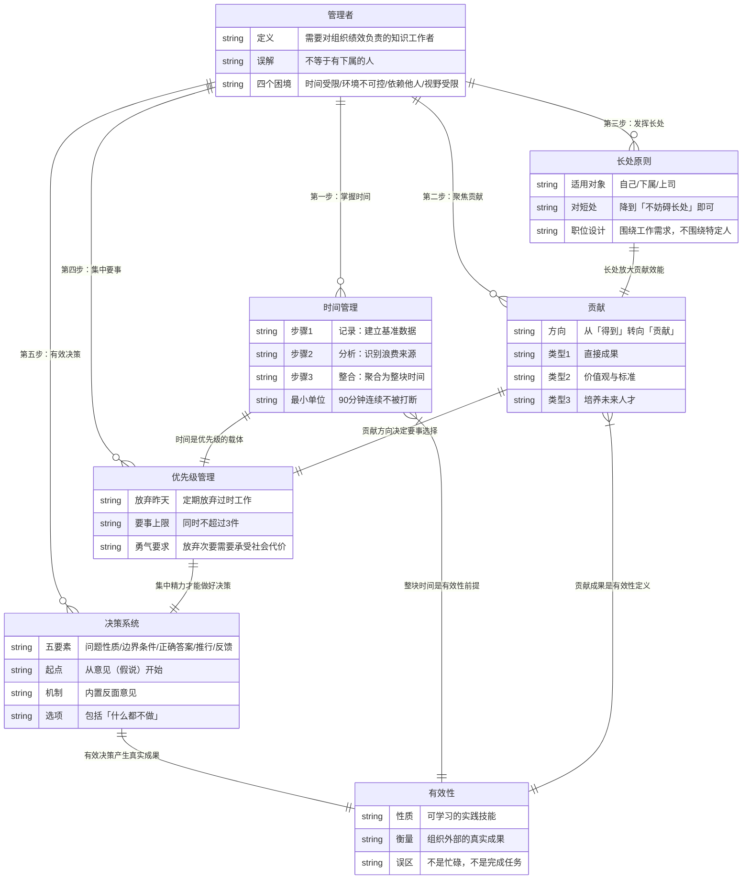

# 总模型：《卓有成效的管理者》可执行版

## 一、全书核心结构（10行以内）

```
卓有成效的管理者 = 在知识工作中持续产生真实外部成果的人

前提：四个现实困境是常数，不能消除，只能在约束内设计行为

五个行动维度：
1. 时间：记录→分析→整合为整块时间（资源管理）
2. 贡献：从「我能得到什么」转向「我能贡献什么」（方向校准）
3. 长处：用人用其长，对自己、下属、上司一律适用（能量配置）
4. 要事：放弃昨天，集中精力于≤3件要事（资源聚焦）
5. 决策：从意见开始→反面意见检验→推行→反馈（质量保障）

五个维度互相依赖，缺任何一个都会在某处漏掉效能
```

---

## 二、if-then触发条件矩阵

| 触发条件（IF） | 行动（THEN） | 对应章节 |
|--------------|------------|---------|
| 感到忙碌但成果模糊 | 问：我在做Efficiency还是Effectiveness？找一件可以停下来的事停掉 | 第1章 |
| 从未记录过时间 | 先做1周时间日志，只观察不改变，再分析 | 第2章 |
| 整块时间不够（<2小时/天） | 找时间浪费来源（会议/信息/重复劳动/人员），针对来源修复 | 第2章 |
| 开始任何工作前 | 问：这件事完成后，组织外部会有什么不同？说不清则重新定义 | 第3章 |
| 准备开会 | 先写：这次会议结束时，[什么]将[存在/改变]，否则不开 | 第3章 |
| 要给人分配工作 | 先问：他在哪里能产生卓越成果？把工作放在那里 | 第4章 |
| 下属有明显短处影响工作 | 判断：短处是否遮蔽了长处？是→处理到「不妨碍」；否→接受 | 第4章 |
| 工作清单超过5项且分散 | 放弃审计：如果今天不存在这项工作，我会启动它吗？NO则放弃 | 第5章 |
| 遇到需要决策的问题 | 先问：这是第几次发生类似情况？超过一次→建立原则，不是应急 | 第6章 |
| 形成了解决方案 | 写出边界条件（必须满足X，不能损害Y），再评估方案 | 第6章 |
| 重要决策只听到赞成声音 | 主动问：谁能给出最强力的反驳？指定一个人承担反驳职责 | 第7章 |
| 准备做重大决策 | 先形成意见（假说），再问：什么证据会证明这个意见是错的？ | 第7章 |
| 考虑行动时 | 先用第二标准检验：如果什么都不做，后果可接受吗？可以则不做 | 第7章 |
| 决策开始执行 | 预设反馈节点（30/90/180天），不等结果自己浮现 | 第6-7章 |

---

## 三、使用边界

**这个框架最有效的场景**：
- 知识工作（靠大脑产出的工作）
- 低频高成本的决策（战略、组织、人事）
- 个人层面的时间和精力管理
- 评估组织或团队的有效性问题

**这个框架不够用的场景**：
- 高频低成本决策（用A/B测试 + 数据驱动更高效）
- 需要快速响应的危机（德鲁克框架太重，需要更简化的应急协议）
- 需要激励系统设计（德鲁克假设人是理性的贡献者，对激励机制的设计讨论不足）
- 组织文化变革（德鲁克提出标准应通过行为传递，但没有给出文化变革的系统方法）

**最大的认知陷阱**：
- 把"忙碌"当作"有效性"的证明——德鲁克整本书都在对抗这个幻觉
- 把"完成任务"当作"贡献成果"——完成任务是服从，贡献是主动定义价值
- 把"我已经知道这些道理"当作"我已经在实践"——这本书的核心是实践，不是知识

---

## 四、与已有体系的同构/互补/矛盾关系

```mermaid
graph TD
    德鲁克["德鲁克：卓有成效的管理者"]

    同构1["波普尔：证伪主义\n（意见=假说，事实=检验）"]
    同构2["斯多葛：控制二分法\n（四个困境=不可控；实践=可控）"]
    同构3["格雷厄姆：创造者vs管理者日程\n（整块时间的精确化）"]
    同构4["巴菲特：专注与放弃\n（要事优先的极端实践）"]

    互补1["GTD（大卫·艾伦）\n（德鲁克：策略；GTD：战术）"]
    互补2["精力管理（洛尔）\n（德鲁克：时间；洛尔：精力）"]
    互补3["OKR框架\n（德鲁克：贡献导向；OKR：落地机制）"]
    互补4["认知偏误（卡尼曼）\n（德鲁克：操作；卡尼曼：解释）"]
    互补5["盖洛普StrengthsFinder\n（德鲁克：长处原则；盖洛普：诊断工具）"]

    矛盾1["数据驱动决策文化\n（数据先行 vs 意见先行）"]
    矛盾2["全面素质教育模型\n（补短板 vs 用长处）"]
    矛盾3["永远在线文化\n（即时响应 vs 整块时间）"]

    德鲁克 -->|"同构"| 同构1
    德鲁克 -->|"同构"| 同构2
    德鲁克 -->|"同构"| 同构3
    德鲁克 -->|"同构"| 同构4
    德鲁克 -->|"互补"| 互补1
    德鲁克 -->|"互补"| 互补2
    德鲁克 -->|"互补"| 互补3
    德鲁克 -->|"互补"| 互补4
    德鲁克 -->|"互补"| 互补5
    德鲁克 -->|"矛盾"| 矛盾1
    德鲁克 -->|"矛盾"| 矛盾2
    德鲁克 -->|"矛盾"| 矛盾3

    style 德鲁克 fill:#ff6b6b,color:#fff
    style 矛盾1 fill:#e74c3c,color:#fff
    style 矛盾2 fill:#e74c3c,color:#fff
    style 矛盾3 fill:#e74c3c,color:#fff
```



---

## 五、全书完整ER图（更新版）



---

## 六、单页总结（可打印版）

```
《卓有成效的管理者》— 核心模型

【前提】
你是知识工作者 → 你就是管理者 → 四个困境是常数

【五个维度】
时间  → 记录 → 分析 → 整块（≥90分钟保护区）
贡献  → 问：组织外部会有什么不同？
长处  → 用长处（自己/下属/上司），短处只需「够用」
要事  → 放弃昨天 → ≤3件要事 → 同时只做一件
决策  → 意见（假说）→ 反驳检验 → 推行 → 反馈

【三个检验问题】
1. 我现在在做的，有人比我更适合做吗？（长处优先）
2. 如果这件事今天不存在，我会启动它吗？（放弃昨天）
3. 这个决策如果错了，什么证据会告诉我？（反馈设计）

【一个核心警告】
忙碌感是有效性的最大幻觉
```

---

## 七、highlights.md核心洞见的位置定位

| 高亮内容 | 在模型中的位置 | 洞见层级 |
|---------|--------------|---------|
| "有效的管理者不做太多的决策" | 决策系统→要事优先→聚焦少数重大决策 | 战略层 |
| "情势中的常数" | 决策系统→问题性质判断→经常性问题识别 | 分析工具 |
| "一项决策如果不能付诸行动，就称不上是真正的决策" | 决策系统→推行要素→最被忽视的部分 | 执行原则 |
| "决策的推行必须接近工作层面，力求简单" | 推行 + 贡献章节的"把抽象转化为具体行动" | 执行原则 |
| "经常性问题只能通过建立规则或原则才能解决" | 决策系统→第一要素→问题性质判断 | 诊断工具 |
| 费尔三大决策案例 | 决策系统→从意见开始→推行→反馈 的完整实证 | 案例验证 |
| 斯隆分权组织制度 | 贡献→价值观建立 + 决策系统→结构性决策 | 案例验证 |
