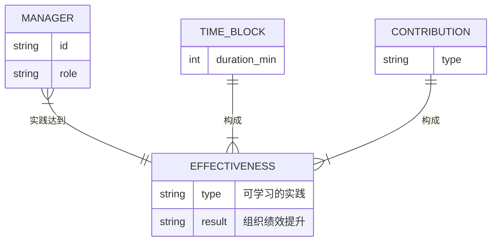
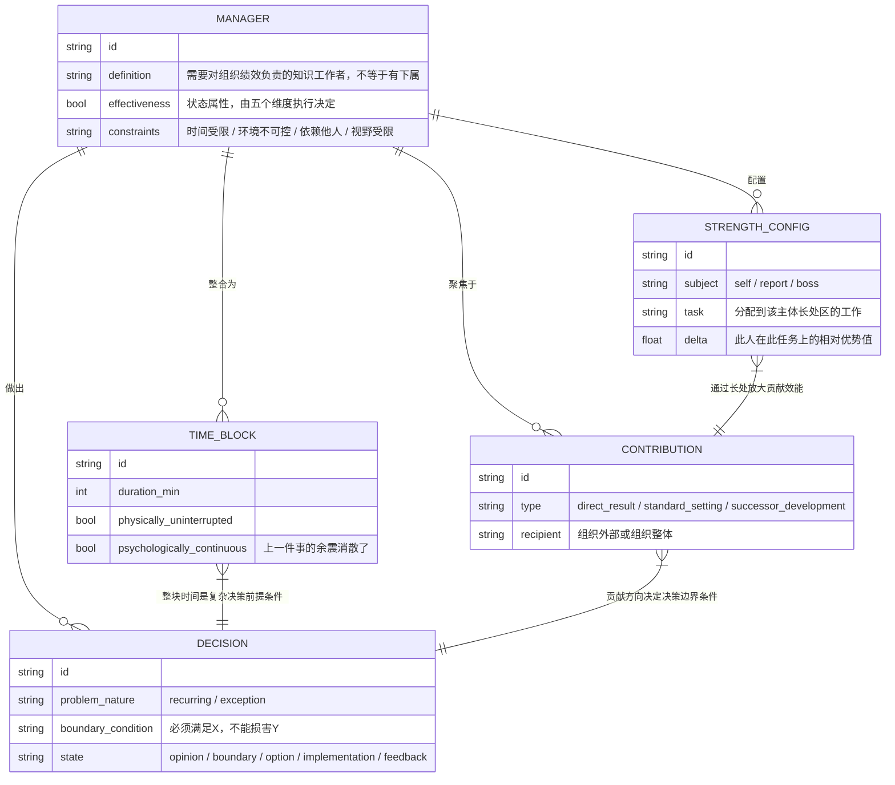
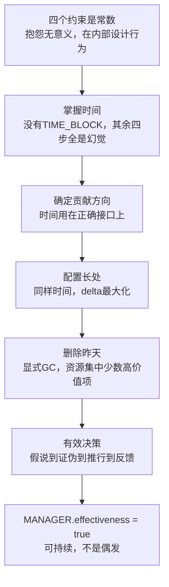

# 第零章：全书ER骨架——《卓有成效的管理者》

这本书描述什么结构？一个知识工作者在四个不可消除的约束内，让自己的工作产生真实的外部成果。输入是时间和脑力，约束是组织现实，输出在系统外部被感受到。管理者不是职级，是角色定义。

---

## 第一次ER草图（错的）

第一反应：把"有效性"建成实体。

画完就知道错了。EFFECTIVENESS的属性是什么？它和其他实体有什么独立关系？全是空的。这在ER设计里是经典的state reification错误——把状态（state）当成实体（entity）建模。`user.is_active = true` 里的 `active` 不需要是一张独立的表，除非它有自己独有的属性和关联。"有效性"就是 `MANAGER.state`，由五个维度的执行决定。建成独立实体只是增加了一个没有信息量的中间节点，查询时还要多一次join，毫无收益。

**修正：有效性是管理者的状态属性，不是独立实体。**

---

## 正确的全书ER图

---

## 全书逻辑链（依赖链，不是并列）

五个维度是依赖链。时间是基础资源，其他四个都以它为前提。没有整块时间，决策质量无从谈起。

---

## ER关系语义说明

这张图里有三种关系需要解释清楚：

**MANAGER ||--o{ TIME_BLOCK**：一个管理者拥有多个时间块（多端可选）。时间块是可被管理的资源单元，外键在TIME_BLOCK表里（time_block.manager_id）。

**TIME_BLOCK }|--|| DECISION**：多个时间块可以是一个决策的前提（整块时间是做复杂决策的必要条件）。这里多端必须意味着：每个TIME_BLOCK必须属于某个DECISION或MANAGER的工作流，不允许孤立存在。

**STRENGTH_CONFIG }|--|| CONTRIBUTION**：多个长处配置影响一类贡献方向。这里的 `delta` 字段是关键——它不是人的绝对能力值，是相对于其他候选人的优势差值。这个设计决策让比较优势原则可以被数据化：查询"谁的delta最大"只需要按task_domain过滤STRENGTH_CONFIG，排序delta字段。

---

## 裁判循环（骨架层）

**第一直觉**：DECISION里的 `state` 字段用 `enum` 类型，枚举值是五个状态。这合理吗？

**哪里错了**：把决策状态建成单一enum字段，意味着一个DECISION实体只能处于一个状态，且状态转移没有时间戳记录。这丢失了审计信息。在实际系统里，如果需要回答"这个决策在什么时候从边界定义阶段进入方案选择阶段"，单个enum字段无法回答。

更准确的设计是：引入DECISION_STATE_LOG实体，每次状态转移产生一条记录（decision_id, from_state, to_state, timestamp, operator）。DECISION当前状态由最新一条LOG记录决定，而不是存在DECISION表里的一个字段。

这是"状态审计"（audit trail）设计模式。当然，如果不需要历史追溯，简化版的enum字段也是可以接受的——设计决策取决于查询需求，不是取决于"哪个更复杂"。

---

## 完成标志（行为层）

三个问题：

一，给你一个业务系统的架构团队场景，你能定位有效性瓶颈在哪个维度吗？

二，"有效性是实体还是属性"——你能给出精确的ER设计理由吗？不是"感觉不对"，是"这在ER设计里是state reification错误，因为它没有独立属性和独立关系，无法单独join，只能作为MANAGER的bool字段存在"。

三，给你一个新的系统问题描述，你能识别出应该对应全书哪个维度的解法吗？（时间整合 / 贡献定义 / 长处配置 / 要事删除 / 决策质量）

三个都答得出来，骨架完成。
