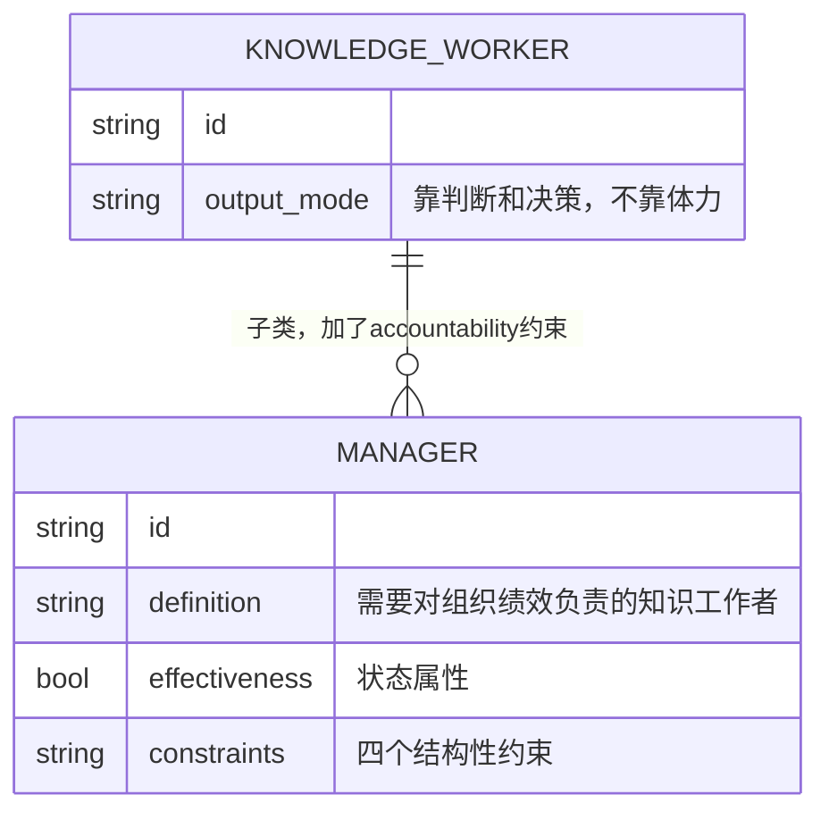
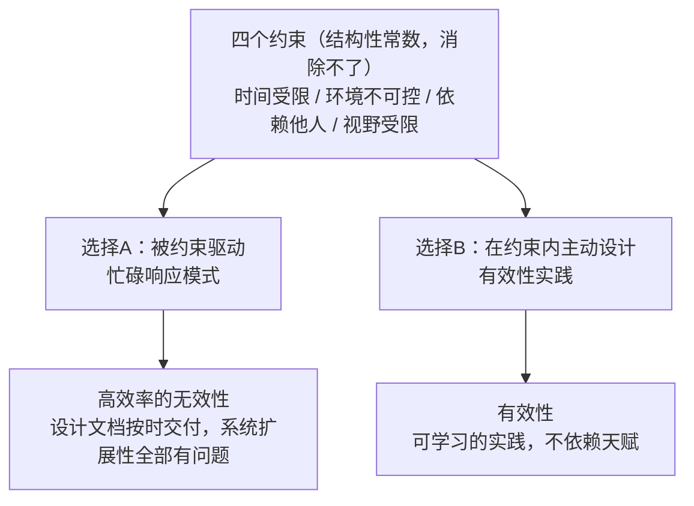

# 第1章：卓有成效是可以学到的

## ER骨架（第一次建模 → 修正）

第一次建模，直接上：



画完发现问题：MANAGER和KNOWLEDGE_WORKER是继承关系（子类），但我把它们建成了关联关系（has-a）。这是ER建模里的is-a vs has-a混淆错误。管理者不是"拥有"一个知识工作者身份，管理者是知识工作者的特化子类型，差别在于多了"对组织绩效负责"这个约束。用 `||--o{` 表达的是一对多的数据关联，不是类型继承。这两种关系在数据库设计里的实现完全不同：继承要么用单表（加discriminator字段），要么用分表+外键；关联是直接外键引用。混用会导致查询语义错误。

修正：用注释标注继承语义，有效性确认为MANAGER的bool状态属性，不是独立实体。

---

## 概念自评（3×3）

| 概念 | 评分(1-3) | 卡点 |
|------|-----------|------|
| Effectiveness vs Efficiency | 1 | 定义能背，但裁判新例子时会滑向efficiency |
| 管理者的定义（德鲁克版） | 2 | 反直觉的部分接受了，但边界例还会错判 |
| 四个约束的内在逻辑 | 1 | 能列举，不能从结构上解释为什么刚好是这四个 |

---

## 裁判循环

### Effectiveness vs Efficiency

**第一直觉（错的）**：一个架构团队所有设计文档按时交付、格式规范、评审通过率100%，这个团队有效吗？

我当时判断：是，他们把设计工作做到了极致。

**哪里错了**：

按时交付、格式规范、评审通过是delivery efficiency的指标。有效性问的是另一层：这些架构决策落地后，系统实际上能扩展吗？三个季度之后那批设计文档有没有指导真实系统走向正确的方向？

如果答案是：系统上线，扩展性全部有问题，因为最初的架构目标定义就是错的——那就是高效率的无效性。Efficiency是"把这件事做好了"，Effectiveness是"这件事本身是对的事"。两件事不在同一层。

技术理由很精确：Efficiency是实现层的质量指标（符合规格说明），Effectiveness是规格说明层的质量指标（规格说明本身是否正确）。一个correctly implemented的系统，如果spec定义错了，correct毫无价值。

**正例**：
- 架构评审开始前，先写"这个系统三年后需要支撑什么业务规模"，然后验证当前设计选择是否指向那个方向
- 业务分析阶段，不问"需求收集完了吗"，问"这个系统上线后，哪个业务流程会有什么实质性不同"

**边界例**：
- "我们的API接口文档100%覆盖" → 未必有效，如果接口本身设计成了未来扩展的障碍
- "sprint按时完成了所有story" → 完成不等于有效，如果story定义偏离了真实业务场景

**反例伪装**：
- "我们把这个微服务拆分做得非常精细" → 精细是efficiency，有没有在正确方向上产生可被感受到的系统能力提升才是effectiveness

---

### 管理者（德鲁克定义）

**正例**：
- 一个没有直接下属的系统架构师，他的接口设计决策影响十几个下游服务团队的工作方式 → 是管理者
- 一个业务分析师，他的领域模型定义影响了整个产品团队对"核心业务实体是什么"的共识 → 是管理者

**边界例**：
- 一个技术总监，有行政权，但所有架构决策都被CTO否定，他的判断从未被执行 → 名义上是管理者，实质上不是

**反例伪装**：
- "我带着30人的工程团队" → 有下属不等于是管理者，关键是决策是否真实影响组织绩效

---

## 结构



四个约束不是随机列表。每一个对应知识工作的一个结构性特征：时间不可再生（不能库存），组织是共同依赖体（你的架构输出依赖别人的业务输入），知识专业化导致视野局限（系统架构师不懂所有业务域）。这是工作的物理定律，不是抱怨对象。

---

## 可执行模型

```
IF 感到忙碌但说不清楚贡献了什么
THEN 你在做efficiency，不是effectiveness。
     问：这件事完成后，系统外部会有什么不同？说不出来 → 停下来重新定义工作。

IF 认为"我没有行政权力所以无法有效"
THEN 德鲁克定义的最大误读。
     有效性是个人实践，不依赖职级。
     没有下属的架构师可以比有下属的技术总监更有效。

IF 觉得这本书的道理"我早就知道"
THEN 背诵不是理解。裁判新场景才是检验标准。
     能说不等于会用。
```

---

## 结构接入（同构识别）

两个精确同构：

**同构一：Effectiveness = Fitness for purpose，Efficiency = Correctness**

软件工程里，correctness是"程序符合规格说明"，fitness是"规格说明本身是正确的"。一个程序可以100%符合一个错误的spec。这里的correctness = efficiency，fitness = effectiveness。德鲁克说"没有什么比高效地做根本不该做的事更无用"——翻译过来：一个correctly implemented的系统，如果spec错了，correct毫无价值。

精确对应关系：
- 这里的correctness = 那里的efficiency
- 这里的fitness for purpose = 那里的effectiveness
- 这里的spec定义阶段 = 那里的"先问我能贡献什么"阶段

**同构二：约束是系统不变量（invariant），不是bug**

一个分布式系统有CAP约束（一致性、可用性、分区容错，最多同时保证两个）。这不是bug，是定理。工程师的工作是在这个invariant内做设计选择，不是抱怨约束存在。四个组织约束的地位完全相同。这里的CAP约束 = 那里的四个结构性约束。
