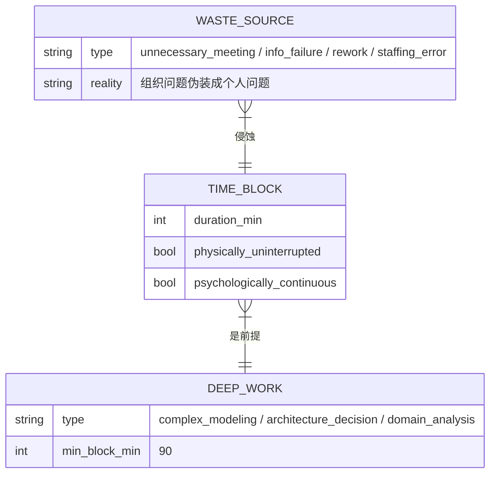
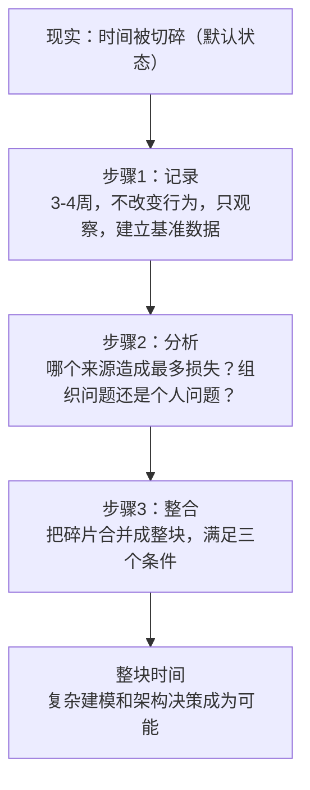

# 第2章：掌握自己的时间

## ER骨架（第一次建模 → 修正）

第一次建模：



画完发现问题：WASTE_SOURCE和TIME_BLOCK的关系方向建反了。我写的是 `WASTE_SOURCE }|--|| TIME_BLOCK`，意思是"多个浪费源对应一个时间块"。这在ER设计里是关系方向错误——实际语义是"一个时间块被多个浪费源侵蚀"，应该是 `TIME_BLOCK ||--o{ WASTE_SOURCE`，时间块是主体，浪费源是附属于时间块的侵蚀事件。方向反了会导致外键放错表：正确做法是在WASTE_SOURCE表里放 `time_block_id` 外键，而不是在TIME_BLOCK里放浪费源引用。

修正后关系：`TIME_BLOCK ||--o{ WASTE_SOURCE : "被侵蚀"`

三步操作序列：记录 → 分析浪费源 → 整合为整块。顺序不能颠倒，因为你不知道自己在浪费什么，直到你记录了。

---

## 概念自评（3×3）

| 概念 | 评分(1-3) | 卡点 |
|------|-----------|------|
| 时间记录 | 1 | 知道应该做，但从来没做过，凭感觉估算时间分配 |
| 整块时间三个条件 | 2 | 理解前两个，心理连续性条件一直被忽视 |
| 时间浪费的来源 | 1 | 能列举四个，但不能诊断自己主要问题在哪个 |

---

## 裁判循环

### 整块时间的三个条件

**第一直觉（错的）**：整块时间 = 日历上没有会议的时间段。

有一次我需要做一个核心业务系统的领域建模。把上午10:00-12:00全部清空，准备画ER图。结果：10:00坐下来，脑子里还在处理9:50刚结束的需求评审里一个没对齐的业务规则，花了25分钟消化这个余震。11:30开始想12:30有个架构对齐会，提前备稿，实际专注时间约45分钟。

日历上是120分钟，实际有效建模时间是45分钟。

**哪里错了**：整块时间有三个条件，缺一个都不成立：
1. 足够长（≥90分钟）
2. 物理不被打断（关掉消息，关门）
3. 心理连续性——上一件事结束了，下一件事焦虑还没开始

条件3是最难的，也是最容易被忽视的。ER图是个有状态的工作。做业务领域建模，脑子里同时维护着实体、关系、业务规则约束、跨系统边界。一旦被打断，这个工作上下文全部失效，回来要重新load。这个重建成本是真实的，但它不出现在日历上。

技术理由：认知工作是CPU密集型，不是I/O密集型。操作系统对I/O密集型任务可以用时间分片（time-slicing），因为任务等I/O时CPU可以去做别的。但复杂建模工作没有"等I/O"的间隙，切换就是浪费，而且context switch cost极高——类似CPU缓存失效，每次切换都要重新load所有上下文。两个45分钟的建模产出，远低于一个90分钟的。

**正例**：
- 做数据建模前，把前一个会议的待处理项先清掉或记录，再开始建模工作
- 整块时间前后各留15分钟buffer，前面用来清空余震，后面用来归档当前状态

**边界例**：
- "我有3小时空档" → 未必是整块时间，如果中间有个无法推迟的电话，它实际上是两个碎片

**反例伪装**：
- "我一边开会一边处理消息，效率很高" → 这是两个碎片并行，不是整块时间，每件事都付了context switch的代价

---

### 时间浪费的四个来源

**核心结构**：德鲁克列的四个来源，全是组织问题伪装成个人问题。

| 来源 | 在工程团队里的伪装形式 | 实质 |
|------|----------------------|------|
| 不必要的会议 | "这个需要大家对齐一下" | 授权结构缺失，决策权不清晰 |
| 信息系统失灵 | "这个数据要去问一下XX" | 信息流设计有缺陷，数据孤岛 |
| 重复劳动 | "这个逻辑上次也做过" | 职责边界不清，模块化不足 |
| 人员配置不当 | "这个只有我会做" | 单点依赖，知识未传递 |

**关键判断**：如果一个时间浪费可以靠"个人更努力"消除，它不在这个列表里。这四个全需要组织层面或系统层面的修复。对着个人动作 = 无效。

---

## 结构



步骤1不能省。你以为的时间使用方式，和实际的，几乎肯定不同。必须用数据打破幻觉。

---

## 可执行模型

```
IF 从未做过时间记录
THEN 先记录1周（每小时一次），不改变任何行为，只建立基准数据
     目标是看清楚实际时间分配，不是立刻优化

IF 每天深度工作时间 < 90分钟
THEN 找主要浪费源：会议？信息不畅？替别人填坑？
     针对来源修复，不是靠意志力撑
     组织问题用组织手段解决

IF 需要做复杂工作（领域建模、系统架构决策、业务分析）
THEN 预留整块时间（至少90分钟）
     满足三个条件：物理不被打断 + 足够长 + 前后留buffer消除心理污染

IF 做业务领域建模被打断了
THEN 不要强行继续，context已经失效
     先把当前状态记录下来（已经确认的实体和关系），再重新评估是否有条件继续
```

---

## 结构接入（同构识别）

**同构：OS的batch processing vs time-slicing**

批处理系统把相同类型的任务攒在一起处理，减少context switch开销。复杂认知工作应该采用批处理架构。

精确对应关系：
- 这里的batch processing = 那里的整块时间
- 这里的context switch cost = 那里的时间碎片的隐性代价
- 这里的cache miss = 那里的"被打断后重建工作上下文"的成本

time-slicing让每个任务看起来都在"进行"，实际上每个任务都在付cache invalidation的代价。知识工作的"缓存"是工作记忆中的领域上下文，一旦切换，重建这个上下文的时间是真实成本，但它是隐形的——它不出现在日历上，但它消耗了时间和认知资源。

**同构二：有状态工作（stateful computation）不能被随意中断**

数据库事务（transaction）有ACID属性，其中A是原子性——要么全做，要么全不做，不允许中间状态。复杂建模工作有类似的特性：ER图的建模过程中间状态是不完整的，被打断后"部分完成的模型"并不比"没开始的模型"好多少，因为中间状态的一致性无法保证。整块时间相当于给这个工作上了事务锁。
