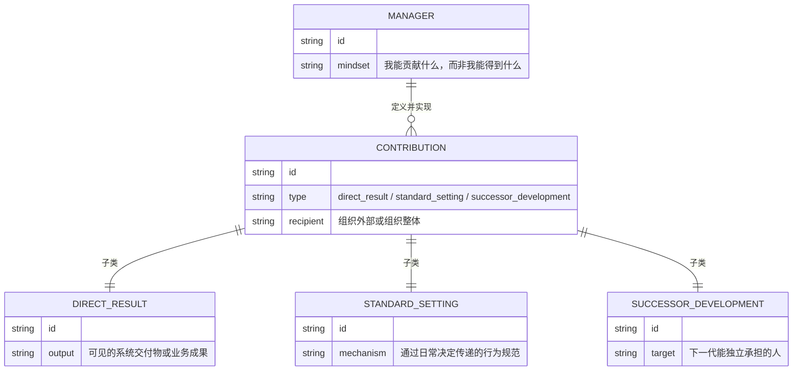
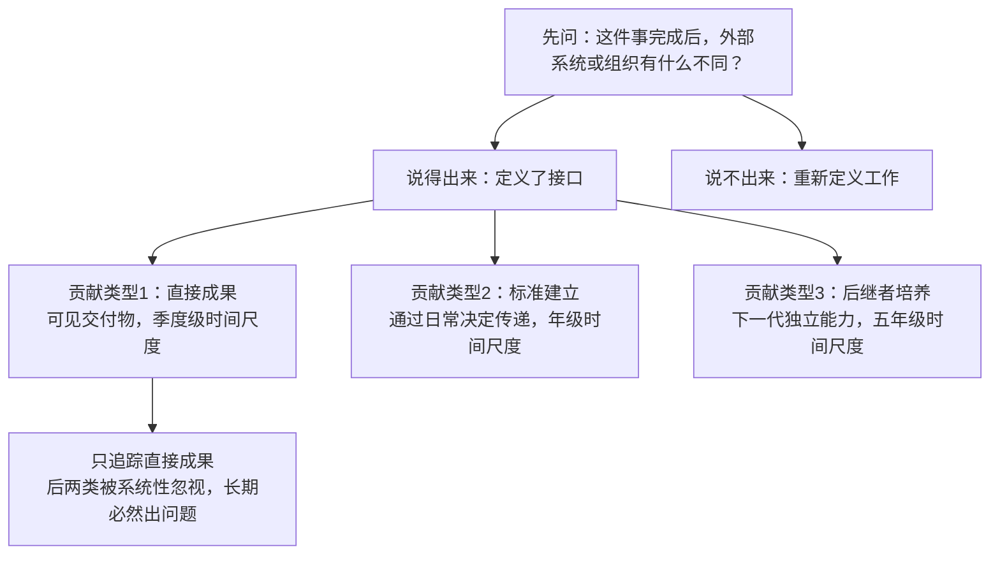

# 第3章：我能贡献什么

## ER骨架（第一次建模 → 修正）

第一次建模：



画完发现问题：三个子类（DIRECT_RESULT、STANDARD_SETTING、SUCCESSOR_DEVELOPMENT）和CONTRIBUTION之间用了 `||--||` 一对一关系。这是错误的——这实际上是继承关系（specialization），不是关联关系。一对一关系在ER里意味着两个表可以合并，是数据冗余的标志。而继承关系的含义是：每个DIRECT_RESULT都是一个CONTRIBUTION，但CONTRIBUTION不一定是DIRECT_RESULT。这在数据库实现里是完全不同的设计：继承要用单表+discriminator字段，或者分表+公共父表，不是简单的外键关联。

修正：三个子类是CONTRIBUTION的specialization，在ER图里用注释标明，不建成独立的一对一关联。

---

## 概念自评（3×3）

| 概念 | 评分(1-3) | 卡点 |
|------|-----------|------|
| 贡献导向（思维转换） | 1 | 能说，但压力下会退回"完成任务"模式 |
| 三类贡献 | 2 | 直接成果清楚，标准建立和后继者培养操作上还模糊 |
| 贡献方向决定时间分配 | 1 | 理解逻辑，但实际操作时还是被任务驱动 |

---

## 裁判循环

### 贡献导向：把工作想成实现接口

**第一直觉（错的）**：我帮一个团队做完了核心业务的ER图，包括所有实体、关系、约束，这是贡献吗？

我当时判断：是，这是直接成果，交付了实实在在的东西。

**哪里错了**：

这个判断漏掉了关键问题：这张ER图是否指向了正确的系统目标？换句话说：这是不是正确方向上的直接成果？

有一次我给一个平台型业务做领域建模，交付了完整的ER图，实体清晰，关系正确，团队看完都说"建得很好"。但三个月后系统开发到一半，发现核心的"交易"实体定义范围太窄，只覆盖了当前业务形态，新的平台业务接入后完全无法复用，需要重新建模。

问题不在于ER图画得好不好，在于我接受了业务方给的需求范围，没有先问：这个系统的目标是什么？三年后这个平台要支撑什么？这张图指向了那个方向吗？

贡献导向要求的是：先定义接口（系统三年后需要支撑什么），再验证当前工作是否在实现那个接口。我在做实现，没有先做接口定义。

**正例**：
- 开始领域建模前，先和业务方写下"这个系统的核心扩展性要求是X，三年后的业务规模是Y"，再验证模型设计是否指向那个方向
- 做系统边界划分时，不问"这个功能放哪个服务"，问"这个划分三年后会不会成为扩展瓶颈"

**反例伪装**：
- "我完成了所有需求文档里的建模任务" → 完成任务是做了别人定义的spec，贡献是先定义spec本身是否正确

---

### 标准建立（最被低估的一类）

**核心结构**：

```
架构师的每一个具体决定 → 向下传递一个信号 → 信号累积 = 团队的实际建模标准
（宣称的标准）- （执行的标准）= 标准债务，团队每天在还息
```

他帮一个团队做完ER图（直接成果），同时他做ER的方式——先建实体和属性，再确认关系方向，最后检查关系基数——影响了团队后续的建模习惯（标准建立）。这是两类贡献同时发生。

**具体场景**：

在一次架构评审里，他当场指出了一个ER图里的state reification错误并修正了它。这是直接成果。但他修正的方式——说出"这是state reification错误，因为这个实体没有独立属性"——给团队建立了一个诊断模式，之后团队做评审时会自发地用同一个诊断框架。这是标准建立。

两类贡献的时间尺度完全不同：直接成果是项目级，标准建立是年级。

---

## 结构



---

## 可执行模型

```
IF 开始任何建模或分析工作前
THEN 先写：这件事完成后，业务系统或组织会有什么实质性不同？
     说不出来则重新定义工作

IF 在架构评审里做了一个与团队宣称规范不符的决定
THEN 意识到：你刚刚更新了团队对实际建模标准的认知，不是你说的那个
     行为比文档更直接，因为行为不能被误解

IF 要开一个架构对齐会
THEN 先写：这次会议结束时，[什么决策]将会[被确认/被推翻/被定义]
     写不出来则不开

IF 评估一个工作的贡献价值
THEN 三类贡献各自评估，不能只看直接成果
     标准建立和后继者培养的缺失，不会立刻显现，但五年后会成为系统性问题
```

---

## 结构接入（同构识别）

**同构：interface vs implementation**

面向对象设计的核心原则：针对接口编程，不针对实现编程。贡献导向就是把"我的工作"想成一个interface的实现：
- 接口由系统需求和业务目标定义（外部贡献方向）
- 实现由我的能力和工具决定（内部执行）
- 评估标准在接口层，不在实现层

如果你只想"我能实现什么"，你会产出一个实现细节丰富但接口定义错误的系统。三个月后需要重新建模，所有已经写的代码都要调整。

精确对应关系：
- 这里的接口定义阶段 = 那里的"先问我能贡献什么"阶段
- 这里的实现细节 = 那里的具体任务执行
- 这里的接口-实现不匹配 = 那里的"高效率的无效性"

**三类贡献对应软件团队的三类输出**：
- 直接成果 = 上线的系统功能
- 标准建立 = 代码质量、架构规范、review标准、建模习惯
- 后继者培养 = 知识传递、团队建模能力、下一代架构师成长

三类缺任何一个，团队短期看起来正常，长期必然出问题。只做功能的团队，技术债务会拖垮它。不传递标准的团队，离开一个关键人物后质量立刻崩。
