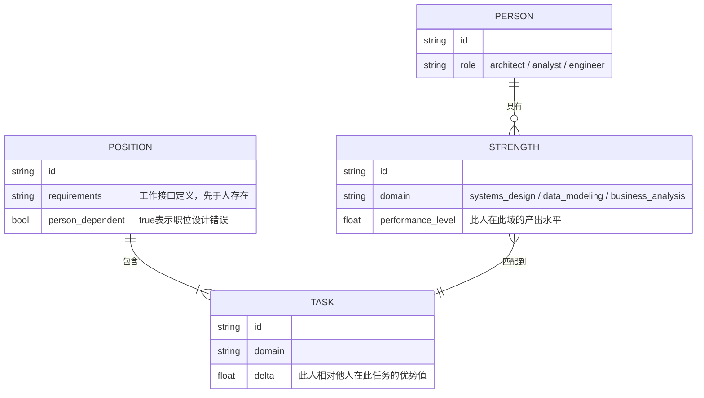
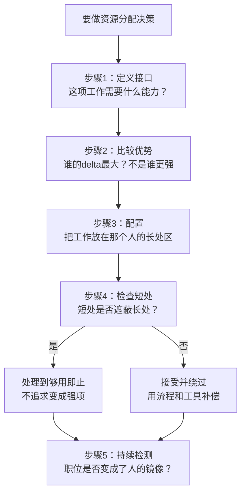

# 第4章：发挥人的长处

## ER骨架（第一次建模 → 修正）

第一次建模：



画完发现问题：STRENGTH和TASK之间用了 `}|--||` 多对一关系，意思是"多个长处对应一个任务"。这在语义上是反的。实际应该是：一个任务可以由多个候选人匹配（TASK ||--o{ PERSON_TASK_MATCH），而每次匹配评估的是delta值。把STRENGTH直接连到TASK，跳过了"比较优势"这个核心概念——delta不是绝对值，是相对于其他候选人的差值。建成静态连接关系，丢失了比较的语义。

这在ER设计里是missing junction table错误：需要一个ASSIGNMENT实体来承载"谁的delta在这个任务上最大"这个比较关系，而不是直接在两个实体间连边。

修正：引入ASSIGNMENT实体，持有person_id、task_id、delta三个字段，每次资源分配决策对应一条ASSIGNMENT记录。

---

## 概念自评（3×3）

| 概念 | 评分(1-3) | 卡点 |
|------|-----------|------|
| 比较优势（delta最大原则） | 1 | 理解逻辑，但面对具体分配决策会退回"谁更强就做什么" |
| 职位接口设计 | 2 | 知道"先工作后人"，但不知道如何检测自己是否违反了 |
| 上司作为API | 1 | 概念上清楚，实际操作时没有做过"识别上司的输入偏好" |

---

## 裁判循环

### 比较优势——delta最大原则

**第一直觉（错的）**：如果架构师A在系统设计和数据建模两个方向都比架构师B强，应该让A把两件事都承担。

我当时判断：合理，因为A的产出质量更高。

**哪里错了**：

这个判断用的是绝对优势逻辑，不是比较优势逻辑。绝对优势看"谁更强"，比较优势看"delta在哪里最大"。两个标准在不同情况下会给出不同答案。

用数字说明：
- A做系统设计：产出100，A做数据建模：产出85
- B做系统设计：产出60，B做数据建模：产出75

如果A承担两件事：总产出理论上是100+85，但A的时间是有限的，他不能同时全力做两件事。如果强行双线：两件事各打折，可能变成70+60=130。如果按比较优势分配——A专注系统设计（他的delta最大，差值100-60=40），B专注数据建模（他的相对优势区，差值85-75=10对比60-75=-15，B在建模上的劣势最小）：总产出100+75=175，而且两人都在自己最有把握的区域工作。

这不是偏心，是资源分配的优化问题。技术理由：比较优势是assignment problem，目标函数是最大化团队总产出，不是让每个人都做他绝对最强的事。

**正例**：
- 团队里有人擅长业务分析、有人擅长数据建模，两件事同时要做时，不是"谁不忙谁上"，而是"谁在这件事上的delta最大"
- 一个全栈都会的工程师，在sprint规划时，优先分配他到他delta最大的模块，不是均匀分配

**边界例**：
- 某人是唯一会某项技能的人 → 分配时没有比较对象，此时应该建立知识传递而不是单点依赖
- 某人不愿意做delta最大的工作 → 这是激励问题，不能用比较优势强行解决

**反例伪装**：
- "让最强的人做最重要的事" → 听起来合理，但没有回答"相对于谁的最强"，忽略了team-level optimization

---

### 职位接口设计

**核心原则**：先写接口（职位要求），再找实现（符合条件的人）。不能先有人再写接口。

**诊断测试**：

```
如果这个人明天离职，这个职位还需要存在吗？
→ YES：职位围绕工作需求设计，正确
→ NO：职位是为人量身定制的，设计有问题
```

**具体场景**：

一个工程团队需要一个专职数据建模的角色。负责人说：老张做ER图做得好，让他来负责这个，然后再写JD。顺序搞反了。正确的顺序是：先定义"这个角色需要交付什么、覆盖哪些业务域、和哪些角色协作"，再看谁符合。

反过来做的后果：JD变成了老张能力的镜像。当老张离职，这个角色的定义就失去了意义，接替者要么过度胜任，要么严重不足。

---

### 上司作为API

**这条最反直觉，但对系统架构师来说就是API调用设计。**

上司是我需要调用的API。每个API都有它最适合处理的输入类型，超出这个范围的输入会得到错误响应或空响应。如果我把错误格式的请求发给API，得不到好的输出，是我的调用方式有问题，不是API的问题。

上司偏好书面材料（READ型接口）还是口头对话（CHAT型接口）？善于处理结构化分析还是直觉判断？这决定了我应该以什么格式"传参"。

---

## 结构



---

## 可执行模型

```
IF 要给团队成员分配工作
THEN 不问"谁还没做过"或"谁更强"
     问"谁在这里的delta最大"（需要比较，不是绝对评估）

IF 团队成员有明显短处
THEN 先判断：短处是否遮蔽了长处？
     是 → 处理到够用即止，不要求变成强项
     否 → 接受并用流程工具绕过，不要消耗他在非长处区

IF 要设计或填充一个职位
THEN 先写清楚工作要求和交付物（接口）
     再找匹配的人（实现）
     不能反过来，不能先定人再写JD

IF 需要从上司那里得到好的架构方向判断
THEN 先识别：他偏好书面分析还是口头对话？
     善于什么类型的输入？
     以他最容易处理的格式传参
```

---

## 结构接入（同构识别）

**同构：依赖倒置原则（DIP）**

好的软件设计：高层模块不依赖低层模块的实现，应该依赖接口（抽象）。职位设计原则就是DIP的组织版本：组织不应该依赖特定的人，应该依赖职位接口。当实现（人）更换，接口（职位）保持稳定，组织继续运转。

精确对应关系：
- 这里的接口（抽象） = 那里的职位要求（工作需求定义）
- 这里的实现（低层模块） = 那里的具体的人
- 这里的高层模块依赖接口 = 那里的组织依赖职位定义而非特定人
- 这里的DIP违反 = 那里的"职位是人的镜像"

**同构：比较优势是assignment problem的最优解**

在运筹学里，这是一个经典的分配问题（assignment problem），可以用匈牙利算法求解，目标函数是最大化总产出。德鲁克的直觉解法和最优化的形式化方法指向同一个结论：最大化团队总产出，不是让每个人都做他绝对最强的事，而是让每个人做他在整个团队中相对优势最大的事。
