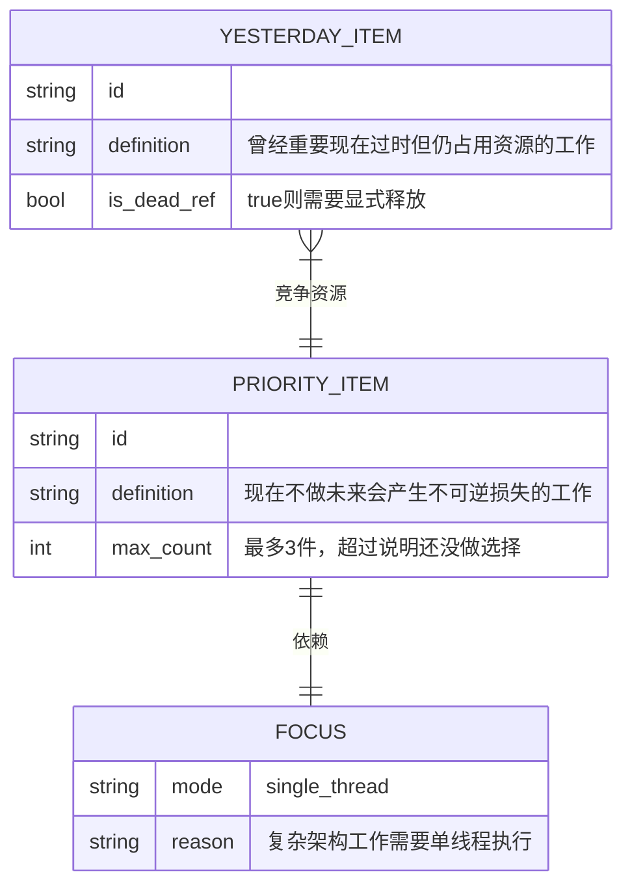
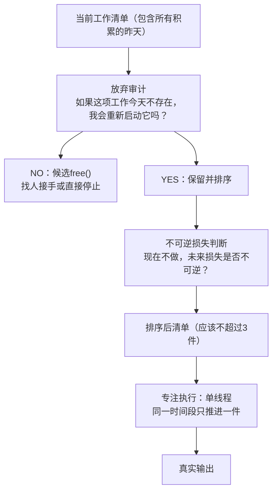

# 第5章：要事优先

## ER骨架（第一次建模 → 修正）

第一次建模：



画完发现问题：PRIORITY_ITEM和FOCUS之间用了 `||--||` 一对一关系。这在ER设计里意味着这两个实体可以合并成一张表——一对一关系通常是设计过度拆分的信号。FOCUS不是一个独立实体，它是PRIORITY_ITEM的执行模式属性（execution_mode = single_thread），应该作为PRIORITY_ITEM的属性字段，不需要单独建表。

另一个问题：YESTERDAY_ITEM和PRIORITY_ITEM建的是 `}|--||` 多对一关系，意思是"多个过时工作竞争一个优先项"。实际上这两类是同一个资源池（时间和注意力）的竞争者，不是直接关联的实体对。应该引入一个RESOURCE_POOL实体，两者都作为资源消耗者关联到它。

修正：FOCUS作为PRIORITY_ITEM的属性字段。引入RESOURCE_POOL承载竞争关系。

---

## 概念自评（3×3）

| 概念 | 评分(1-3) | 卡点 |
|------|-----------|------|
| 要事的判断标准 | 1 | 容易被"紧急"劫持，忘记问"不做的不可逆损失" |
| 放弃昨天（显式GC） | 1 | 没有操作框架，知道有这个概念但不知道怎么执行 |
| 专注原则（单线程） | 2 | 有直觉，但"一件事"的粒度边界模糊 |

---

## 裁判循环

### 放弃昨天——平台功能列表的GC问题

**老德这里说得绕。我翻译成自己的语言：**

"放弃昨天"本质上是一个显式垃圾回收（explicit GC）问题。

在C语言里，内存不会自动释放。过期的对象，如果你不手动 `free()`，它们会一直占用内存，直到程序崩溃或内存耗尽。"昨天的工作"就是这些死引用（dead references）——曾经有价值，现在没有了，但仍然占用资源。它们不会自动消失，因为没有GC。需要手动释放。

**第一直觉（错的）**：一个平台型产品的功能清单是公司能力的体现，应该越来越丰富，只增不减。

我当时判断：是，功能越多代表平台越成熟。

**哪里错了**：

一个平台运营了五年。每次版本规划，产品经理都在原有基础上新增功能，从没有做过功能下线。五年下来发生了什么：

- 功能数量是第一年的四倍，但核心用户场景没有增加四倍
- 维护成本（兼容性测试、文档更新、客服支持）随功能数量线性增长
- 第四年开始，维护成本超过了新功能开发成本
- 第五年，新功能开发速度下降到第一年的1/3，因为每次改动要考虑的兼容情况太多

这就是死引用积累导致的系统退化。平台的功能列表是一个资源竞争者的集合，不是成就墙。每个存在的功能都在持续消耗：开发时间、测试覆盖、文档维护、架构复杂度。如果不做显式GC，这些成本会持续累积，直到新功能开发速度趋近于零。

**解决方案：零基础功能审计（类比zero-based budgeting）**

不是每次规划在现有基础上增量修改，而是定期从空白开始：
- 先定义：这个平台的核心业务场景是什么？（重新定义接口）
- 再问：要支撑这些场景，最少需要哪些功能？（从头设计实现）
- 逐项比对现有功能清单，无法justify的下线

这个过程很痛苦，因为要下线工程团队花了很多精力建的功能。但不做这个，平台会越来越重，新业务接入成本越来越高，最终失去竞争力。

---

### 要事的判断

**正确判断方式**：不是"这件事重要吗？"，是"如果现在不做，未来损失是否不可逆？"

紧急的事情不一定是要事。一个平台反复出现同一类数据一致性问题，每次紧急处理、修数据、发公告——这是对着信号动作，不是要事。真正的要事是：识别根因，决定是修底层数据模型还是加补偿机制，这个决策一旦延迟，技术债务利息会持续累积，且越晚做改动成本越高（不可逆性增加）。

要事的清单不能超过3件。超过3件说明还没做真正的选择，只是列了一个"比较重要"的清单。

---

## 结构



---

## 可执行模型

```
IF 工作清单超过5项且感到分散
THEN 做放弃审计：问"如果今天不存在这项工作，我会重新启动它吗？"
     NO则执行free()：找人接手或停止，释放出来的资源重新分配

IF 一个平台的功能列表只增不减超过三年
THEN 这是死引用积累，需要做零基础功能审计
     先定义核心场景，再逐项justify现有功能，无法justify的下线

IF 遇到"一切都很重要，没法选"
THEN 这是放弃恐惧伪装成判断困难
     强迫自己问：如果只能推进一件，不做哪件的不可逆损失最大？
     那件就是要事

IF 要确认某件事是否是要事
THEN 问两个问题：
     1. 现在不做，未来损失是否不可逆？
     2. 这个判断是基于不可逆性，还是基于紧急感？
     只有第一个是要事判断标准
```

---

## 结构接入（同构识别）

**同构：显式垃圾回收（explicit GC）**

Java有自动GC，但GC是有代价的——它会在某个时刻暂停程序（Stop-the-World），集中清理死对象。这个暂停是不可避免的，问题只是"何时暂停"和"付多少代价"。主动触发GC（在受控条件下清理）比等到内存耗尽被迫触发的代价小得多。

精确对应关系：
- 这里的死对象 = 那里的"昨天的工作"
- 这里的内存占用 = 那里的时间、注意力、维护成本
- 这里的Stop-the-World GC = 那里的定期放弃审计
- 这里的OOM崩溃 = 那里的精力耗尽、平台失去竞争力
- 这里的主动free() = 那里的显式停止某项工作

**同构：单线程执行模型**

JavaScript是单线程的，通过事件循环处理并发，但任何一个时刻只有一个任务在CPU上运行。这不是缺陷，是设计选择——消除了线程安全问题，让程序行为可预测。

复杂架构工作和平台系统分析应该采用单线程模型：同一时间只推进一件核心工作。看起来像"低效"，实际上消除了context switch代价，总产出更高。

**优先级是删除问题，不是排序问题**：排序假设所有事情都要做，只是顺序不同。真正的优先级决策是：哪些东西根本不应该出现在清单里？删掉之后，剩下的清单自然就能处理了。这对平台功能规划同样成立。
