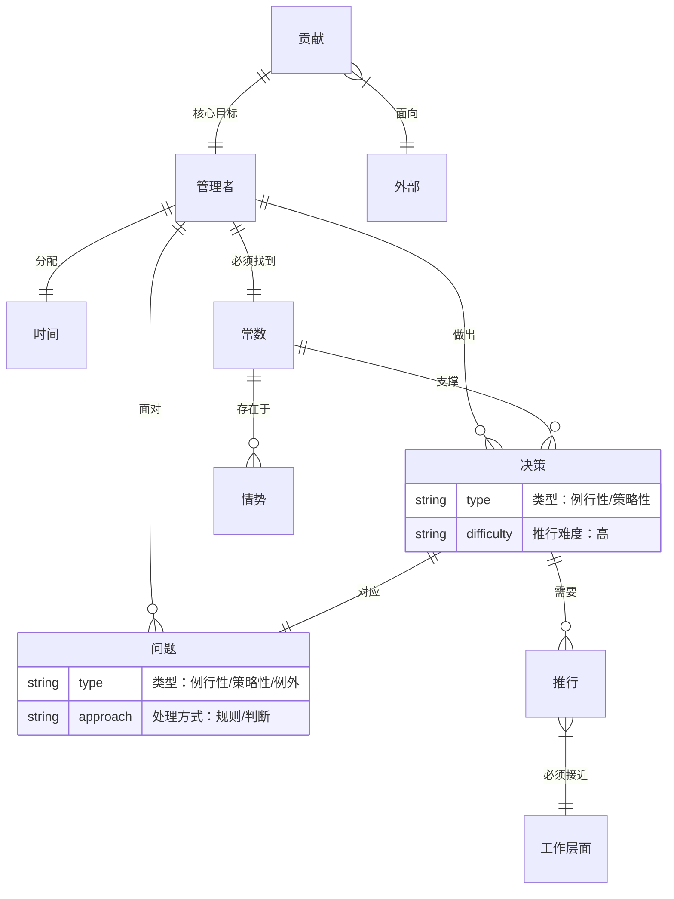
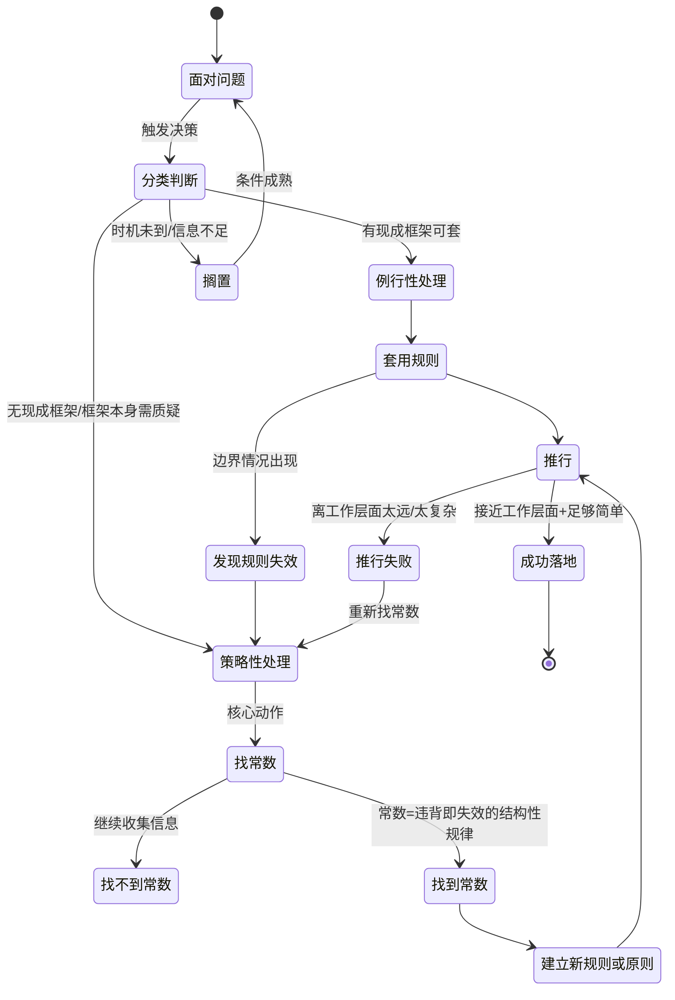

好，严格按沈老师画像来。他不会管德鲁克是谁，不会管历史背景，不会批判叙述者。他只有一个问题：**"有效管理"这个领域的底层结构是什么，怎么能直接用。**

------

## 第零步：ER提取（先建骨架，不读文字）

扫一遍所有高亮，提实体和关系，不管作者的叙事顺序。



**第零步结论：** 这个领域的中心节点是**决策**，决策的质量取决于**问题分类的准确性**，问题分类的准确性取决于**能不能找到情势中的常数**。三层嵌套，常数是最底层。

------

## 第一步：概念清单与自评

从原文提取需要建模的核心概念：

```
- 例行性问题：2级（能说出但边界不清）→ 进第二步
- 策略性问题：2级（能说出但边界不清）→ 进第二步  
- 情势中的常数：1级（听起来懂，实际说不清）→ 进第二步
- 决策的推行：3级（清楚，就是执行落地）→ 不需要处理
- 以贡献为目标：2级（抽象，操作化边界不清）→ 进第二步
```

------

## 第二步：实例裁判循环

### 概念一：例行性问题 vs 策略性问题

**AI出三个例子，沈老师来裁判：**

**正例（例行性）：** 服务器CPU使用率超过80%，触发扩容流程。 → **裁判：属于例行性。** 有先例，有规则，照规则处理，不需要判断。

**边界例：** 一个核心工程师提出离职，你要不要挽留，怎么挽留。 → **裁判：策略性。** 表面像是HR的例行操作（走流程），但真正的决策是：这个人对团队的结构性价值是什么，挽留的代价是什么，不挽留的连锁反应是什么。没有先例可以直接套，每个人的情况不同。

**反例伪装（看起来是策略性，其实是例行性）：** 每季度做一次技术债务盘点，决定优先处理哪些。 → **裁判：例行性。** 虽然每次的结论不同，但处理框架是固定的（影响度×修复成本矩阵）。只要框架建好了，执行就是例行操作。不需要每次都重新判断。

**本轮边界感知：** 区分的关键不是"有没有先例"，而是**"有没有可以直接套用的处理框架"**。有框架=例行性，没框架/框架本身需要被质疑=策略性。

------

### 概念二：情势中的常数

**AI出三个例子：**

**正例：** 双面市场平台（滴滴、淘宝），无论业务模式怎么变，"供给侧和需求侧的密度必须同步增长"这个常数始终成立。补贴策略、UI设计、定价机制全都是变量，这个常数不变。 → **裁判：属于常数。** 任何时候违背它，平台就会崩（要么司机等太久，要么乘客等太久）。

**边界例：** "用户体验要好"——这是不是常数？ → **裁判：不是常数，是目标。** 常数是结构性的，是机制层面的，违背了系统就失效。"用户体验要好"违背了，系统还能跑，只是跑得不好。常数违背了，系统直接失效。这是判断一个东西是不是常数的真正标准。

**反例伪装：** "要以客户为中心"——这是常数？ → **裁判：不是常数，是价值观表述。** 这个东西永远正确，永远无法被证伪，所以没有操作价值。常数必须是可以被违背的（违背了会有具体后果），否则它不是常数，只是口号。

**本轮边界感知：** 常数的判断标准：**违背了系统直接失效**，而不是"运行得不好"。能被违背且有具体后果=常数，永远正确无法证伪=口号，追求的方向=目标。三类必须区分。

------

### 概念三：以贡献为目标（操作化）

**AI出三个例子：**

**正例：** 架构师在设计一个系统时，不问"我怎么把这个设计得更优雅"，而问"这个设计交付之后，业务团队能做到什么他们现在做不到的事"。 → **裁判：属于。** 贡献的方向是外部，是"别人因为我的工作能做什么"，不是"我的工作本身有多好"。

**边界例：** 写了一篇非常深刻的技术文档，但没人读。 → **裁判：不属于"有贡献"。** 贡献必须被接收，文档写得再好没人读=没有贡献。但这里有个边界：如果没人读是因为推广不够，那是执行问题；如果没人读是因为这个文档根本不是别人需要的，那是方向问题。两者的修复方式不同。

**反例伪装：** 花三个月优化了系统性能，响应速度提升了50%，但这个系统的业务量其实很低，瓶颈根本不在性能上。 → **裁判：不属于有效贡献。** 做了正确的事（性能优化是好事），但不是当前情势下需要的贡献。贡献不只是"做了好事"，而是"做了当前最需要的好事"。

**本轮边界感知：** 贡献=外部可感知的价值变化+当前情势下最需要的那个变化。两个条件缺一不可。

------

## 第三步：结构可视化

把德鲁克这本书的核心决策逻辑转成状态机：



**图检验：** 原文里有一句"决策的推行必须尽可能接近工作层面，力求简单"——这个在图里体现为`推行→推行失败`的分支条件。图画完发现：**德鲁克没有说推行失败之后怎么办**，他只说了推行要简单。这个空缺是认知漏洞，需要自己补——推行失败意味着决策本身有问题，要回到策略性处理重新找常数，不只是"再推一遍"。

------

## 第四步：可执行结构模型

压缩成可以直接用的模型，5行以内：

```
【有效管理决策】可执行模型：

核心结构：
问题分类决定处理方式。分类的标准只有一个：
有可直接套用的处理框架 → 例行性 → 套框架执行
没有/框架本身需质疑 → 策略性 → 先找常数再建框架

常数的判断标准：违背了系统直接失效（不是"运行变差"，是"失效"）

执行落地标准：接收方能用 + 当前最需要 + 足够简单

使用边界：
此模型在"决策者有足够余裕思考分类"时有效。
高压/信息极度不足时，模型失效，退化为直觉应对。
```

------

## 第五步：系统接入

**同构？** 这个决策模型和软件系统里的**路由机制**完全同构：

- 例行性问题 = 静态路由（有规则直接命中，走固定处理器）
- 策略性问题 = 动态路由（没有预设规则，需要运行时判断）
- 找常数 = 找路由规则本身（不是配置具体路由，是找路由规则的生成逻辑）

**借用价值**：软件系统里有"路由规则的版本管理和灰度更新"的成熟方案。管理里对应的就是：新建的规则/原则，先小范围试用，验证有效再推广。德鲁克没提这一步，但软件工程的经验告诉我们这一步不能省。

**填补空缺：** 之前知道"问题要分类处理"，但不知道分类的操作性标准是什么。现在的模型补上了：**"有没有可直接套用的处理框架"** 是唯一的分类依据，比"重要/紧急"四象限更精确，因为它直接指向处理方式，不是重要性评估。

**更新后的认知图谱新增节点：** `决策分类→框架存在性检验→常数识别→规则构建→接近工作层面推行`

------

## 沈老师的最终输出（蒸馏到极简）

```
有效管理 = 
  分得清（例行/策略）
  + 找得到（情势中的常数）
  + 落得下（接近工作层面，足够简单）

分类标准：有框架=例行，无框架=策略
常数标准：违背即失效（不是变差，是失效）
落地标准：接收方能用 + 当前最需要
```

------

**对比一下**：Solomon读完这本书，输出的是"老德在这里耍了个滑头，他把分类权藏起来了……"然后接WHN、接嘉靖、接AI时代的推演，五百字，有锋芒有纵深。

沈老师读完，输出的是上面这三行加一张状态机。他对德鲁克是谁、服务于谁、藏了什么完全不关心。他要的是那张图，那三行，拿来就能在下周的团队管理里用。
