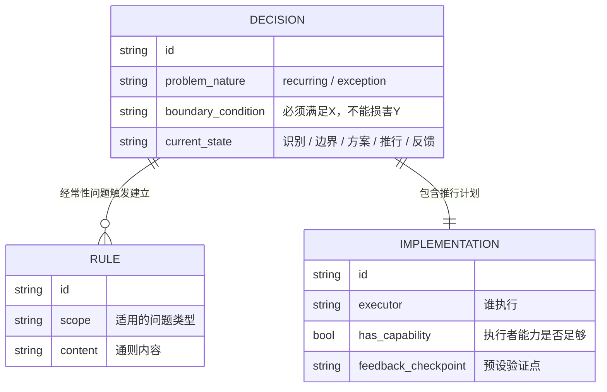
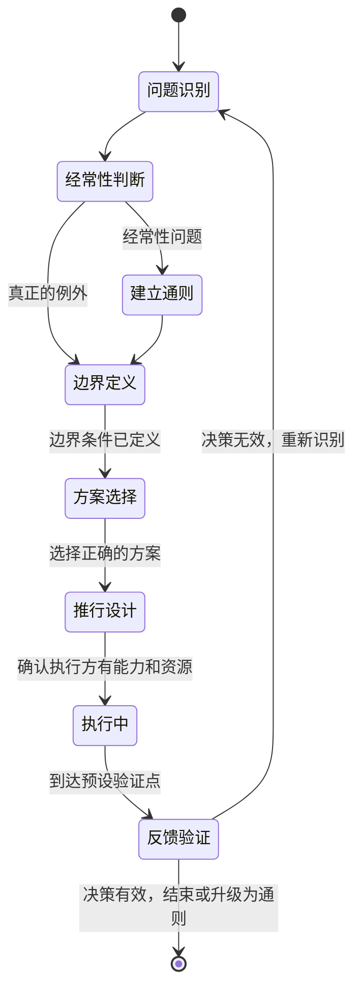

# 第6章：决策的要素

## ER骨架（第一次建模 → 修正）

第一次建模：



画完发现问题：DECISION和IMPLEMENTATION之间用了 `||--||` 一对一关系。这又是state reification的变体——IMPLEMENTATION不是一个独立实体，它是DECISION在"推行"状态下的属性集合。把它单独建表，意味着每次查询一个决策的推行信息都要join一张额外的表，而这张表除了和DECISION的外键以外没有任何独立的存在意义。

更深的问题：这个设计把决策（DECISION）和推行（IMPLEMENTATION）建成了两件事，但德鲁克明确说：一项不能推行的决策不是决策，是良好意愿。推行是决策本身的一部分，不是后续步骤。应该把推行相关字段（executor、has_capability、feedback_checkpoint）直接作为DECISION的属性。

修正：IMPLEMENTATION的字段合并进DECISION，DECISION用 `current_state` 字段追踪状态机状态。

---

## 概念自评（3×3）

| 概念 | 评分(1-3) | 卡点 |
|------|-----------|------|
| 经常性 vs 例外 | 2 | 直觉有，但"表面是例外的经常性问题"容易误判 |
| 边界条件的写法 | 1 | 理解定义，但不知道如何写一个合格的边界条件 |
| 推行是决策的一部分 | 1 | 习惯把决策和推行当成两件事 |
| 反馈设计 | 1 | 几乎不主动设计反馈机制，等别人反馈 |

---

## 裁判循环

### 经常性 vs 例外——最重要也最被低估的区分

**第一直觉（错的）**：一个软件团队线上出现了一个数据不一致的bug，业务方投诉，紧急处理：定位问题，修数据，发公告，关单。这是一次有效的决策处理过程吗？

我当时判断：是，响应及时，问题解决了。

**哪里错了**：

两周后，同类型的数据不一致问题再次出现。又是紧急处理、修数据、发公告、关单。第三次出现的时候，我才问：这类问题的根因是什么？是数据模型设计问题，还是服务间调用缺少事务保证，还是补偿逻辑有漏洞？

这三次，我在对着信号动作：信号（bug报告）出现，处理它，信号消失。但结构没变。

技术理由：如果一个问题反复出现，每次都当成例外事件单独处理，你在付O(n)的代价。建立通则（根因修复原则 / 设计规范 / 自动检测机制）是O(1)的查表。用O(n)做可以O(1)的事，是系统设计里的性能问题，也是决策里的有效性问题。而且没有通则约束，每次处理的结果可能不一致（这次修数据的方式和上次不同，留下新的不一致风险）。

经常性问题的识别信号：这类问题出现超过一次，或者你预期它还会出现。一旦识别为经常性，正确的响应是建立通则，不是应急处理。

**正例**：
- 发现三个服务都有类似的数据一致性风险 → 识别为经常性问题 → 制定团队级的分布式事务使用规范（建立通则），而不是每个服务单独修
- 架构评审里反复出现"这个服务的职责边界不清晰"的评论 → 识别为经常性问题 → 制定服务拆分的判断标准（通则）

**边界例**：
- 某个极罕见的外部系统故障导致的数据问题 → 真正的例外，特殊处理合理
- 某个新业务场景第一次出现的设计问题 → 需要判断：这类新场景会持续出现吗？如果是，仍然是经常性问题

---

### 边界条件：决策的约束定义

**操作格式**：

```
这项决策必须实现 [最低目标]，同时不能损害 [受保护的价值]
```

**具体场景**：

一个平台要做服务拆分决策，边界条件应该是：
- 必须实现：核心业务链路的响应时间不超过现有水平（最低目标）
- 不能损害：现有数据一致性保证，不能引入新的事务边界问题（受保护的价值）

任何拆分方案如果满足不了第一条，直接排除，无论拆得多么"架构合理"。任何方案如果引入了新的事务风险，同样排除。边界条件不满足 = 方案无效，不进入评估。

---

### 推行是决策的一部分

**德鲁克说得直接：一项决策如果不能付诸行动，最多只是良好意愿。**

推行不是"发邮件通知"。发邮件是传递信息，推行是确认：执行方有能力、有资源、有明确验证点，且有人对结果负责。

四个推行检查项：
1. 谁需要知道这个决策？（信息传达）
2. 谁需要采取具体行动？（执行主体）
3. 执行主体有能力和资源吗？（可行性）
4. 什么时间点、看什么指标来验证决策有效？（反馈机制）

第4项几乎从不被主动设计。大多数人等结果自然浮现，再被动响应。这是把反馈设计外包给偶然性。

---

## 结构



---

## 可执行模型

```
IF 遇到任何问题
THEN 先问：这是第几次发生类似情况？
     超过一次 → 经常性问题 → 建立通则，不是应急处理

IF 开始设计方案
THEN 先写边界条件：必须实现X，不能损害Y
     边界条件不满足的方案不进入评估，无论它多有吸引力

IF 形成了决策
THEN 必须能回答：谁执行？他有能力和资源吗？不能回答 → 决策未完成

IF 决策开始执行
THEN 预设反馈节点：什么时候检查什么指标
     不等结果自然浮现，不把反馈设计外包给偶然性
```

---

## 结构接入（同构识别）

**同构：状态机（State Machine）**

五要素决策框架就是一个状态机。精确对应关系：
- 这里的状态集合 = 那里的{问题识别, 边界定义, 方案选择, 推行设计, 反馈验证}
- 这里的状态转移条件 = 那里的每个要素完成的标准
- 这里的非法状态跳转 = 那里的跳过边界定义直接选方案
- 这里的循环回边 = 那里的反馈验证失败后重新识别问题

大多数决策失败是状态跳转错误：直接从"问题识别"跳到"方案选择"，跳过了"边界定义"这个关键状态。等同于状态机中的非法转移，输出状态不可预测。

**同构：O(1) vs O(n) 的问题处理复杂度**

经常性问题建立通则 = 构建查找表，O(1)查询。例外事件特殊处理 = 每次O(n)重新分析。

如果把经常性问题当成例外事件处理，系统在用O(n)解决本可以O(1)的问题，而且每次处理还会出现不一致（没有通则约束）。这是算法层面的低效，和时间复杂度问题一样真实。
