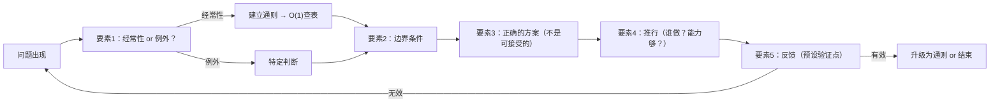

# 第6章：决策的要素

## 第零步：ER图

德鲁克的五要素决策框架，本质上是一个状态机。

```
决策 {
    enum 问题性质   "经常性 | 例外"
    enum 当前状态   "问题识别 → 边界定义 → 方案选择 → 推行 → 反馈验证"
    string 边界条件 "必须满足X，不能损害Y"
}

状态转移：
问题识别 --[性质为经常性]--> 建立通则 ---> 边界定义
问题识别 --[性质为例外]----> 边界定义
边界定义 ---> 方案选择（正确的，不是可接受的）
方案选择 ---> 推行（谁做？能力够吗？）
推行 ---> 反馈验证（预设检查点）
反馈验证 --[决策有效]--> 结束 or 升级为通则
反馈验证 --[决策无效]--> 重新问题识别
```

---

## 第一步：概念自评

| 概念 | 评分 | 备注 |
|------|------|------|
| 经常性 vs 例外 | 2 | 直觉有，但"表面是例外的经常性问题"容易误判 |
| 边界条件 | 1 | 理解定义，但不知道怎么写一个好的边界条件 |
| 推行（第四要素） | 0 | 把决策和推行当成两件事，这是错误的分界 |
| 反馈设计 | 0 | 完全被动，等别人反馈而不是主动设计 |

---

## 第二步：裁判循环

### 经常性 vs 例外——最重要也最被低估的区分

**核心洞察（不是我第一个想到的，是读者笔记里的）**：

> 对着信号动作 vs 对着结构动作。对着信号动作：信号消失，停下来。对着结构动作：结构改变，信号不再出现。

这个描述在CS里有精确的对应：

- **对着信号动作** = 处理一个具体的bug report，打了补丁，这次错误消失了
- **对着结构动作** = 发现这类bug的根本原因是某个设计决策，修改设计，这类bug不再出现

如果一个问题反复出现，每次都当成例外事件单独处理，你在付O(n)的代价。建立通则（原则/规则），是O(1)的查表。你在用O(n)做可以O(1)的事情。

**教学例子（第一直觉，错的）**：

学生来问"老师，这道题的递归怎么写"，我给他解释，他懂了，我们都满意。

第二周又有不同的学生来问，又是类似的问题。我再解释一遍。

一个学期下来，我解释了同一类问题20次。

我在对着信号动作。每次信号（学生的问题）出现，我处理它，信号消失。但结构没变：学生对递归的初始理解是有缺陷的，因为课程里讲这部分的方式没有解决这个根本困惑。

真正的要事是：这类问题反复出现，说明它是经常性问题，需要的是改进课程里讲递归的方式（对着结构动作），而不是一遍遍单独回答（对着信号动作）。

原来这才是真正的问题。我以为自己在帮学生，但我只是在低效地维持现状。

---

### 边界条件

**边界条件 = 这个决策必须满足的最低要求，不满足则方案无效，无论多便宜或多吸引人。**

**操作格式**：
```
"这项决策必须实现 [最低目标]，同时不能损害 [受保护的价值]"
```

**教学例子**：

期末考试形式的决策，我的边界条件是：
- 必须能区分真正理解概念的学生和死记硬背的学生（最低目标）
- 不能让题目过难导致班级均分崩溃影响学校指标（受保护的价值）

任何满足不了第一条的考试形式（比如纯选择题），直接排除，无论多容易批改。

---

### 推行（最被忽视的要素）

**德鲁克说得直接：一项决策如果不能付诸行动，最多只是良好意愿。**

推行不是"发通知"。发通知是传递信息，推行是确认：接收方有能力、有意愿、有资源执行，且有人对执行结果负责。

**四个推行问题**：
1. 谁需要知道这个决策？
2. 谁需要采取行动？
3. 这些人有能力做到吗？
4. 这个决策距离他们的日常工作有多远？

---

## 第三步：结构



---

## 第四步：可执行模型

```
IF 遇到任何问题
THEN 先问：这是第几次发生类似情况？超过一次 → 经常性 → 建立通则，不是应急处理

IF 开始设计方案
THEN 先写边界条件（"必须实现X，不能损害Y"），边界条件不满足的方案不进入评估

IF 形成了决策
THEN 必须能回答：谁执行？他有能力和资源吗？不能回答 → 决策未完成

IF 决策开始执行
THEN 预设反馈节点（什么时候检查什么指标），不等结果自然浮现
```

---

## 第五步：接入CS知识体系

**同构：状态机（State Machine）**

五要素决策框架就是一个状态机：
- 状态：{问题识别, 边界定义, 方案选择, 推行, 反馈验证}
- 转移条件：每个状态完成后才能进入下一个
- 错误转移：跳过状态（比如跳过边界定义直接选方案）产生错误的决策

大多数决策失败是因为状态跳转错误：直接从"问题识别"跳到"方案选择"，跳过了"边界定义"这个关键状态。

**同构：O(1) vs O(n) 的问题性质判断**

经常性问题建立通则 = 构建lookup table，O(1)查询。
例外事件特殊处理 = 每次O(n)重新分析。

如果你把经常性问题当成例外事件处理，你的系统在用O(n)解决本可以O(1)的问题，而且每次处理还会出现不一致（没有通则约束，每次答案可能不同）。

**接入编译器类比**：

编译器处理代码经过三个阶段：
- Parsing（解析）：识别问题的语法结构
- Analysis（分析）：理解语义，检查类型
- Optimization（优化）：在约束内找最优方案

德鲁克的五要素对应：
- 问题性质识别 ≈ Parsing
- 边界条件 ≈ Type checking（约束检查）
- 正确方案 ≈ Optimization（在约束内求最优）
- 推行+反馈 ≈ Code generation + runtime verification

跳过任何一个阶段，输出都是错的。就像跳过type checking直接编译，程序可能运行，但行为不可预测。
