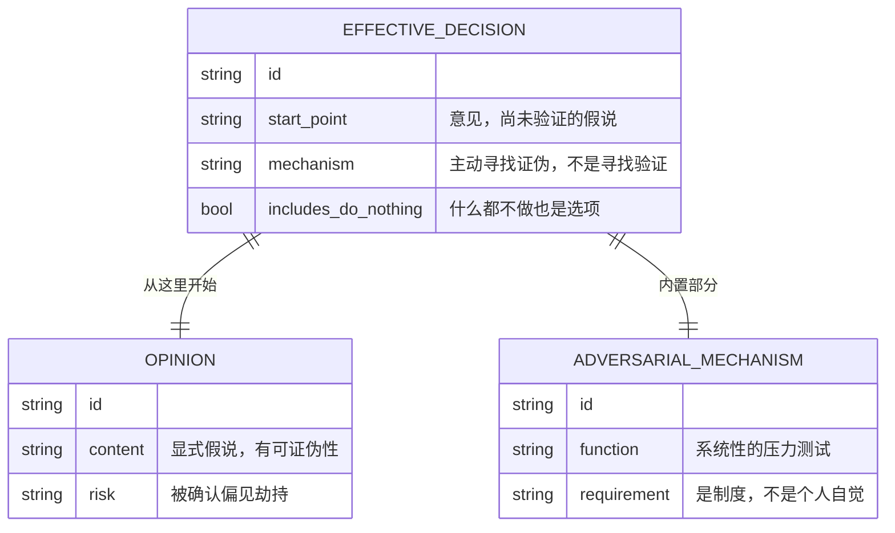
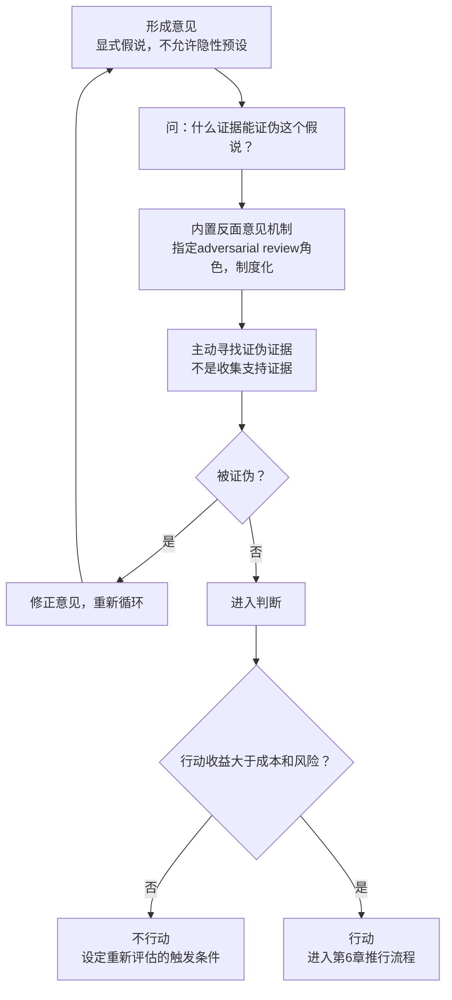

# 第7章：有效的决策

## ER骨架（第一次建模 → 修正）

第一次建模：



画完发现问题：EFFECTIVE_DECISION和OPINION之间用了 `||--||` 一对一关系，EFFECTIVE_DECISION和ADVERSARIAL_MECHANISM也是 `||--||`。两个一对一关系出现在同一个实体上，这是明显的过度拆分信号。

OPINION不是一个独立实体，它是EFFECTIVE_DECISION在初始阶段的必要起点属性（start_with_opinion = true / false）。ADVERSARIAL_MECHANISM是决策过程的一个步骤标志，不是独立实体。把这些概念建成独立实体，然后用一对一关系连接，是把流程步骤当成数据实体的经典错误——在ER设计里，流程步骤应该用状态字段或关联的流程记录表来建模，而不是给每个步骤建一个实体。

修正：OPINION的关键属性（显式假说、可证伪性要求）合并进EFFECTIVE_DECISION。ADVERSARIAL_MECHANISM作为DECISION_PROCESS的一个步骤记录。

---

## 概念自评（3×3）

| 概念 | 评分(1-3) | 卡点 |
|------|-----------|------|
| 从意见开始（显式假说） | 1 | 第一反应是"这不就是确认偏见吗"，需要重新理解区别 |
| 反面意见机制 | 1 | 知道重要，但对"制度 vs 个人自觉"的区分还模糊 |
| 什么都不做是决策 | 1 | 这个选项在我的决策习惯里几乎不存在 |

---

## 裁判循环

### 从意见开始——不是确认偏见

**第一直觉（错的）**：从意见开始不就是先入为主吗？

我读到这里的第一直觉是拒绝——"先形成意见，再用数据检验"，这不就是先有结论再找证据？这跟科学方法完全相反。做业务系统分析应该先收集数据，再形成判断，不是先判断再收集数据。

**哪里错了**：

确认偏见的问题在于：你不知道你有假设，所以你不知道应该检验什么。假设是隐性的，数据的选择、解读都在无意识地向隐性假设靠拢，你以为在"客观看数据"，实际在投影自己的预设。

"从意见开始"恰恰相反：把假设显式化。

两种方法的关键区别：
- 确认偏见：假设是隐性的 → 你不会问"什么证据能证明我是错的"
- 德鲁克方法：假设是显式的 → 你必须问"什么证据能证明这个假设是错的"，然后主动去找那个证据

**具体场景**：

在做业务系统分析时，他总是先写下："我认为这个系统的核心实体是X，性能瓶颈在Y，扩展性问题来自Z。"然后验证这三个假设。

不是先收集所有数据再形成观点。为什么？因为"先收集数据"没有聚焦点，你会收集到大量无关数据，然后在数据里寻找你潜意识里已经期待看到的模式——这才是真正的确认偏见。

显式假说让分析有了证伪目标：去找能推翻"核心实体是X"的证据。如果找到了，修正假设。如果没找到，假设通过检验。这个过程才是真正的系统分析，而不是数据浏览。

技术理由：这就是TDD（测试驱动开发）的决策层面版本。TDD要求先写测试（定义预期行为），再写代码让测试通过。测试失败 → 修改代码，不是修改测试。"从意见开始"= 先写测试，"用数据检验"= 运行测试，"被证伪则修正意见"= 修改代码而非修改测试。确认偏见 = 为了让测试通过而修改测试标准。

**正例**：
- 开始系统架构分析前，先写"我认为这个系统的读写比是8:2，瓶颈在读路径"，再用实际监控数据验证
- 做平台业务模型分析时，先写"我认为这个平台的核心供需匹配逻辑是X"，再和业务方逐条对比

**反例伪装**：
- "我们先把所有数据都整理一遍，然后看看有什么发现" → 这是没有假设的数据浏览，不是分析。发现的"规律"通常是隐性假设的投影

---

### 反面意见机制——为什么需要制度

**第一直觉（错的）**：只要团队成员都愿意说真话，就不需要专门的机制。

**哪里错了**：

一个正确的少数派意见，在组织内部会自然消亡。三个原因：
1. 权力结构压制异见（工程师不敢在架构评审里公开反驳首席架构师）
2. 确认偏见是默认设置（团队成员会自动过滤不符合主流判断的信息）
3. 社会成本（唱反调的人承担团队关系代价）

这三个力量在任何组织里都持续存在，不会因为"文化好"而消失。所以需要的是制度，不是个人自觉。

反面意见机制的最小可行实现：

在架构决策评审前，指定一个工程师（可以轮换）做adversarial review：
1. 整理所有支持这个架构方案的理由
2. 构造最强力的反驳（不是随机质疑，是系统性地找这个方案的致命弱点）
3. 提案人必须书面回应每一条反驳（不是推翻，是说明"为什么在存在这些风险的情况下仍然选择这个方案"）

这个过程不是为了否定方案，是为了在上线前找到方案的真实边界。

---

### 什么都不做是决策

**两个判断标准**：
1. 行动的收益 > 成本 + 风险？
2. 不行动的代价，和行动的风险相比，哪个更大？

如果两个问题的答案都指向"不行动"，那什么都不做就是正确决策。不是拖延，是主动选择。

**具体场景**：

一个平台考虑是否做一次微服务拆分重构。论据：现有单体服务在某些模块变更时影响范围太广。

用两个标准检验：
- 收益大于成本+风险吗？拆分后确实能隔离变更影响，但拆分过程需要6个月，期间功能交付暂停，引入分布式事务复杂度，测试覆盖需要重建。
- 不行动的代价？现有单体的维护成本是已知的，通过模块化（不拆分服务，改善内部边界）可以部分解决变更影响范围的问题，代价远低于完整拆分。

什么都不做（保持单体，改善内部模块化）是正确决策。不是因为懒，是分析后行动成本大于收益。

---

## 结构



---

## 可执行模型

```
IF 需要做系统架构或业务分析决策
THEN 先写下意见：我认为核心实体是X，瓶颈在Y，根因是Z
     再问：什么证据能证明我是错的？
     主动去找那个证据，不是找支持证据

IF 架构评审只听到赞成声音
THEN 这是危险信号，不是好消息
     主动指定一个人做adversarial review，要求书面构造最强反驳

IF 形成了一个系统改造方案
THEN 先问：什么都不做，三个月后的代价是什么？
     如果代价可以接受，不做

IF 意见通过了证伪检验，准备推行
THEN 进入第6章推行流程：谁执行？能力够？反馈节点在哪里？
```

---

## 结构接入（同构识别）

**同构：TDD（测试驱动开发）**

| TDD | 德鲁克决策方法 |
|-----|--------------|
| 先写测试（定义预期行为） | 先形成意见（显式假说） |
| 运行测试，观察失败 | 寻找证伪证据 |
| 修改代码让测试通过 | 收集数据，修正意见 |
| 不修改测试来迎合代码 | 不选择性忽视反驳 |
| 重构（优化实现，保持测试不变） | 推行决策（改进执行，保持方向） |

精确对应：
- 这里的先写测试 = 那里的先形成显式意见
- 这里的修改测试而非代码（TDD反模式） = 那里的确认偏见
- 这里的测试覆盖率 = 那里的假说被证伪尝试的次数

**同构：adversarial testing / red teaming**

软件安全里，红队（red team）专门尝试攻破系统，找漏洞。不是随机测试，是系统性地站在攻击者视角构造攻击。一个没有经过red team测试的系统，上线后被攻击是可预见的失败。

精确对应：
- 这里的red team = 那里的反面意见机制（adversarial review角色）
- 这里的安全漏洞 = 那里的决策盲点
- 这里的上线前测试 = 那里的决策执行前压力测试
- 这里的没有red team就上线 = 那里的没有反面意见机制就推行决策
