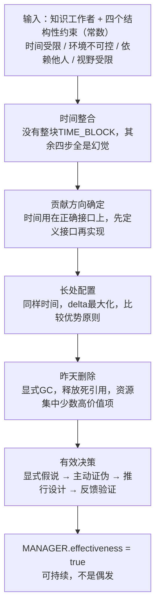

# 总模型：《卓有成效的管理者》可执行版

## 一、全书数据流图



五步是依赖链，不是并列菜单。没有整块时间，决策质量无从谈起。顺序不能颠倒。

---

## 二、触发条件矩阵

| IF（触发） | THEN（行动） | 所属维度 |
|-----------|------------|---------|
| 感到忙碌但成果模糊 | 问：这件事完成后，系统外部会有什么不同？说不出来 → 停下来重新定义工作 | 有效性 |
| 每天深度工作 < 90分钟 | 找浪费来源（会议 / 信息孤岛 / 重复劳动 / 配置错误），针对来源修复 | 时间 |
| 要开始领域建模或架构分析 | 预留整块时间，满足三个条件：足够长 + 物理不被打断 + 心理连续性 | 时间 |
| 建模被打断后 | 不强行继续，先记录当前状态，context已失效 | 时间 |
| 任何工作开始前 | 先写：完成后业务系统或组织有什么实质性不同？说不出来则重新定义 | 贡献 |
| 在架构决策中行为与宣称规范不符 | 意识到：你刚刚更新了团队的实际建模标准，行为比文档更直接 | 贡献-标准 |
| 要分配工作给团队 | 不问谁不忙或谁更强，问：谁在这里的delta最大？ | 长处 |
| 要设计或填充一个职位 | 先写工作要求（接口），再找人（实现），不能反过来 | 长处 |
| 工作清单超过5项且感到分散 | 放弃审计：如果今天不存在这项，我会重新启动吗？NO则执行free() | 要事 |
| 平台功能列表只增不减超过三年 | 零基础功能审计：先定义核心场景，再逐项justify，无法justify的下线 | 要事-GC |
| 遇到反复出现的系统问题 | 识别为经常性问题，对着结构动作（根因修复+通则建立），不是对着信号动作 | 决策要素 |
| 架构评审只听到赞成声音 | 这是危险信号，指定adversarial review角色，要求书面构造最强反驳 | 决策 |
| 准备做系统改造行动 | 先问：什么都不做三个月后的代价是什么？代价可接受 → 不做 | 决策 |
| 形成了系统架构决策 | 必须能回答：谁执行？有能力和资源吗？反馈验证点在哪里？不能回答 → 决策未完成 | 推行 |

---

## 三、CS同构对照表

| 德鲁克概念 | CS对应 | 精确对应关系 |
|-----------|--------|------------|
| 有效性（Effectiveness） | Fitness for purpose | 规格说明本身是正确的 |
| 效率（Efficiency） | Correctness | 符合规格说明 |
| 整块时间 | Batch processing | 高context-rebuild-cost的任务用批处理 |
| 时间碎片的代价 | Cache miss cost | context switch导致工作记忆失效 |
| 贡献导向 | Interface-first design | 先定义接口再实现，评估标准在接口层 |
| 比较优势 | Assignment problem最优解 | 最大化团队总产出，不是个人绝对最强 |
| 职位接口设计 | 依赖倒置原则（DIP） | 组织依赖职位定义，不依赖特定人 |
| 放弃昨天 | Explicit GC | 显式free()死引用，防止资源耗尽 |
| 要事专注 | 单线程执行模型 | 消除context switch，总产出更高 |
| 经常性问题建立通则 | O(n)到O(1) | 构建查找表，替代每次重新分析 |
| 从意见开始 | TDD | 先写测试（显式假说），再写实现（收集数据） |
| 反面意见机制 | Adversarial testing / red teaming | 上线前系统性压力测试 |
| 五要素决策 | 状态机（State Machine） | 非法状态跳转导致决策失效 |
| 约束是常数 | CAP定理 / System invariant | 在invariant内做设计选择，不是抱怨它 |

---

## 四、框架边界：这个框架在哪里不适用

**适用范围**：

```
IF 决策频率低（每月或更少）
AND 决策成本高（影响系统架构 / 团队结构 / 平台方向）
AND 后果不可逆（已发布的接口 / 已迁移的数据 / 已承诺的架构方向）
THEN 德鲁克五要素框架是合适的工具
```

**不适用范围**：

德鲁克的框架对低频高成本决策设计。但实际工作中大量决策是高频低成本的：一个sprint里用A方案还是B方案？这个函数用哪种设计模式？今天先处理哪个工单？

把五要素状态机搬到这些决策上，执行成本远高于决策本身的价值。这里需要的是轻量启发式规则（heuristics），不是决策框架。框架是工具，不是信仰。工具错配的后果是：重要决策用轻量规则（欠工程），轻量决策用重型框架（过度工程）。

---

## 五、同构对照的使用方式

这张对照表不是装饰。两个问题：

一，给你一个新的组织管理问题，你能找到它在CS里的同构吗？找到同构意味着你可以直接调用已有的技术直觉来处理这个管理问题。例如：一个团队不断出现相同类型的线上事故，处理方式是每次重新分析——这是O(n)在做可以O(1)的事，同构识别立刻指向解法：建立事故分类通则和标准处置流程。

二，找到同构之后，你能精确说出"这里的A = 那里的X，这里的B = 那里的Y"吗？不能精确说出对应关系，说明同构识别是模糊的，还没有到可用的程度。"感觉有点像"不算。

---

## 六、裁判循环（总模型层）

**第一直觉（错的）**：这五个维度是独立的改进方向，哪个薄弱就补哪个。

我当时的判断：这本书是个工具箱，根据自己的情况选用相关的章节。

**哪里错了**：

五步是依赖链，不是并列工具。这个错误会导致典型的"局部优化"陷阱。

具体场景：一个工程团队觉得决策质量有问题（第六章问题），于是引入了更严格的架构评审流程，要求更多文档、更多review轮次。结果：决策流程更重了，但每个工程师能用于深度思考的时间减少了。因为评审会议增加，时间更碎片化，没有整块时间来做真正的架构分析。决策质量没有提升，反而下降了。

为什么？因为跳过了步骤B（时间整合）直接跳到步骤F（决策质量）。依赖链被打断，局部优化反而加剧了全局问题。

技术理由：这是经典的局部优化（local optimization）vs 全局优化（global optimization）问题。在分布式系统里，优化单个节点的吞吐量，如果没有相应地优化上游输入和下游输出，可能导致整个系统的瓶颈更加突出。五步依赖链的每一步都是下一步的前置条件，不能跳过。

---

## 七、一个核心警告

忙碌是有效性最大的幻觉，对知识工作者尤其如此。

架构图画了三十张，需求文档覆盖了所有场景，评审通过了所有流程——这些都是efficiency指标。有效性问的是：系统上线后，业务实际上变了吗？平台的扩展性有没有真实提升？组织的决策质量有没有实质性改变？

如果这些指标回答不了那三个问题，那只是在高效地做错的事。Correctly implemented wrong spec.

两个问题作为结束检验：

一，这本书最核心的一个概念是什么？（不是"最重要的章节"，是"如果只保留一个概念，是哪个"）

二，你能用这本书的框架分析一个你实际遇到过的系统架构或组织管理问题吗？找到具体的触发条件和对应的行动，精确到"这是第几章的哪个概念，对应的行动是什么"。

能回答这两个问题，这本书的建模工作完成了。
