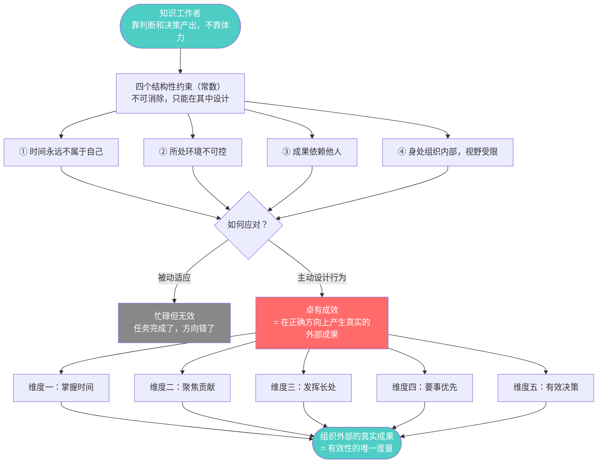
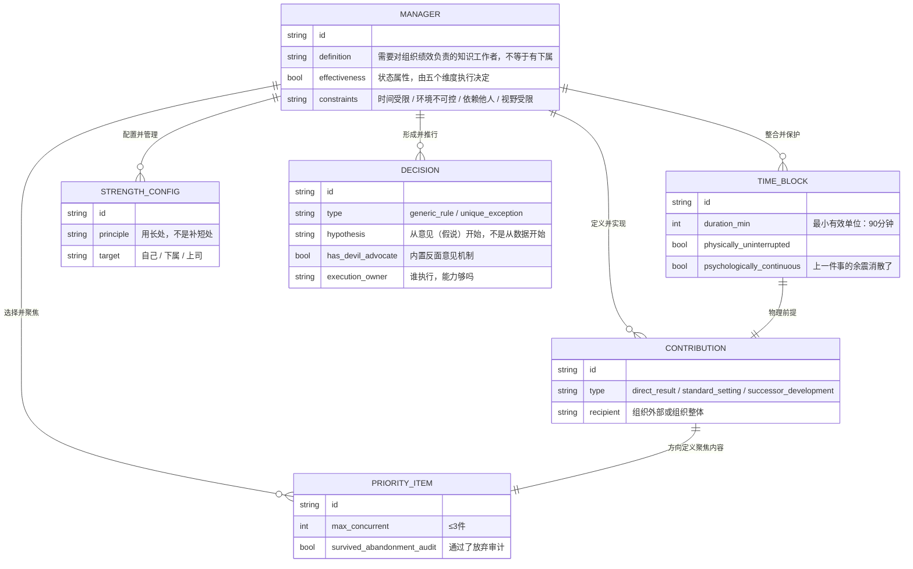
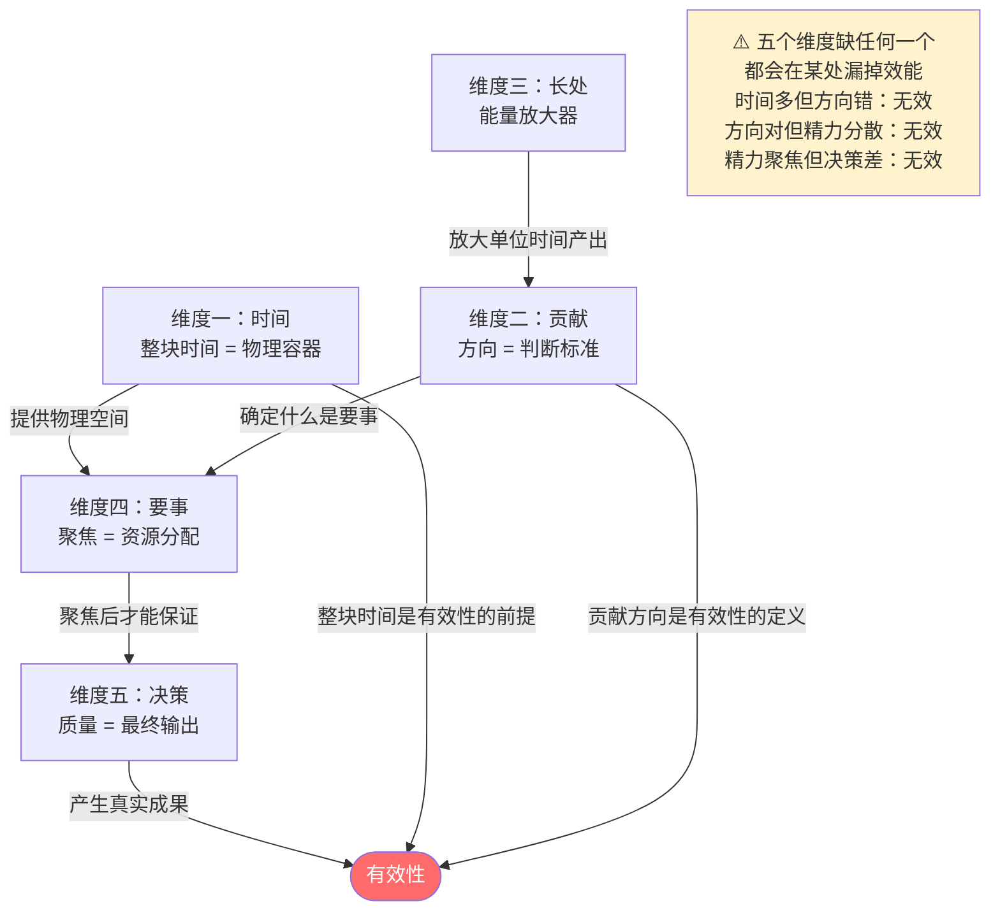

# 第零章：全书流图骨架——《卓有成效的管理者》
> 沈老师视角 · 2026-03-24

这本书在说一件事：知识工作者活在四个不可消除的约束里，但有效性是可以在这些约束内设计出来的。五个维度是设计工具，不是道德要求。

---

## 一、全书最高层抽象



**第一个要分清楚的边界**：有效性（Effectiveness）≠ 效率（Efficiency）。效率是把一件事做好了（实现层质量），有效性是这件事本身是对的（规格说明层质量）。一个把错误方向执行得非常精准的人，是高效率的无效性。

---

## 二、全书ER骨架



**骨架的关键洞见**：五个实体不是并列的工具箱，是依赖链。`TIME_BLOCK` 是物理前提——没有整块时间，`DECISION` 的质量就无从保证。`CONTRIBUTION` 是方向定义——方向错了，`PRIORITY_ITEM` 里的要事也是错的要事。

---

## 三、五维度依赖关系图



---

## 四、全书核心概念自评矩阵

| 维度 | 核心概念 | 第一遍读完的理解等级 | 主要卡点 |
|------|---------|------------------|--------|
| 有效性定义 | Effectiveness vs Efficiency | 2 | 说得出来，但压力下会退回efficiency模式 |
| 时间 | 整块时间三个条件 | 1 | 只想到"没会议"，心理连续性条件一直被忽视 |
| 贡献 | 三类贡献的操作化 | 1 | 直接成果清楚，标准建立和后继者培养说不清怎么做 |
| 长处 | 比较优势原则 | 2 | 对自己有感觉，对上司管理是完全的盲区 |
| 要事 | 放弃昨天的操作逻辑 | 1 | 知道应该放弃，但没有系统的放弃审计机制 |
| 决策 | 从意见开始 + 反面意见机制 | 1 | 意见先行是自然的，但制度化的反面意见机制从来没建立过 |

---

## 五、这本书对我的增量在哪里（诚实评估）

```mermaid
flowchart LR
    subgraph 已有认知（不是增量）
        K1["有效性比效率更重要\n早就知道"]
        K2["要聚焦，不要分散\n知道"]
        K3["要发挥长处\n知道"]
    end

    subgraph 真正的认知增量
        N1["时间管理三步的顺序：\n先记录再分析，不能跳过记录\n这个顺序是增量"]
        N2["上司管理：识别上司长处\n让上司的长处为自己工作\n这个方向完全没想过"]
        N3["放弃审计的操作化：\n每半年一次，如果今天不存在\n我会重新启动吗？这是工具"]
        N4["反面意见的制度设计：\n指定一人承担最强力反驳\n决策者必须书面回应\n这是制度，不是态度"]
    end

    K1 & K2 & K3 -.->|"没有新结构\n不是增量"| SKIP["跳过，不需要深入处理"]
    N1 & N2 & N3 & N4 -->|"有新结构\n需要深入建模"| PROCESS["进入裁判循环处理"]

    style SKIP fill:#888,color:#fff
    style PROCESS fill:#ff6b6b,color:#fff
```

---

*第零章完 · 骨架建立，方向确认 · 下面五章逐一深入*
