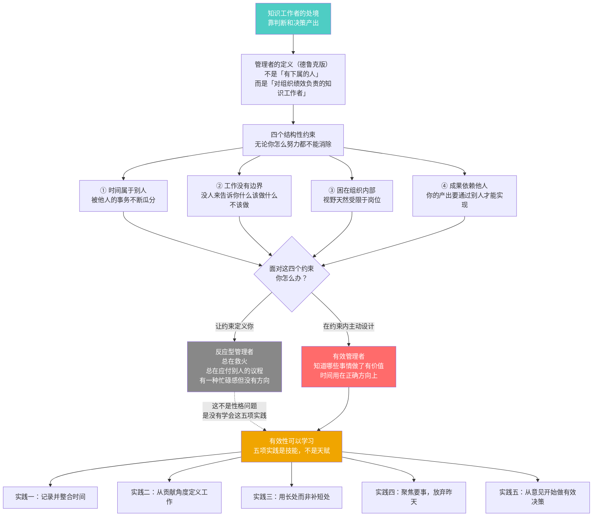
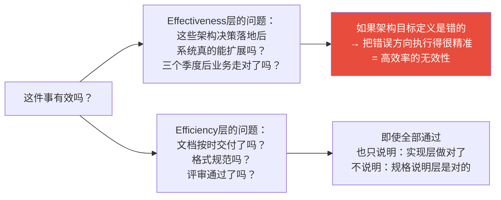
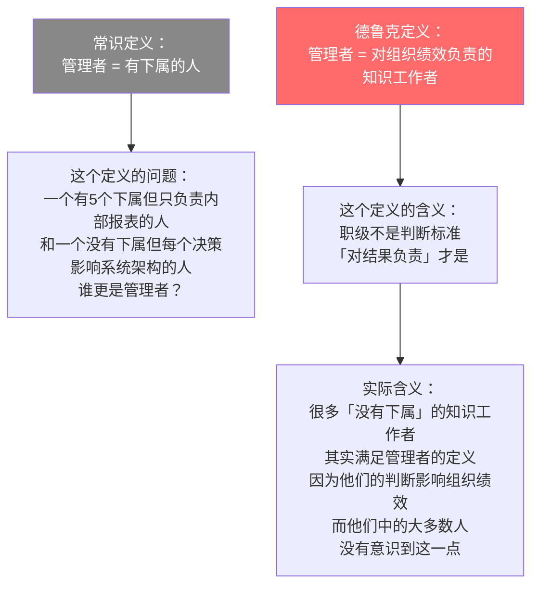
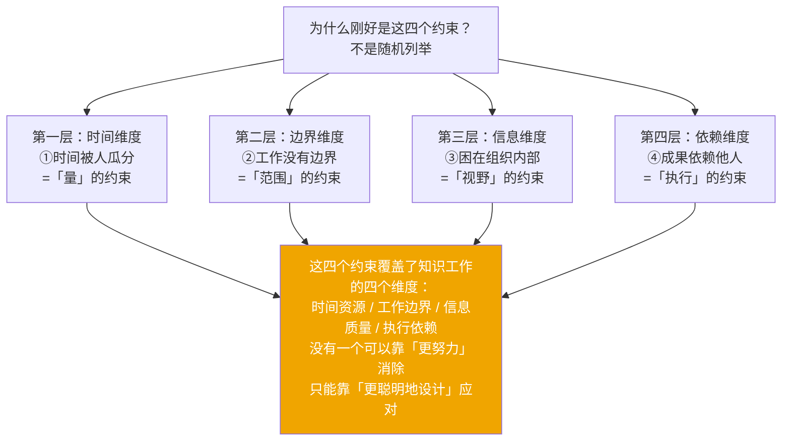

# 第1章：卓有成效是可以学到的
> 沈老师视角 · 2026-03-24

这章的核心命题：有效性不是天赋，是实践。四个约束是结构性的，有效性是在约束内设计出来的能力。

---

## 一、本章核心流图



---

## 二、关键概念裁判

### Effectiveness vs Efficiency：最容易混的边界

**第一直觉（常见的错法）**：

一个架构团队按时交付了所有设计文档，格式规范，评审通过率100%。这个团队有效吗？

很多人判断：有效，他们把设计工作做到了极致。

**哪里错了**：



**精确区分**：
- Efficiency = 符合规格说明（correctness）
- Effectiveness = 规格说明本身是正确的（fitness for purpose）

一个系统可以 correctly implemented + wrong spec = 高效但无效。

---

### 管理者定义：反直觉的部分

德鲁克的定义不是职级，是功能：**对组织绩效负责的知识工作者**。



**边界例**：
- 一个架构师，没有直接下属，但他的技术决策影响20个工程师的方向 → **是管理者**（德鲁克定义）
- 一个部门总监，有10个下属，但他的工作完全是执行上级指令，没有自主判断 → **在这个定义下不完全是**

---

### 四个约束：为什么是刚好这四个



---

## 三、同构识别

**斯多葛的控制二分法 ↔ 德鲁克的四个约束**

斯多葛：把世界分成「在我控制范围内」和「不在我控制范围内」，智慧在于区分两者并只为前者耗费精力。

德鲁克的四个约束 = 不在控制范围内的那一侧。五个实践 = 在控制范围内的那一侧。

结构完全同构：都是在接受外部不可控之后，全力设计内部可控的行动。

**系统工程 ↔ 德鲁克的约束**

约束（constraint）在系统设计里是 invariant——系统在任何运行状态下都必须满足的条件。好的架构师不是试图消除 invariant，而是在 invariant 的边界内做最优设计选择。四个约束是知识工作的 system invariant，CAP定理是分布式系统的 invariant——都是无法违反的，只能在其中做权衡。

---

## 四、可执行模型

```
IF 感到忙碌但不确定自己在做有效的工作
THEN 问一个问题：这件事完成后，系统外部（组织的客户/用户/受益方）
     会有什么实质性的不同？
     说不清楚 = 可能在做Efficiency，不是Effectiveness

IF 在判断某个人是否是「管理者」
THEN 不看职级，不看是否有下属
     问：他/她的判断和决策是否影响组织绩效？
     YES = 是管理者，应该按管理者的方式来要求有效性

IF 面对某个约束感到沮丧（"时间总是不够用"）
THEN 识别：这是四个结构性约束之一
     不是个人失败，是知识工作的物理定律
     停止试图消除约束，开始在约束内做设计
```

---

*第1章完 · 有效性是实践，不是天赋 · 四个约束是常数，五个维度是设计工具*
