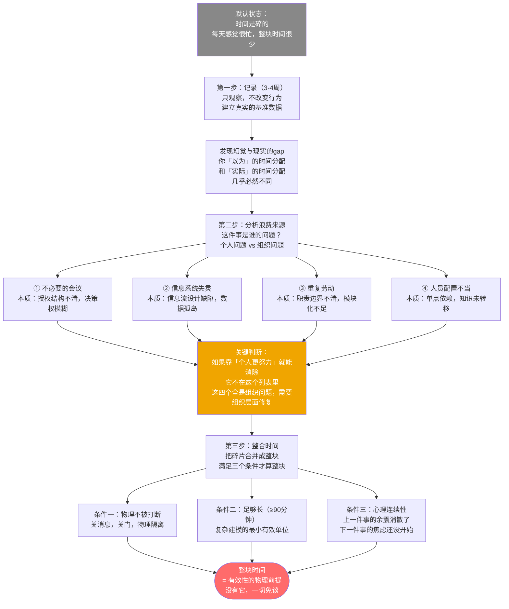
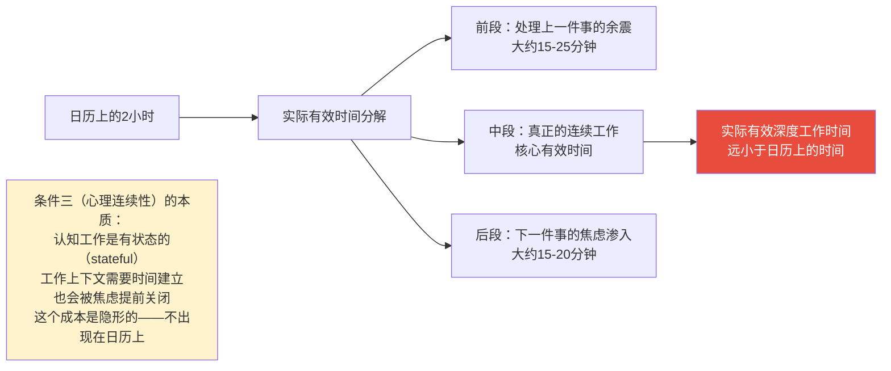
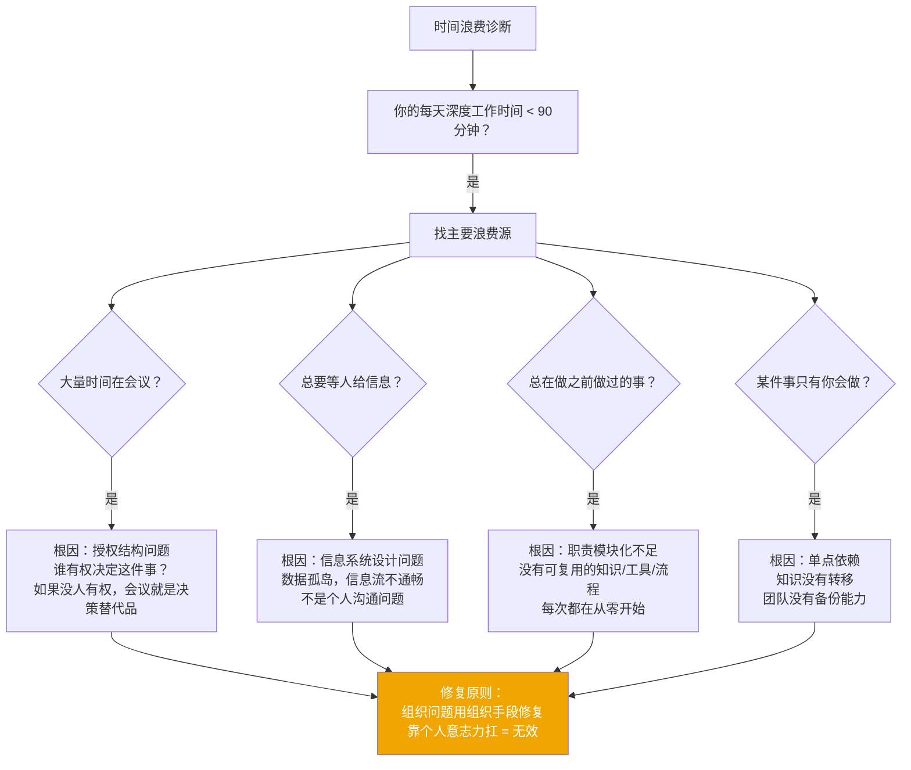

# 第2章：掌握自己的时间
> 沈老师视角 · 2026-03-24

时间管理不是"把日历排得更满"，而是找到是什么在吃掉你的时间，然后把碎片整合成整块。没有整块时间，后面四项实践全是幻觉。

---

## 一、本章核心流图



---

## 二、关键概念裁判

### 整块时间的三个条件

**这是本章最容易被忽视的洞见**：条件三（心理连续性）是很多人从来没注意到的。

**典型错误**：整块时间 = 日历上没有会议的时间段。

有过这样的情况：把上午10:00-12:00清空，准备做领域建模。但10:00坐下来，脑子里还在处理9:50刚结束的需求评审里一个没对齐的规则，花了25分钟消化余震。11:30开始想12:30有架构对齐会，提前备稿。实际专注时间：约45分钟。

日历上是120分钟，实际有效时间是45分钟。



**为什么是90分钟最小单位**：

复杂建模（ER建模、架构决策、业务领域分析）在脑子里同时维护着实体、关系、约束、跨系统边界。这是 CPU 密集型工作，不是 I/O 密集型。I/O 密集型任务可以时间分片——等待时 CPU 去做别的。但建模工作没有"等I/O"的间隙，切换就是纯粹的浪费，而且 context switch 成本极高：类似 CPU 缓存失效，每次切换都要把所有上下文重新 load 一遍。

---

### 四个浪费来源：诊断工具



---

## 三、同构识别

**OS 的批处理 vs 时间分片 ↔ 德鲁克的整块时间**

批处理（batch processing）：把相同类型的高 context-switch-cost 任务攒在一起处理，减少切换开销。

时间分片（time-slicing）：每个任务都得到一小片时间，看起来并发，实际每个任务都在付 cache invalidation 的代价。

知识工作应该用批处理架构：同类高认知负荷的任务，攒成整块处理。

精确对应：
| 德鲁克的概念 | OS 对应 |
|------------|--------|
| 整块时间 | Batch processing window |
| 时间碎片的隐性代价 | Context switch cost |
| 被打断后重建工作上下文 | Cache miss + reload |
| 心理连续性被破坏 | Working memory invalidation |

**数据库事务 ↔ 整块时间**

数据库事务有原子性（A）：要么全做，要么全不做，不允许中间状态。复杂建模工作有类似特性：ER 图的建模过程中间状态是不完整的，被打断后"部分完成的模型"并不比"没开始的模型"好多少，因为中间状态的一致性无法保证。整块时间相当于给这个工作加了事务锁。

---

## 四、可执行模型

```
IF 从来没做过时间记录
THEN 先记录1周（每小时一次），只观察不改变行为
     目标是建立基准数据，不是立刻优化
     假设：你以为的时间使用方式和实际的几乎肯定不同

IF 每天深度工作时间 < 90分钟
THEN 找主要浪费来源（会议 / 信息不畅 / 重复劳动 / 单点依赖）
     针对来源做组织层面的修复
     不靠意志力扛，靠系统设计

IF 需要做复杂工作（领域建模 / 系统架构 / 业务分析）
THEN 预留整块时间（≥90分钟）
     满足三个条件：物理不被打断 + 足够长 + 前后各留15分钟 buffer
     前面 buffer：清掉上一件事的余震
     后面 buffer：在焦虑渗入之前完成并归档

IF 深度工作被打断
THEN 不要强行继续，context 已经失效
     先把当前状态记录下来（已确认的实体和关系）
     重新评估是否有条件继续
```

---

*第2章完 · 时间管理 = 资源调度问题 · 先建基准数据，再找瓶颈，再做资源重新分配*
