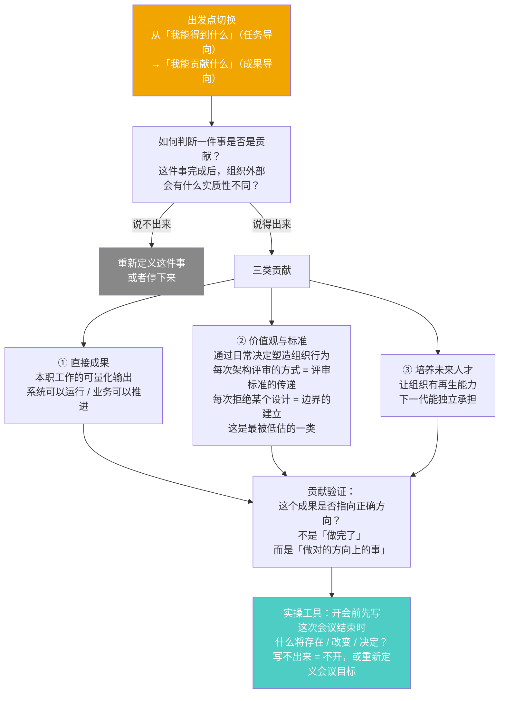
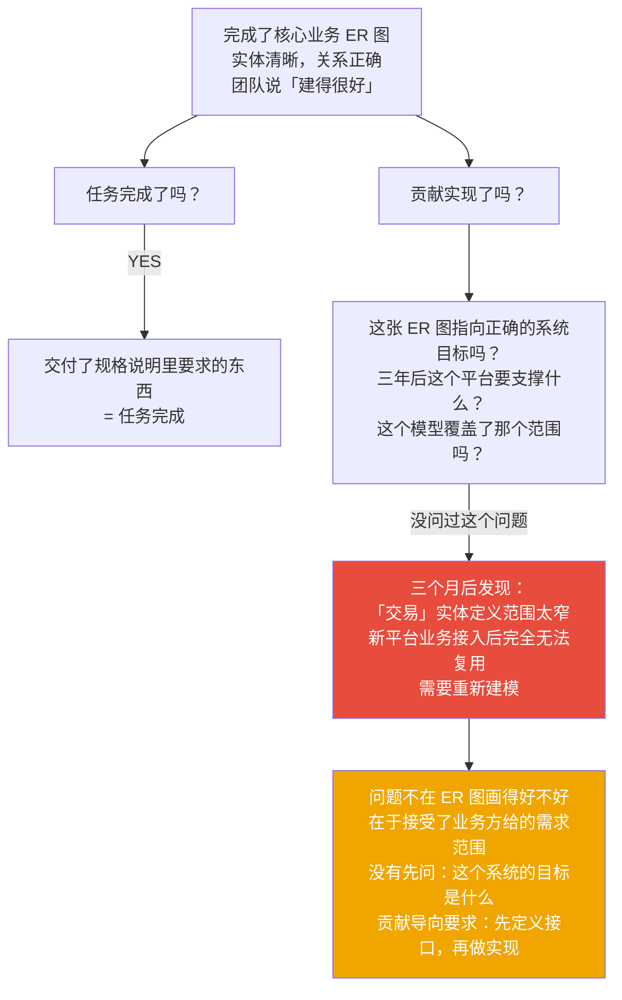
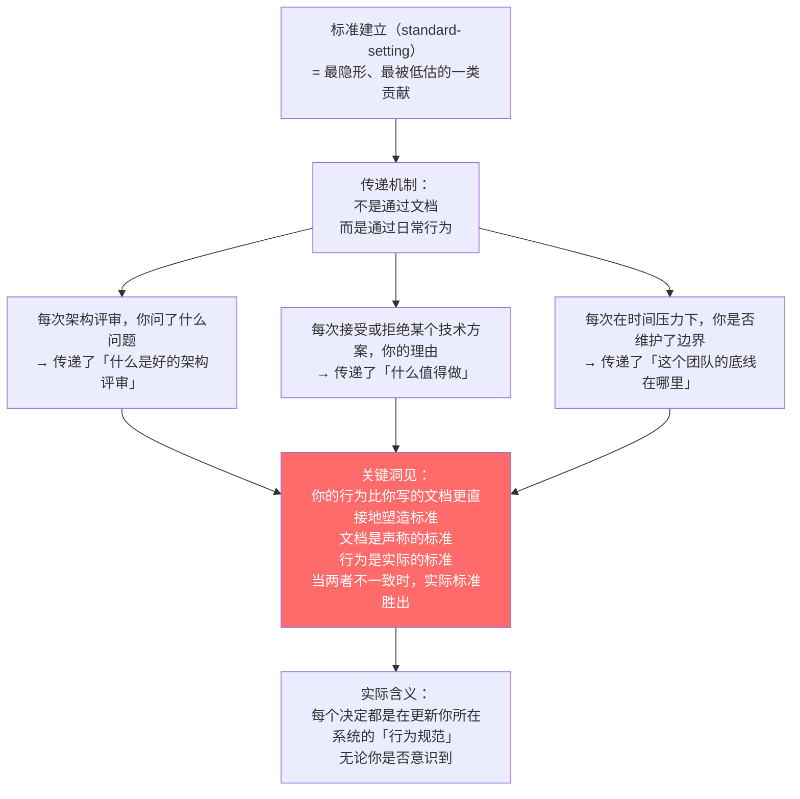
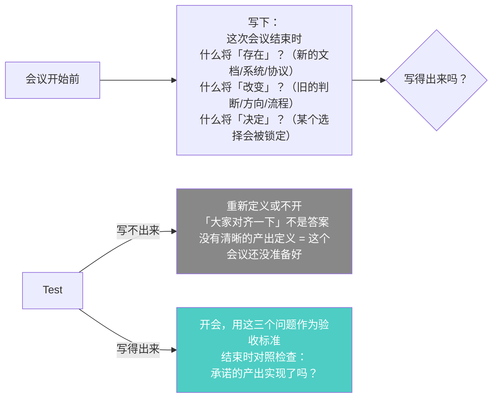

# 第3章：我能贡献什么
> 沈老师视角 · 2026-03-24

这章的核心是思维方向的切换：从「我能得到什么」（任务导向）→ 「我能贡献什么」（成果导向）。切换点在于先定义接口，再做实现。

---

## 一、本章核心流图



---

## 二、关键概念裁判

### 贡献导向 vs 任务导向

**典型错误**：我完成了一个核心业务的 ER 图，包括所有实体、关系、约束，这是贡献吗？

第一反应：是，这是直接成果，交付了实实在在的东西。

**哪里错了**：



**精确区分**：
- 任务导向：接受别人定义的 spec，把它实现好
- 贡献导向：先验证 spec 本身是否指向正确方向，再实现

接口优先（Interface-first design）：先定义接口，再写实现。贡献导向就是在管理工作里的接口优先。

---

### 标准建立：最被低估的一类贡献



---

### 贡献导向开会法

这是本章最可操作的工具：



---

## 三、同构识别

**Interface-first design ↔ 贡献导向**

好的 API 设计原则：先写接口（interface），再写实现（implementation）。接口定义了"这个组件对外承诺什么"，评估标准在接口层，不在实现层。

贡献导向就是这个原则在管理工作里的应用：先定义"这个工作对组织外部承诺什么成果"（接口），再去执行（实现）。评估标准在接口层——这个成果方向是否正确，而不是实现层——任务完成得有多精确。

**依赖倒置原则（DIP）↔ 贡献导向中的职位设计**

DIP：高层模块不应依赖低层模块，两者都应依赖抽象（接口）。在组织设计里：职位不应该围绕某个特定的人来设计（依赖具体实现），而应该围绕工作要求（接口）来设计，再找能满足接口要求的人（实现）。反过来做——先有人，再给他安排工作——违反了 DIP，组织就像依赖了具体实现类的高层模块，人一走，耦合就断裂了。

---

## 四、可执行模型

```
IF 在开始任何工作之前
THEN 先写：这件事完成后，系统外部（组织的客户/用户/受益方）
     会有什么实质性不同？
     说不清楚 = 重新定义这件事，不要直接开始

IF 准备召集或参加一个会议
THEN 先写三个问题的答案：
     - 会议结束时什么将「存在」（新的）？
     - 什么将「改变」（从旧到新）？
     - 什么将「决定」（选择被锁定）？
     写不出来 = 重新定义会议目标，或者取消

IF 在做架构评审或技术决策
THEN 意识到：你这次问了什么问题、接受了什么标准
     = 你在更新团队的实际技术标准
     行为比文档更直接，要刻意使用这个标准建立的作用
```

---

*第3章完 · 贡献导向 = 接口优先 · 先定义系统对外承诺什么，再做实现*
