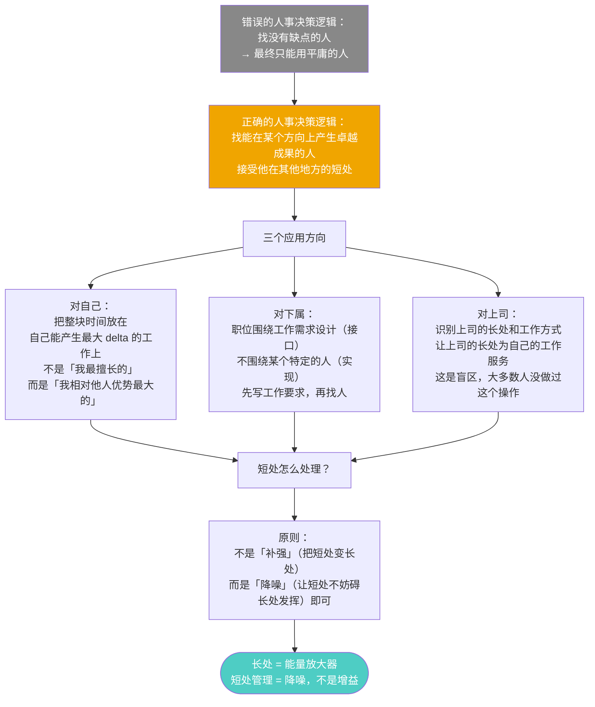
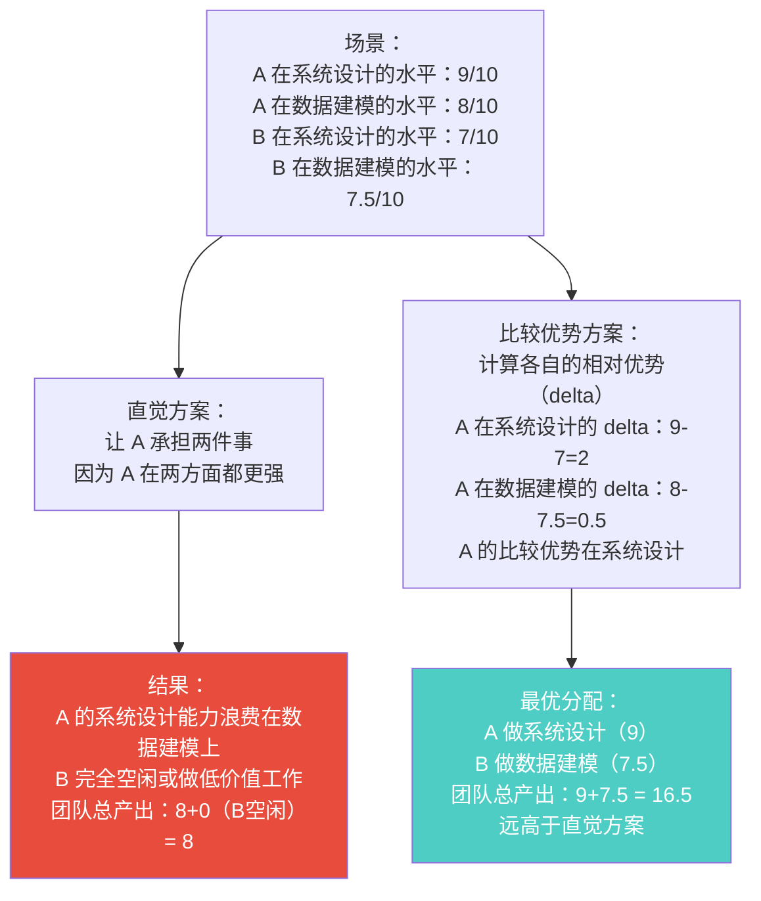
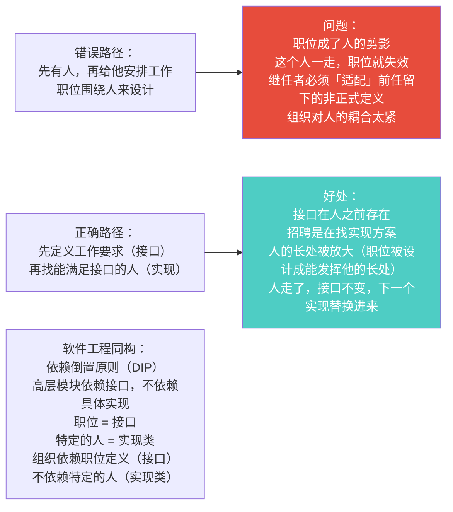
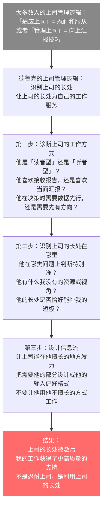

# 第4章：发挥人的长处
> 沈老师视角 · 2026-03-24

这章的核心：人事决策的出发点不是「谁没有缺点」，而是「谁在哪里能产生最大的增量（delta）」。短处管理不是目标，降到不妨碍长处发挥才是目标。

---

## 一、本章核心流图



---

## 二、关键概念裁判

### 比较优势：delta 最大原则

**第一直觉（错的）**：如果架构师 A 在系统设计和数据建模两个方向都比架构师 B 强，应该让 A 把两件事都承担。

判断：合理，因为 A 的产出质量更高。

**哪里错了**：



**核心洞见**：资源分配的目标是最大化团队总产出（assignment problem 的最优解），不是让每个人都在做自己的绝对最强项，也不是让最强的人做所有重要的事。

这是经济学比较优势原理（comparative advantage）在团队管理里的直接应用。

---

### 职位接口设计：先接口后实现



**诊断信号**：如果一个职位的要求写成了特定某人的技能列表，而不是工作需要产生什么成果，那这个职位是围绕人设计的，不是围绕工作设计的。

---

### 上司管理：最大的认知盲区

这是本章最反直觉的部分，也是真正的认知增量。



**一个诊断性问题**：你上司最擅长做什么判断？上一次你的工作利用了那个判断是什么时候？如果答不上来，说明你还没做过上司管理。

---

## 三、同构识别

**比较优势（Comparative Advantage）↔ Assignment Problem**

经济学的比较优势原理：即使一个国家在所有商品的生产上都比另一个国家更高效，两国通过专业化（各做自己的相对优势项）和贸易，仍然可以都获益。

在团队管理里：即使 A 在所有任务上都比 B 强，通过专业化分工，仍然可以最大化团队总产出。

这是 Assignment Problem（分配问题）的线性规划解法：最大化总收益，不是最大化个体最优。

**GC（垃圾回收）↔ 短处管理**

短处管理不是让短处变成长处，而是让短处降到"不泄漏、不崩溃"的程度。这就是 GC 的逻辑——不需要让内存永远满满当当，只需要确保不会内存泄漏（短处不妨碍系统正常运行）。

---

## 四、可执行模型

```
IF 需要在团队里分配工作
THEN 不问「谁更强」或「谁更闲」
     问：谁在这个任务上的 delta（相对其他人的优势）最大？
     目标是最大化团队总产出，不是让最强的人承担所有重要工作

IF 需要设计或填充一个职位
THEN 第一步：写清楚这个职位需要产生什么成果（接口，与人无关）
     第二步：再找能满足这个接口的人（实现）
     检验：职位描述能不能在不提到任何具体人名的情况下说清楚？

IF 要与上司合作一件重要的事
THEN 先诊断：上司是「读者型」还是「听者型」？
     他在什么类型的决策上判断最准？
     设计信息流，让他能在他擅长的地方发力

IF 团队成员有明显短处影响工作
THEN 先问：这个短处是否遮蔽了他的长处？
     是 → 调整职责到不妨碍；否 → 接受，不做无谓的补短尝试
```

---

*第4章完 · 长处 = 能量放大器 · 短处管理 = 降噪，不是增益 · 上司管理 = 激活上司的长处为自己服务*
