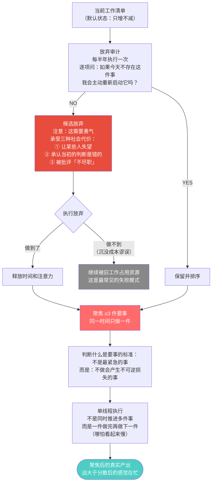
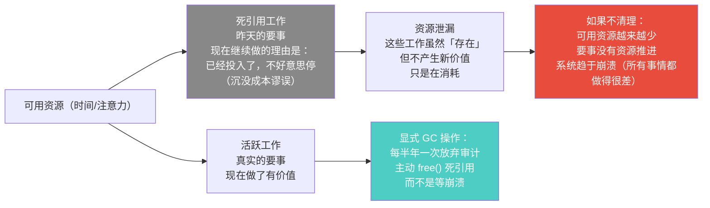
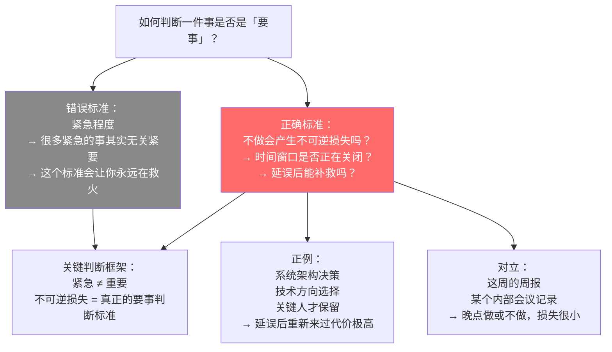
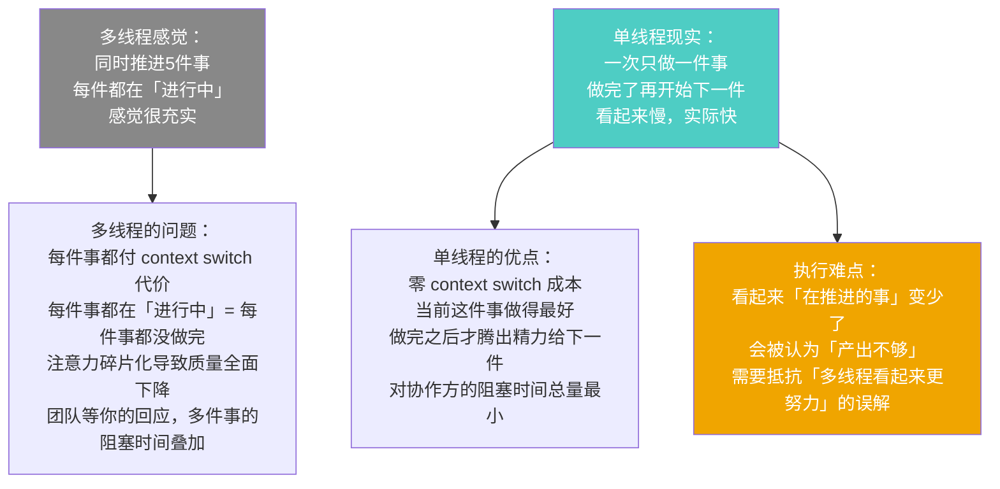

# 第5章：要事优先
> 沈老师视角 · 2026-03-24

这章最核心的洞见不是「要聚焦」（这个大家都知道），而是：「放弃昨天」需要勇气，需要一个显式的操作机制。聚焦的障碍不是不知道要聚焦，而是旧工作不会自动消失。

---

## 一、本章核心流图



---

## 二、关键概念裁判

### 放弃昨天：显式 GC

**老德这里说得绕，翻译成工程语言**：

"放弃昨天"本质上是一个显式垃圾回收（explicit GC）问题。

在 C 语言里，内存不会自动释放。过期的对象，如果你不手动 `free()`，它们会一直占用内存，直到程序崩溃或内存耗尽。"昨天的工作"就是这些死引用（dead references）——曾经有价值，现在没有了，但仍然占用资源。它们不会自动消失，因为没有 GC。需要手动释放。



**典型错误**：一个平台型产品的功能清单只增不减，认为功能越多代表平台越成熟。

**哪里错了**：功能是死代码的完美类比。功能越多，每个功能的维护成本越高（测试/文档/兼容性），用户的认知负担越重，工程师的心智负担越大。真正成熟的平台不是功能最多的，而是用最少的核心功能覆盖最关键的场景，并且有勇气删掉使用率极低的功能。

---

### 要事的判断标准：紧急 vs 不可逆



---

### 单线程执行：为什么一次只做一件事



---

## 三、同构识别

**技术债清理 ↔ 放弃昨天**

技术债是过去的工程决策在现在继续产生利息（维护成本、变更阻力）。不主动清理技术债，代码库会越来越难以改动，直到被迫重写。

放弃昨天是同一个结构：过去的工作承诺在现在继续消耗资源（时间、注意力）。不主动清理，个人的执行系统会越来越沉，直到什么都做不好。

清理的逻辑也一样：不是一次全清，而是定期审计（技术债评审 / 放弃审计），按优先级逐步清理，以释放资源给高价值工作。

**巴菲特的25个目标清单 ↔ 德鲁克的要事优先**

巴菲特的建议：写下25个你想做的目标，圈出5个最重要的，然后把剩下20个列为「回避清单」——不是「以后再做」，而是主动避开。

结构同构：都在说聚焦的代价是放弃，而放弃比选择更难，需要主动制度化来保证它被执行。

---

## 四、可执行模型

```
IF 当前工作清单超过 5 项且感到分散
THEN 执行放弃审计：
     逐项问：如果今天这件事不存在，我会主动重新启动它吗？
     NO → 候选放弃，开始 free() 操作
     YES → 保留，进入优先级排序

IF 在判断是否应该做某件事
THEN 不问「这件事紧急吗」
     问：不做这件事会产生什么不可逆损失？
     如果损失可逆且可延迟 → 不是要事，放到后面

IF 发现自己同时在推进超过 3 件事
THEN 停下来，排序，选最重要的一件做完再开始下一件
     接受「在推进的事变少了」的外部观感

IF 某个项目 / 功能 / 工作已经存在超过 2 年
THEN 触发放弃审计：这个东西现在还值得做吗？
     评估标准：现在的使用情况、维护成本、和当前方向的相关性
     如果不符合放弃条件，明确记录「为什么继续」
```

---

*第5章完 · 聚焦的代价是放弃 · 放弃不会自动发生，需要显式操作 · 放弃需要勇气，因为它有社会代价*
