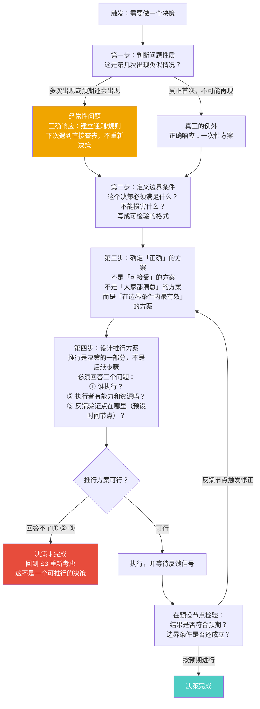
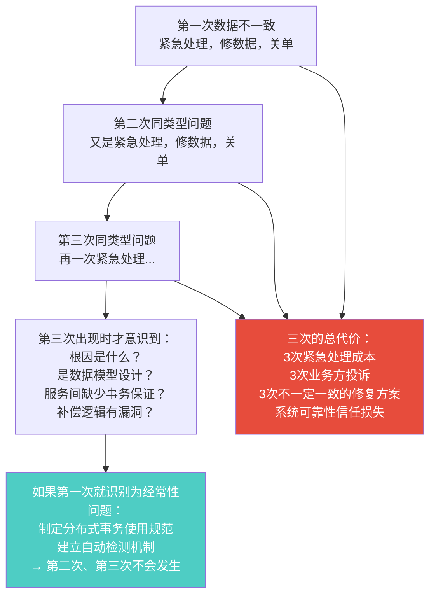
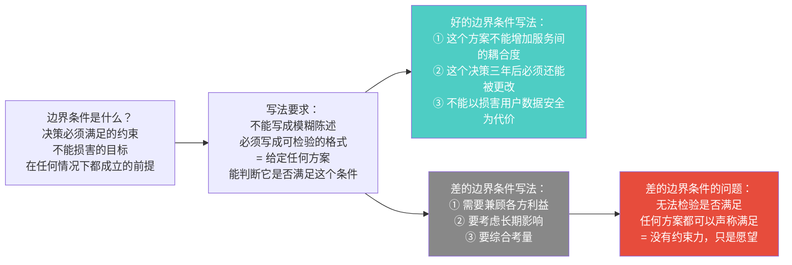
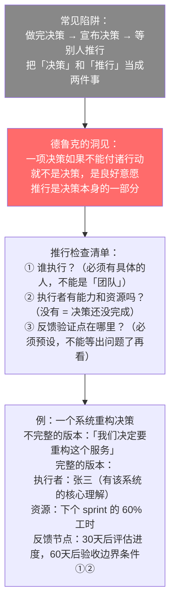

# 第6章：决策的要素
> 沈老师视角 · 2026-03-24

这章讲决策的结构。关键洞见：决策不是「选择」，是「状态机」——有五个步骤，缺一步都不算完成决策。另一个洞见：推行是决策的一部分，不是决策之后的事。

---

## 一、本章核心流图（决策状态机）



---

## 二、关键概念裁判

### 经常性 vs 例外：最重要的第一步

**典型错误**：线上出现了数据不一致 bug，紧急处理：定位问题，修数据，发公告，关单。这是一次有效的决策处理吗？

第一反应：是，响应及时，问题解决了。

**哪里错了**：



**复杂度分析**（工程视角）：
- 对着信号动作（每次当例外处理）= O(n) 代价
- 建立通则（根因修复 + 规范建立）= O(1) 查表代价

用 O(n) 做可以 O(1) 的事是性能问题，也是决策有效性问题。

**经常性问题的识别信号**：这类问题出现超过一次，或者你预期它还会出现。一旦识别为经常性，应该建立通则，不是应急处理。

---

### 边界条件：决策的约束定义

这是最难操作化的概念，但也是最关键的一步。



**一个诊断性问题**：给定你当前最重要的决策，把它的边界条件写出来。能不能对任意一个方案，回答"它满足 / 不满足这个条件"？如果不能，边界条件还没写清楚。

---

### 推行是决策的一部分



---

## 三、同构识别

**状态机（State Machine）↔ 决策的五个步骤**

决策的五个步骤是一个状态机：问题性质识别 → 边界条件定义 → 方案确定 → 推行设计 → 反馈验证。非法的状态跳转（跳过某步直接进入下一步）导致决策失效。

最常见的非法跳转：
- 跳过边界条件（S2）直接做方案（S3）→ 方案满足了什么约束？不知道
- 跳过推行设计（S4）直接宣布执行（S5）→ 谁做、怎么做不清楚，决策停在纸上

**O(n) → O(1) 复杂度优化 ↔ 建立通则**

每次遇到经常性问题都重新分析和决策 = O(n)，n 是问题出现次数。建立通则，问题出现时直接查表 = O(1)。通则建立的一次性成本 = O(k)，k 是通则的复杂度，通常 k << n × 单次分析成本。

---

## 四、可执行模型

```
IF 遇到一个问题需要决策
THEN 第一个问题：这类问题之前出现过吗？以后会再出现吗？
     YES → 经常性问题，目标是建立通则，不是解决这一次
     NO  → 真正的例外，一次性方案

IF 准备做一个重要决策
THEN 先写边界条件：
     格式：「这个方案不能 X / 必须满足 Y」
     测试：给定任意方案，你能判断它满足还是不满足吗？
     不能判断 = 边界条件还没写清楚

IF 一个决策已经确定了方案
THEN 在宣布之前，先回答三个问题：
     ① 谁执行？（具体的人）
     ② 执行者有能力和资源吗？
     ③ 什么时候检验结果？（具体的时间节点）
     回答不了 → 决策还没完成

IF 反复遇到同类型的问题（>2次）
THEN 识别为经常性问题
     停止应急处理，切换到「建立通则」模式
     根因分析 → 制定规范 → 下次直接查表
```

---

*第6章完 · 决策是状态机，不能跳步 · 推行是决策的一部分，不是后续 · 经常性问题要建通则，不是每次从零分析*
