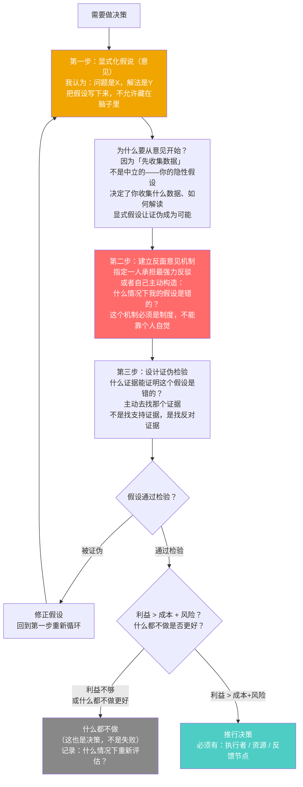
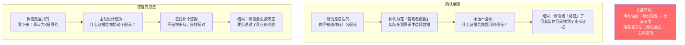
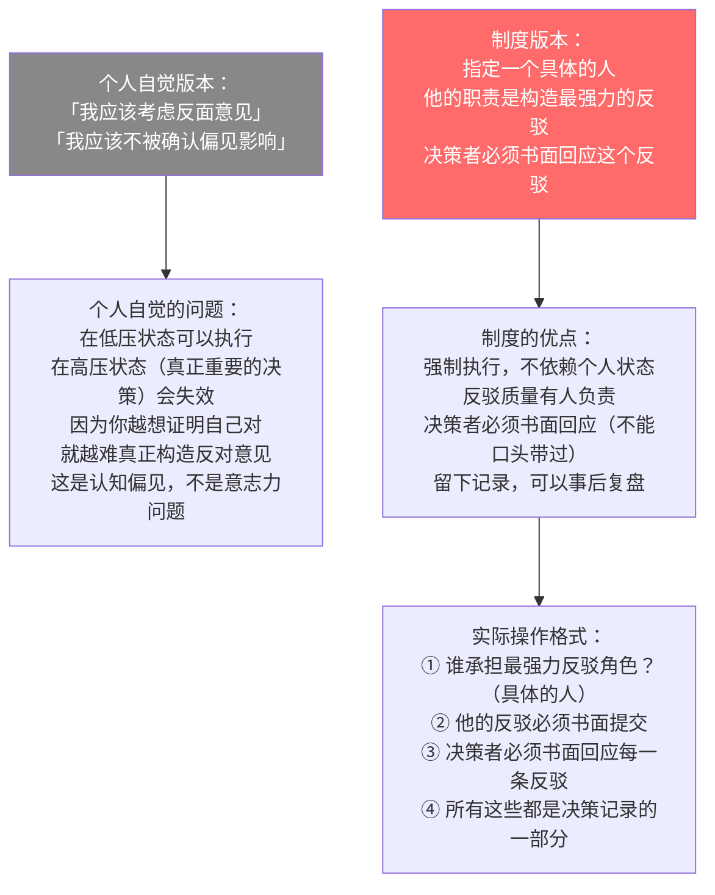
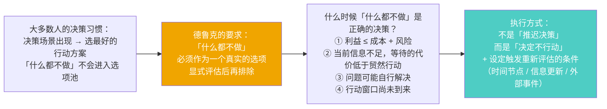

# 第7章：有效的决策
> 沈老师视角 · 2026-03-24

这章讲有效决策的执行机制。两个核心洞见：① 从意见（假说）开始不是确认偏见，而是它的对立面；② 反面意见机制必须是制度，不能依赖个人自觉。

---

## 一、本章核心流图



---

## 二、关键概念裁判

### 从意见开始：不是确认偏见，是它的对立面

**第一直觉（错的）**：从意见开始不就是先入为主吗？先有结论再找证据，这不是科学方法的反面吗？

**哪里错了**：



**TDD 同构**：这是 TDD（测试驱动开发）的决策层面版本。
- TDD：先写测试（定义预期行为）→ 写代码让测试通过 → 测试失败就修代码，不修测试
- 有效决策：先写假设 → 设计证伪检验 → 被证伪就修假设，不修检验标准

确认偏见 = 为了让测试通过而修改测试标准。

---

### 反面意见机制：制度 vs 个人自觉

**这是本章最大的认知增量**：



**诊断性问题**：你上一次重要决策时，谁提出了最强力的反对意见？你是如何书面回应的？如果没有，说明你的决策过程缺少这个机制。

---

### 什么都不做：被忽视的选项



---

## 三、同构识别

**波普尔证伪主义 ↔ 德鲁克的决策方法**

波普尔：科学命题的真正有效性标准不是能被验证，而是能被证伪。不能被证伪的命题不是科学，是形而上学。

德鲁克的决策方法的底层结构完全相同：一个假设（意见）如果无法被设计成可证伪的形式，它就不是一个真正有效的决策起点，而是一个信念声明。

精确对应：
- 波普尔的科学命题 = 德鲁克的「意见」（显式假说）
- 波普尔的可证伪性 = 德鲁克的「能设计出什么情况下我是错的」
- 波普尔的证伪实验 = 德鲁克的「主动寻找反面证据 + 反面意见机制」

**Adversarial Testing / Red Teaming ↔ 反面意见机制**

安全工程里的 Red Teaming：在上线前，专门组建一个团队，他们的职责是找出系统的漏洞。这个团队的职责是「攻击」，不是「防御」。不是随机测试，是针对性压力测试。

反面意见机制就是决策的 Red Team：在推行前，专门设计一个「攻击」决策本身的机制，找出决策的漏洞。

---

## 四、可执行模型

```
IF 面对任何需要决策的情况
THEN 第一步：写下显式假设
     格式：「我认为 [问题的本质] 是 [X]，解法应该是 [Y]，
             因为 [Z]。我认为自己是错的情况是 [W]」
     缺少最后一句 = 假设还没有显式化

IF 在做重要决策（影响大 / 可逆性低）
THEN 指定一个人承担反驳角色
     要求：书面提交最强力的反驳
     要求：决策者书面回应每一条反驳
     这两个「书面」都是刚性要求，不能口头替代

IF 架构评审或决策会议只听到赞成声音
THEN 这是危险信号
     主动问：谁能给出这个方案最强力的反对意见？
     没有人回答 = 临时指定一人承担这个角色

IF 准备推行一个决策
THEN 先显式评估「什么都不做」：
     - 不行动的代价是什么？（30天后，90天后）
     - 利益是否 > 成本 + 风险？
     - 行动窗口是否已经到来？
     如果「什么都不做」代价可接受 → 设定触发重新评估的条件，先不动
```

---

*第7章完 · 从意见开始 = 显式假说 + 主动证伪 · 反面意见机制必须制度化 · 什么都不做是真实的选项*
