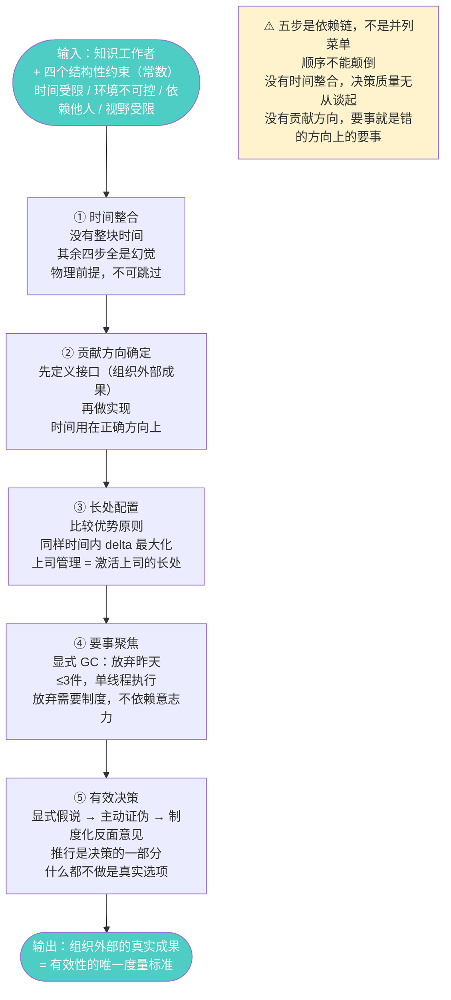
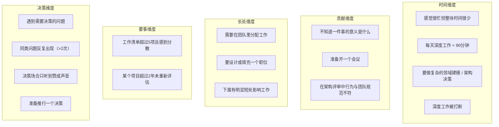
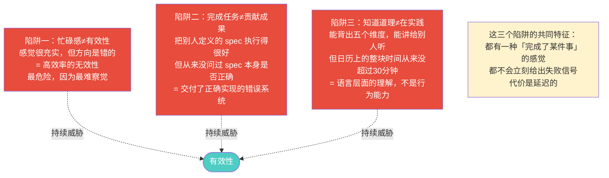

# 总模型：《卓有成效的管理者》可执行版
> 沈老师视角 · 2026-03-24

这一章是工厂的最终输出：把前面七章全部压缩成一个可操作的系统。书是原料，这是成品。

---

## 一、全书数据流（依赖链）



---

## 二、触发条件矩阵（if-then 完整版）



| 触发条件 | 行动处方 | 维度 |
|--------|---------|------|
| 感觉很忙但整块时间很少 | 做1周时间日志，每小时记一次，只观察不改变，建立基准数据 | 时间 |
| 每天深度工作 < 90分钟 | 找主要浪费源（会议/信息孤岛/重复劳动/单点依赖），针对来源做组织修复 | 时间 |
| 要做复杂建模 / 架构决策 | 预留整块时间（≥90min），满足三个条件：物理不被打断 + 足够长 + 前后留15min buffer | 时间 |
| 深度工作被打断 | 不强行继续，先记录当前状态，context已失效 | 时间 |
| 不知道一件事的意义 | 问：这件事完成后，组织外部会有什么实质性不同？说不清楚 = 重新定义 | 贡献 |
| 准备开一个会议 | 先写：什么将存在/改变/决定？写不出来 = 不开或重新定义目标 | 贡献 |
| 行为与团队规范不符 | 意识到：你刚更新了团队的实际标准，行为比文档更直接 | 贡献 |
| 需要分配工作 | 不问「谁更强」，问「谁在这件事上的delta最大」 | 长处 |
| 要设计一个职位 | 先写工作要求（接口），再找人（实现），不能反过来 | 长处 |
| 下属有明显短处 | 先问：短处是否遮蔽了长处？是 → 调整职责；否 → 接受 | 长处 |
| 工作清单超过5项 | 放弃审计：如果今天不存在，我会重新启动吗？NO → 候选放弃 | 要事 |
| 某项目超过2年未评估 | 零基础重新评估：现在值得做吗？如果不符合放弃条件，记录「为什么继续」 | 要事 |
| 遇到需要决策的问题 | 第一步判断性质：这类问题出现过几次？多次 = 建通则；首次 = 具体处理 | 决策 |
| 同类问题反复出现 | 停止应急处理，切换到「建立通则」模式：根因分析 → 制定规范 | 决策 |
| 决策场合只听赞成声音 | 危险信号！指定一人承担最强力反驳，要求书面提交，决策者书面回应 | 决策 |
| 准备推行一个决策 | 先显式评估「什么都不做」；确认：谁执行？能力够吗？反馈节点在哪？ | 决策 |

---

## 三、同构对照表（完整版）

| 德鲁克概念 | CS / 工程对应 | 精确对应关系 |
|-----------|------------|------------|
| 有效性（Effectiveness） | Fitness for purpose | 规格说明本身是正确的，而不只是实现正确 |
| 效率（Efficiency） | Correctness | 符合规格说明，规格说明对不对是另一回事 |
| 整块时间 | Batch processing | 高 context-rebuild-cost 的任务批量处理 |
| 时间碎片的隐性代价 | Cache miss cost | context switch 导致工作记忆失效 |
| 心理连续性 | Working memory state | 被打断后工作上下文需要重新 load |
| 贡献导向 | Interface-first design | 先定义接口再实现，评估标准在接口层 |
| 标准建立 | Implicit API versioning | 你的行为在更新团队的实际行为规范 |
| 比较优势 | Assignment Problem 最优解 | 最大化团队总产出，不是个人绝对最强项 |
| 职位接口设计 | 依赖倒置原则（DIP） | 组织依赖职位定义（接口），不依赖特定人（实现） |
| 放弃昨天 | Explicit GC | 显式 free() 死引用，防止资源耗尽 |
| 要事专注 | 单线程执行模型 | 消除 context switch，总产出更高 |
| 经常性问题建立通则 | O(n) → O(1) | 构建查找表，替代每次重新分析 |
| 从意见开始 | TDD | 先写测试（显式假说），再收集数据（让测试通过） |
| 反面意见机制 | Adversarial testing / Red team | 上线前系统性压力测试，职责制度化 |
| 什么都不做是选项 | YAGNI 原则 | 不需要的功能不实现，不需要的行动不执行 |
| 四个约束是常数 | System invariant | 在 invariant 内做设计选择，不是试图消除它 |

---

## 四、三个陷阱：持续威胁有效性的敌人



---

## 五、框架边界：这个框架在哪里不适用

```
适用范围：
IF 决策频率低（每月或更少）
AND 决策成本高（影响系统架构 / 团队结构 / 平台方向）
AND 后果不可逆（已发布的接口 / 已迁移的数据 / 已承诺的架构方向）
THEN 这个框架的完整流程是合适的工具

不适用范围：
IF 决策高频且可逆（每天几十次的技术选择）
THEN 用直觉和快速实验，不用五步流程

IF 明确的最优解存在（有定理或工程标准）
THEN 用已有标准，不需要假说-证伪流程

IF 极度时间压力下需要立刻行动
THEN 先行动，事后复盘，而不是先完成五步决策流程
```

---

## 六、这本书真正给我的东西（诚实评估）

| 维度 | 输入前的状态 | 真实增量 |
|------|-----------|---------|
| 有效性定义 | 有直觉，边界模糊 | 三条可操作标准（方向正确/外部成果/持续） |
| 时间管理 | 知道要整合，但从没做过记录 | **「先记录再分析」这个顺序是真正的增量** |
| 贡献导向 | 在工程决策中实践过，但不知道这是原则 | 把这个原则从工程语境中普适化了 |
| 长处发挥 | 对自己执行得好，对下属和上司执行不稳定 | **上司管理（让上司的长处为自己服务）是盲区** |
| 要事优先 | 有聚焦本能，但没有放弃操作框架 | **放弃审计 + 放弃的社会代价 = 真正的新工具** |
| 有效决策 | 意见先行是自然的，但从没制度化反面意见 | **反面意见机制的制度设计是最大增量** |

加粗的三条是真正的认知增量，其他是已有认知的结构化确认。

---

*总模型完 · 书是原料，人是工厂 · 理解 = 行为能力，不是语言能力*
