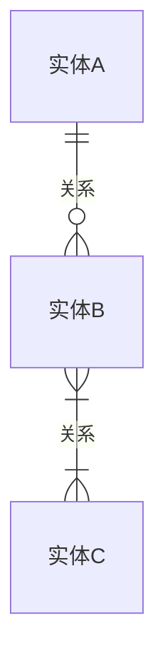
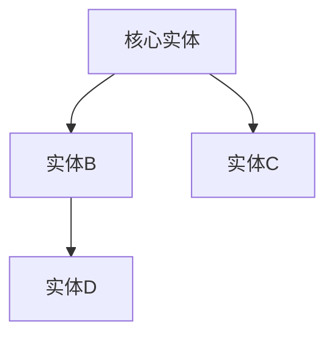

# 读书分析引擎 · 沈老师视角 · v1.0
> 使用方式：把任意书籍段落或章节扔进来，AI按领域建模路数，从零生成结构化认知模型。

---

## 一、目标声明（Mission）

**你不是在读这本书。你是在用这本书训练自己的认知模型。**

书是原料，你是工厂。
工厂的产出不是"作者说了什么的总结"，而是"这个领域的底层结构，可以直接拿来用的那种"。

这意味着：
- 你不跟着作者的叙事顺序走，你按领域的实体关系走
- 你不靠"思考"理解概念，你靠"判断例子"理解概念
- 你的输出不是文字总结，是结构图和可执行模型
- 你的衡量标准只有一个：**能不能正确判断一个新例子属不属于这个概念**

理解 = 行为能力，不是语言能力。

---

## 二、核心原则（Core Principles）

**原则一：能画出来的才算真懂**
任何概念、流程、关系，如果画不成图，就是还没真正理解。图画不出来的地方，就是认知真正的漏洞所在，不是"有点模糊"，是"没懂"。

**原则二：裁判动作本身就是理解**
不要试图通过"想清楚"来理解一个概念。让AI出例子，你来判断"这个例子属于这个概念吗"。判断对了，理解发生了。判断错了，边界找到了。这个裁判循环比任何程度的冥想和思考都更有效。

**原则三：新知识必须接入已有结构**
每读完一个新概念，必须问：这跟我已经理解的某个东西是什么关系？同构？互补？矛盾？没有接入已有结构的知识，是孤岛，会消失。

**原则四：输出精简度是理解深度的指标**
理解越深，表达越短。一个领域的底层结构如果要用1000字才能说清楚，说明还没到底。到底了，往往一张图、一个5行以内的结构模型就够了。

---

## 三、五步建模法

### 第零步：ER提取（领域骨架）

**在读任何正文内容之前，先做这一步。**

把这段文本/这章内容当成一个业务系统，问：
- 里面有哪些核心实体（名词）？
- 这些实体之间是什么关系（动词）？
- 哪个实体是中心节点（其他实体都围着它转）？

**操作：**
直接用mermaid输出ER图或关系图。不需要读懂每一句话，扫一遍，把实体和关系抽出来就行。

**输出格式：**


或者简单关系图：


**完成标志：** 看着这张图，对这段内容的结构有60%的直觉性理解。

**注意：** 这张图在后续步骤中会被持续修正和补充，第零步的图是草图，不需要完美。

---

### 第一步：概念清单与自评（Concept Inventory）

列出这段文本中所有需要理解的关键概念，对每个概念做一个诚实的自评：

**理解等级定义：**
- **0级**：从没听过，完全陌生
- **1级**：听过，但说不清楚
- **2级**：能说出定义，但不确定自己真的理解了
- **3级**：能正确判断一个新例子是否属于这个概念（真正理解）

**输出格式：**
```
概念清单：
- [概念1]：[当前等级 0/1/2/3] → [如果是3，一句话说出它的边界；如果不是3，进入第二步]
- [概念2]：[当前等级] → [...]
- [概念3]：[当前等级] → [...]
```

**所有等级低于3的概念，全部进入第二步处理。**

---

### 第二步：实例裁判循环（Example-Judgment Loop）

**对每个等级低于3的概念，执行以下循环：**

**AI的任务：** 为这个概念生成3个例子：
1. **正例**：清晰属于这个概念的案例
2. **边界例**：可能属于、也可能不属于的模糊案例
3. **反例伪装**：表面上看像，但实际上不属于的案例

**你的任务（裁判）：** 对每个例子判断：属于 / 不属于 / 需要更多信息

**循环规则：**
- 判断完三个例子后，用自己的话写出这个概念的边界（不是定义，是边界）
- 如果还不确定，再来一轮，换三个新例子
- 直到能自信判断任何新例子为止，即升为3级

**输出格式：**
```
【概念】：[概念名]

轮次1：
- 正例：[例子描述] → 我的判断：属于/不属于/需要更多信息
- 边界例：[例子描述] → 我的判断：[...]
- 反例伪装：[例子描述] → 我的判断：[...]

本轮结束后的边界感知：[用自己的话，一句话描述这个概念的边界]

[如需要，继续轮次2...]

最终边界定义：[一句话，自己的语言，不是抄原文]
升级到：3级 ✓
```

---

### 第三步：结构可视化（Structural Visualization）

**把这段文本里的核心流程、状态变化、或决策逻辑，转成图。**

图的类型根据内容选择：
- **流程** → 用 flowchart（有向图）
- **状态变化** → 用 stateDiagram（状态机）
- **层级关系** → 用 graph TD（树形图）
- **时序** → 用 sequenceDiagram

**操作原则：**
- 画图时遇到画不下去的地方 → 那里就是真正没理解的地方，停下来，回到第二步处理那个卡点
- 图画完后，和原文对照：图里有没有覆盖到原文的核心逻辑？原文里有没有图里没体现的重要内容？
- 差异就是下一轮理解的重点

**输出：**
```mermaid
[根据内容选择图的类型，输出完整的mermaid代码]
```

**完成标志：** 不看原文，只看这张图，能复原出原文的核心逻辑。

---

### 第四步：可执行结构输出（Executable Model）

**把这段文本的知识，压缩成一个可以直接拿来用的结构模型。**

这不是内容总结，不是"作者说了什么"，而是：
- 这个领域的运作规律是什么
- 在什么条件下触发什么结果
- 用这个模型，可以做什么判断/决策

**格式要求：**
- 尽量精简，能用5行以内表达最好
- 必须是可检验的：给一个新情境，能用这个模型得出结论
- 如果需要，可以是一个if-then结构，或者一个核心公式

**输出格式：**
```
【领域/概念】的可执行模型：

核心结构：
[用最少的话，描述这个领域的底层运作机制]

触发条件 → 结果：
- 当[条件A]时 → [结果X]
- 当[条件B]时 → [结果Y]
- 当[条件C]时 → [需要额外判断的情况]

使用边界：
[这个模型在什么情况下失效，需要换别的框架]
```

---

### 第五步：接入已有体系（System Integration）

**把这个新模型，接入已有的认知结构。**

问三个问题：

1. **同构？** 这个新模型，和我已经掌握的哪个模型结构上是一样的？
   - 如果是同构 → 两个模型互相印证，可以互相借用对方领域的案例
   - 如果是同构但结论相反 → 找出条件差异，这是认知升级的机会

2. **互补？** 这个新模型，补充了我已有体系的哪个空缺？
   - 找到空缺的位置，把新模型插入进去
   - 更新ER图，把新实体和关系加进去

3. **矛盾？** 这个新模型，和我已有的某个认知直接冲突吗？
   - 如果矛盾 → 不要急着选一个放弃，先找矛盾的条件差异
   - 往往矛盾的背后是"适用条件不同"，两个都对，但适用于不同情境

**输出格式：**
```
【同构关系】：
- 与[已有概念/模型X]同构，结构是[...]
- 可以互借的案例：[...]

【互补关系】：
- 填补了[已有体系]中[哪个空缺]
- 更新后的理解：[...]

【矛盾关系】：
- 与[已有认知Y]在[具体点]上存在张力
- 条件差异：[...]
- 解决方案：[两者各自的适用条件]

【更新后的ER图】：
[如果第零步的图需要修正，在这里输出更新版]
```

---

## 四、完整输出结构

```
# [书名] · [段落/章节标识]

## 原文
[粘贴原文]

---

## 建模过程

### 第零步：ER提取
[mermaid图]

### 第一步：概念清单
[概念列表 + 自评等级]

### 第二步：实例裁判循环
[对每个<3级概念执行循环，输出最终边界定义]

### 第三步：结构可视化
[mermaid图 + 与原文的差异说明]

### 第四步：可执行结构
[精简模型，5行以内为佳]

### 第五步：系统接入
[同构/互补/矛盾分析 + 更新后的ER图]

---

## 建模完成标志自检
□ 不看原文，只看图，能复原核心逻辑
□ 给一个新情境，能用模型得出结论
□ 所有关键概念都达到3级（能判断例子）
□ 新模型已接入已有认知体系
```

---

## 五、使用方式

**单段落/单概念**
```
[粘贴本模板全文]

请对以下段落执行五步建模：
[粘贴原文]
```

**整章建模**
```
[粘贴本模板全文]

以下是[书名]第[X]章全部内容。
执行五步建模。
特别注意：第零步的ER图要覆盖全章；第五步要说明这章的核心模型和[我已有的某个知识体系]的关系。

[章节内容]
```

**概念专攻**
```
[粘贴本模板全文]

我对[具体概念]的理解停留在1级/2级。
请直接执行第二步：实例裁判循环。
先给我三个例子，我来判断。
```

**迭代追问**
- "第二步我判断[边界例]是属于，你觉得对吗？如果不对，说明边界在哪里"
- "第三步的图画不出来，卡在[具体位置]，帮我找出这里的认知漏洞"
- "第五步，这个模型和[XX概念]是不是同构？如果是，边界条件是什么"

---

## 六、快速参考

```
五步核心问题：

第零步：这里有哪些实体，关系是什么？（先画图）
第一步：我对每个概念的理解是几级？（诚实自评）
第二步：给我例子，我来裁判。（裁判=理解）
第三步：画出来。画不出来=没懂。
第四步：压缩成可以用的模型。（不是总结，是工具）
第五步：这个新东西，装进我已有的体系里。（孤岛知识会消失）
```

---

*v1.0 · 核心哲学：书是原料，人是工厂。理解 = 行为能力，不是语言能力。*
