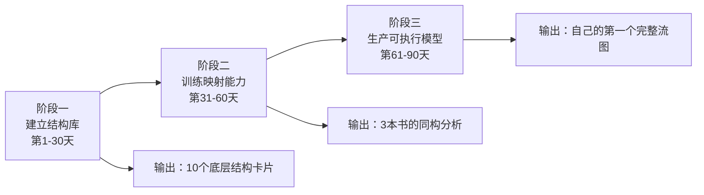

# 90天认知突破计划：从"看懂流图"到"生产流图"

> 为 shen260324 定制 · 2026-03-24 启动

---

## 【诊断】你当前的真实状态

### 已掌握能力
- ✅ 能看懂沈老师的流图（理解力）
- ✅ 感受到差距存在（觉知力）
- ✅ 有学习意愿和行动力

### 核心缺失
- ❌ **同构识别能力**：只能在书的语境理解，无法跨域映射
- ❌ **ER建模能力**：在做文本总结，没有做概念工程
- ❌ **可执行模型能力**：输出知识笔记，没有输出行为工具

---

## 【路径】三阶段能力建设



---

## 阶段一：建立结构库（第1-30天）

### 目标
从0到10个可复用的底层结构模式

### 为什么这是第一步
沈老师能做同构识别，是因为他脑中有**结构库**：
- 瓶颈分析（工程）
- 证伪逻辑（哲学）
- ER建模（数据库）
- 资源调度（系统设计）
- ...

**你看不到高度，是因为没有这些结构作为"接入点"。**

### 具体训练方法

#### Week 1-2：识别现有结构（从熟悉领域提取）

**任务1：提取你工作中的5个底层模式**

问自己：
- 我在工作中反复用到的决策框架是什么？
- 我解决问题时的通用步骤是什么？
- 我评估方案时的判断标准是什么？

**输出格式**：
```markdown
## 结构卡片：[结构名]

**来源领域**：[你最熟悉的领域]
**核心模式**：[用3-5个实体+关系描述]
**可识别特征**：[在其他领域看到什么就能认出这个结构]
**已知实例**：[至少3个不同领域的例子]
```

**示例**：
```markdown
## 结构卡片：漏斗模型

**来源领域**：产品转化分析
**核心模式**：
- 实体：阶段1、阶段2、...、最终目标
- 关系：每阶段 → 下一阶段（有转化率）
- 约束：瓶颈阶段决定最终产出

**可识别特征**：
- 有连续阶段
- 每阶段有损耗
- 最窄处决定全局产出

**已知实例**：
1. 销售漏斗（线索→商机→成交）
2. 招聘漏斗（简历→面试→offer→入职）
3. 德鲁克的时间管理（记录→分析→整合）← 新识别
```

**本周目标**：完成5张卡片

---

#### Week 3-4：扩展结构库（从经典模型学习）

**任务2：学习并内化5个跨域通用结构**

推荐起点（按学习难度排序）：

1. **二分法结构**
   - 来源：斯多葛哲学（控制二分）、设计原则（关注点分离）
   - 实例：德鲁克的"四个困境（外部）vs 五个实践（内部）"

2. **反馈循环**
   - 来源：控制论、系统思考
   - 实例：PDCA、OODA、德鲁克的"决策→反馈→修正"

3. **约束理论**
   - 来源：TOC（瓶颈管理）
   - 实例：德鲁克的"时间是唯一约束"

4. **假说-检验循环**
   - 来源：科学方法、精益创业
   - 实例：德鲁克的"意见→反驳→修正"

5. **层次依赖**
   - 来源：系统架构、马斯洛需求
   - 实例：德鲁克的"五维度依赖图"

**学习方法**：
- 每个结构用1周时间
- 找3个不同领域的实例
- 写成卡片（同Week 1格式）

**本周目标**：累计10张结构卡片

---

### Week 1-4 输出物

一个文件：`我的结构库_v1.md`，包含：
- 10张结构卡片
- 每张卡片有至少3个跨域实例
- 用Mermaid画出核心关系图

---

## 阶段二：训练映射能力（第31-60天）

### 目标
用你的结构库，重新分析3本书，生产"同构分析"

### 为什么这是第二步
有了结构库，你才能"看出"新内容中的熟悉模式。
**沈老师的高度，不是他比你聪明，是他见过1000个实例，你只见过10个。**

### 具体训练方法

#### Week 5-6：重读《卓有成效的管理者》

**任务3：用你的10个结构，重新标注这本书**

**操作步骤**：
1. 打开你的`结构库_v1.md`
2. 重读德鲁克每一章
3. 每次看到能映射的地方，标注：
   ```markdown
   **第3章P47**：这里是【反馈循环】结构
   - 德鲁克的实例：决策→执行→30天反馈→修正
   - 我的卡片中的另一个实例：产品迭代→上线→数据监控→调整
   - 为什么是同一个结构：都有"预设检查点+根据偏差调整"
   ```

**输出**：`德鲁克_同构分析.md`
- 至少找到20处映射
- 每处说明"为什么是同一个结构"

---

#### Week 7-8：分析第二本书（选1本）

**推荐书单**（选你最感兴趣的）：
- **工程类**：《人月神话》（软件工程）
- **商业类**：《从优秀到卓越》（柯林斯）
- **哲学类**：《思考，快与慢》（卡尼曼）
- **方法类**：《金字塔原理》（麦肯锡）

**任务4：用同样方法分析新书**
- 输出：`[书名]_同构分析.md`
- 目标：找到15处与你结构库的映射

---

#### Week 9-10：分析第三本书

**任务5：选一本完全不同领域的书**

**关键要求**：
- 如果第二本是工程类，第三本必须选哲学/商业/心理学
- 强迫你在陌生领域寻找熟悉结构

**输出**：`[书名]_同构分析.md`

---

### Week 5-10 输出物

三个同构分析文件，合并写一个：
```markdown
# 我的跨域映射报告

## 我的10个结构在3本书中的分布

| 结构名 | 德鲁克 | 书2 | 书3 | 总计 |
|--------|--------|-----|-----|------|
| 反馈循环 | 5处 | 3处 | 2处 | 10处 |
| ...    | ...  | ... | ... | ...  |

## 新发现的结构（候选加入v2）
- [在3本书中反复出现但我结构库里没有的模式]
```

---

## 阶段三：生产可执行模型（第61-90天）

### 目标
为一本新书，生产你自己的完整流图（沈老师标准）

### 为什么这是第三步
前两阶段你在"识别"，现在要"设计"。
**沈老师的流图不是笔记，是工具。工具的标准：给定情境，输出行动。**

### 具体训练方法

#### Week 11：选书 + 拆解任务

**任务6：选一本你想深度掌握的书**

**标准**：
- 不能是前面分析过的3本
- 必须是"方法类/框架类"书（不是故事类）
- 你希望真正用它改变行为

**拆解任务**：
参考沈老师的流图结构，你需要产出：
1. ✅ 核心论点流（这本书在说什么）
2. ✅ 内部结构（每个关键维度的展开）
3. ✅ 跨域同构图（与你的结构库映射）
4. ✅ 可执行模型（if-then矩阵）
5. ✅ 增量评估（对你有什么新价值）

---

#### Week 12-13：生产流图

**任务7：每周完成2-3个部分**

**质量标准**（对标沈老师）：
- [ ] 用Mermaid画流程图（不是文字列表）
- [ ] 每个节点是"实体"或"关系"（不是观点句子）
- [ ] 有if-then矩阵（给定情境→输出行动）
- [ ] 有同构分析（至少3个跨域映射）
- [ ] 有增量评估（对比你的现有认知）

**输出**：`[书名]_流图_我的版本.md`

---

#### Week 14：迭代 + 对标

**任务8：用沈老师的流图做对照**

**对标清单**：
- [ ] 我的流图能否在5分钟内讲清楚整本书？
- [ ] 给一个新情境，我的模型能否输出行动？
- [ ] 我的同构分析是否找到了3个以上非平凡映射？
- [ ] 我的增量评估是否区分了"知道"和"新知道"？

**迭代方法**：
- 拿给1-2个人讲（不能看书）
- 记录他们的疑问
- 修改流图直到能解释清楚

**最终输出**：
- `[书名]_流图_v2.md`（迭代后版本）
- `我的第一个流图_复盘.md`（写下这个过程中的卡点和突破）

---

## 阶段三的真正目标

**不是"完美复制沈老师"，而是**：
1. 你能用结构思维重构一本书
2. 你的输出是工具（能用）而非笔记（能看）
3. 你知道自己的差距在哪里（有参照系）

---

## 【关键原则】贯穿90天的三条铁律

### 铁律1：输出驱动，不是输入驱动
- ❌ "我要多读几本书" → ⭕ "我要产出10张结构卡片"
- ❌ "我要理解同构" → ⭕ "我要找到20处映射"

### 铁律2：先量后质，不是追求完美
- Week 1的卡片会很粗糙 → 正常
- Week 5的映射会有错误 → 正常
- Week 12的流图不如沈老师 → 正常

**关键**：90天后你有：
- 10张结构卡片（可迭代）
- 3次同构分析（有方法）
- 1个完整流图（有模板）

### 铁律3：实例积累，不是概念理解
- 沈老师的高度 = 1000个实例的积累
- 你的路径 = 从0到50个实例（90天能达到的）
- **理解"同构"这个词 ≠ 能识别同构**
  **能识别同构 = 见过50次同构实例**

---

## 【检查点】每30天的自我评估

### Day 30 检查点
- [ ] 我有10张结构卡片
- [ ] 每张卡片有3个跨域实例
- [ ] 我能用5分钟讲清楚任意一张卡片

**不及格信号**：
- 卡片都是文字描述，没有图
- 实例都来自同一个领域
- 讲给别人听，别人听不懂

### Day 60 检查点
- [ ] 我分析了3本书
- [ ] 找到了40+处结构映射
- [ ] 我能看着一本新书，10分钟内找到3处映射

**不及格信号**：
- 映射都是"这里也在说xxx"（没有结构）
- 只能在同类书中找映射（没有跨域）
- 花很久才能找到一处映射（没有形成直觉）

### Day 90 检查点
- [ ] 我产出了一个完整流图
- [ ] 流图有5个标准部分（论点/结构/同构/模型/增量）
- [ ] 我能用这个流图教会一个没读过书的人

**不及格信号**：
- 流图是章节总结（不是结构重构）
- 没有if-then矩阵（不可执行）
- 别人看完说"挺好"但没有行动改变

---

## 【你的真实困境与解法】

### 困境："我感觉这仍然离他的真实高度很远"

**为什么有这个感觉**：
- 沈老师可能有20年的刻意训练
- 他的结构库可能有100+个底层模式
- 他每年可能深度分析50本书

**90天能达到什么**：
- 你不会达到他的高度（这需要5-10年）
- 但你会**看见高度**（现在你"知道"但"看不见"）
- 你会有**攀登路径**（现在你"想努力"但"没方向"）

**类比**：
- Day 0：你在山脚，看不到山顶（现在）
- Day 90：你在半山腰，能看到山顶+知道怎么爬（目标）
- Year 5：你接近山顶（长期愿景）

### 困境："我缺少这样的训练，看不到高度"

**真相**：
- 沈老师的训练不是"刻意设计"的
- 是他在工程/哲学/商业中反复遇到问题
- 每次解决问题时提取了结构，积累了20年

**你的加速方法**：
- 用"结构卡片"系统提取
- 用"同构分析"刻意练习
- 用"流图生产"强制输出

**这90天在做的事**：
- 把沈老师20年无意识积累的过程
- 变成你90天有意识的训练

---

## 【资源与支持】

### 推荐工具
1. **Obsidian** + Dataview插件
   - 管理你的结构卡片
   - 自动统计映射次数
   - 可视化你的结构库

2. **Mermaid Live Editor**
   - 快速画流程图
   - 导出为图片

3. **Claude / ChatGPT**
   - 让AI帮你找更多实例
   - 问："这个结构在XX领域有什么实例？"

### 学习资源
- **结构库建设**：《The Art of Doing Science and Engineering》（Hamming）
- **同构识别**：《Gödel, Escher, Bach》（侯世达）
- **系统思考**：《系统之美》（Meadows）

---

## 【开始行动】

### 你的Week 1任务（现在就可以开始）

**Day 1-2：提取第一张结构卡片**
- 回顾你最近解决的一个工作问题
- 问：我用了什么框架/模式/步骤？
- 写成卡片（格式见上文）

**Day 3-4：找3个跨域实例**
- 这个结构在其他领域有吗？
- 德鲁克的书里有吗？
- 你生活中有吗？

**Day 5-7：画出结构图**
- 用Mermaid画出实体和关系
- 标注约束条件
- 写出"可识别特征"

**Week 1结束时**：
你有1张完整的结构卡片
→ 这是你的第一个"接入点"
→ 你开始能"看见"沈老师在做什么了

---

## 【最后：给你的信心支持】

### 你已经具备的优势
1. ✅ 你能看懂沈老师的流图（说明你有结构感知）
2. ✅ 你意识到差距（说明你有元认知）
3. ✅ 你愿意投入时间（说明你有行动力）

### 你只是缺少
- ❌ 系统的训练方法（这个计划给你）
- ❌ 足够的实例积累（90天给你50个）
- ❌ 可对照的标准（沈老师的流图给你）

### 90天后的你
- 你会有自己的"结构库"
- 你会有"同构识别"的直觉
- 你会有"生产流图"的能力
- **你会看见高度，并且知道怎么攀登**

---

**现在，从Week 1 Day 1开始。**

你的第一张结构卡片，今天就可以写。
