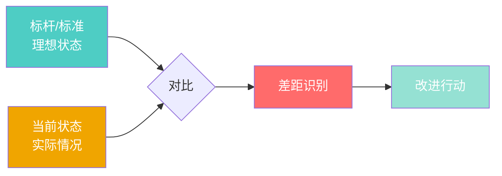

# 结构卡片 #01：对标法（Benchmarking）

> 创建时间：2026-03-24
> 来源：我学习沈老师思维方法的过程

---

## 一、核心结构

### 定义
通过对照标杆/标准，找出当前状态的差距，并采取针对性改进行动的方法。

### 四个必要元素

### 可识别特征（如何判断是否是"对标法"）
- ✅ 有明确的"标准"或"标杆"（不一定是人，可以是指标、最佳实践等）
- ✅ 有可观察的"当前状态"
- ✅ 有对比动作（显性或隐性）
- ✅ 以差距为驱动采取行动

### 不是对标法的反例
- ❌ 只有筛选标准，没有"标杆对照"（如德鲁克的"放弃审计"）
- ❌ 只有模仿，没有对比分析（如简单的抄袭）
- ❌ 只有记录，没有改进行动（如流水账日记）

---

## 二、跨域实例库

### 实例1：我学习沈老师思维方法（认知学习领域）

**场景**：
- 看到沈老师的AI报告和读书流图，想学习他的思维方法

**对标过程**：
1. **建立标杆**：让AI输出沈老师的画像和读书方法
2. **当前状态**：我自己用自己的方式读同一本书
3. **对比**：让AI用沈老师的方式输出，与我的对照
4. **差距识别**：我注重思想理解，不注重实践套路；难以举一反三
5. **改进行动**：制定90天训练计划，建立结构库

**为什么是对标法**：
- 标杆明确（沈老师的方法）
- 有对比动作（AI输出两种方式）
- 以差距驱动（发现自己的问题模式）

---

### 实例2：医生诊断疾病（医疗领域）

**场景**：
- 病人就医，医生检查身体状况

**对标过程**：
1. **标杆/标准**：医学定义的正常生理指标
2. **当前状态**：病人的各项检查数据
3. **对比**：医生查看哪些指标偏离正常范围
4. **差距识别**：血压高、血糖高等异常指标
5. **改进行动**：开药治疗，让指标回归正常

**为什么是对标法**：
- 标准明确（正常指标范围）
- 有数据对比（实际值 vs 正常值）
- 以差距驱动（治疗偏离的指标）

**同构验证**：
- 学习高手 ≈ 治疗疾病
- 高手的方法 ≈ 正常指标
- 我的当前水平 ≈ 病人数据
- 能力差距 ≈ 指标偏差
- 训练提升 ≈ 药物治疗

---

### 实例3：德鲁克的时间管理（管理学领域）

**场景**：
- 管理者感觉时间不够用，想提升时间利用率

**对标过程**：
1. **建立基准**：记录1周的时间使用（当前状态）
2. **对照标准**：分析哪些是浪费（会议、重复劳动、信息噪音）
3. **差距识别**：发现大量时间被切碎、无效会议多
4. **改进行动**：整合为整块时间，减少浪费来源

**为什么是对标法**：
- 虽然没有外部标杆，但有"理想时间使用状态"作为隐性标准
- 通过记录建立当前状态
- 分析过程就是对比（实际 vs 理想）
- 以差距驱动（整合时间）

**特殊之处**：
- 标杆不是外部的人，而是"理想的自己"
- 这是"自我对标"的变体

---

### 实例4：[待扩展]

**场景**：
[后续发现新实例时添加]

---

## 三、结构变体

### 变体1：外部对标
- 标杆：其他人/组织的最佳实践
- 例子：学习沈老师、竞品分析

### 变体2：内部对标
- 标杆：自己的理想状态或历史最佳
- 例子：德鲁克的时间记录、健身追踪数据

### 变体3：标准对标
- 标杆：行业标准、科学指标
- 例子：医学指标、质量标准

---

## 四、应用场景

### 什么时候用"对标法"？

✅ **适用**：
- 想学习某个高手的能力
- 想提升自己在某方面的水平
- 有明确的标准或最佳实践
- 能观察到当前状态（可量化或可描述）

❌ **不适用**：
- 没有可参考的标杆（开创性工作）
- 无法观察当前状态（黑盒问题）
- 标杆本身有问题（错误的标准）

---

## 五、与其他结构的关系

### 相似但不同的结构

| 结构名 | 核心逻辑 | 与对标法的区别 |
|--------|----------|----------------|
| **过滤器模型** | 用标准筛选候选项 | 没有"改进"环节，只有"保留/丢弃" |
| **实验法** | 假设→验证→结论 | 关注因果关系，不一定有"标杆" |
| **复盘法** | 回顾→分析→改进 | 可能没有明确标杆，只有经验总结 |

**举例**：
- 德鲁克的"放弃审计"是**过滤器模型**（筛选要事），不是对标法
- 德鲁克的"时间管理"是**对标法**（对照理想状态改进）

---

## 六、我的理解里程碑

### 2026-03-24（今天）
- ✅ 识别出我学习沈老师的过程就是"对标法"
- ✅ 能判断"放弃审计"不是对标法（结构敏感度）
- ✅ 发现医疗诊断和认知学习是同一个结构（跨域识别）
- ✅ 理解"标杆可以是人、标准、理想状态"

### 下一步提升方向
- [ ] 找到10个不同领域的对标法实例
- [ ] 识别"对标法"的失效场景（什么时候不该用）
- [ ] 学会设计自己的对标系统（如何选标杆、如何对比）

---

## 七、快速识别检查清单

当我看到一个新场景，快速判断是否是"对标法"：

- [ ] 有明确的标杆/标准吗？
- [ ] 有可观察的当前状态吗？
- [ ] 有对比分析的动作吗？
- [ ] 有基于差距的改进吗？

**4个都是 ✅ → 是对标法**
**有任何一个是 ❌ → 不是（或是变体/其他结构）**

---

*结构卡片完成 · 这是我的第一个"接入点" · 后续会不断扩展实例库*
