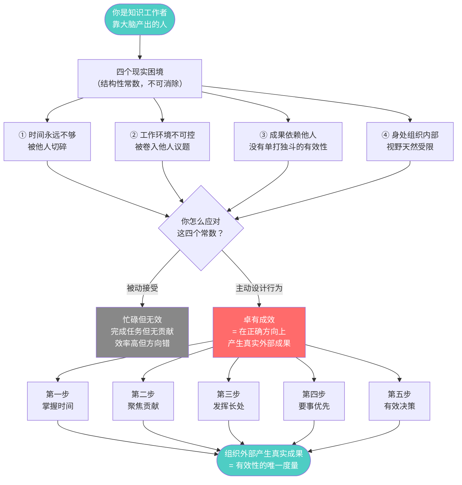
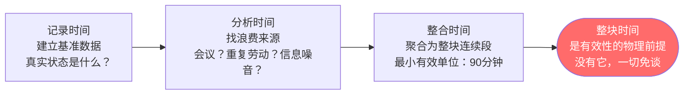
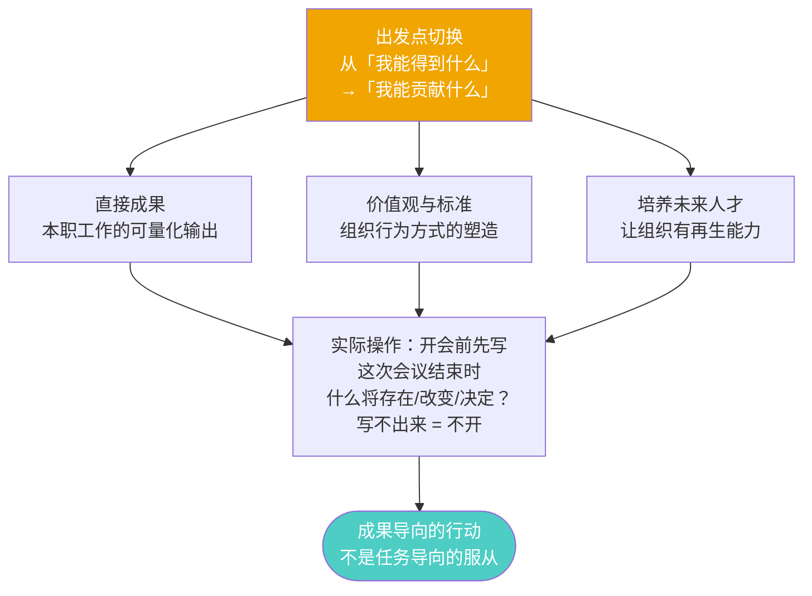
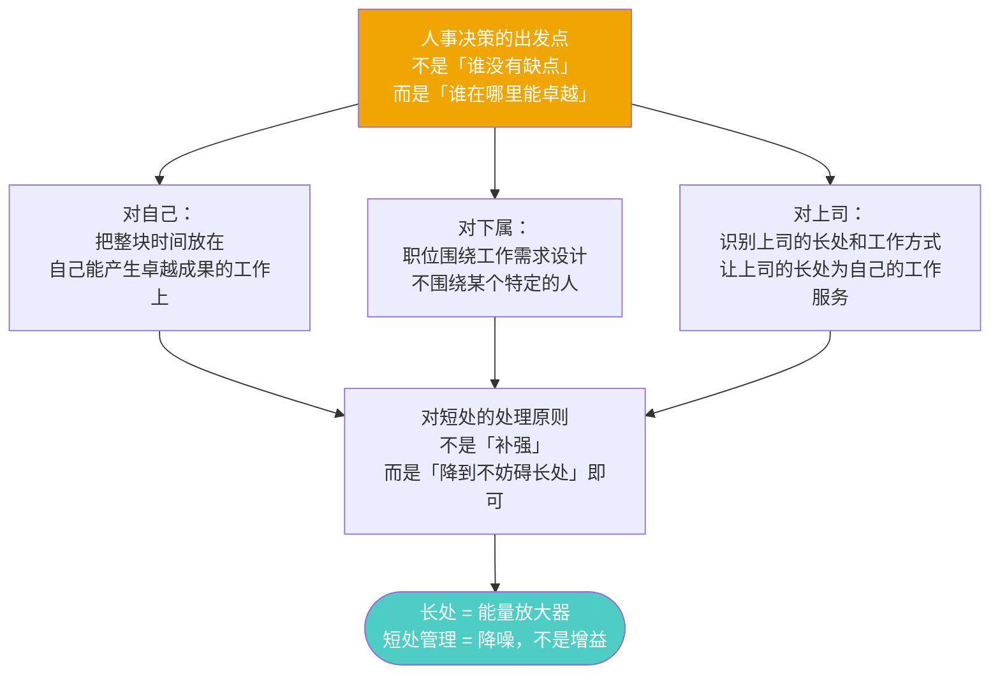
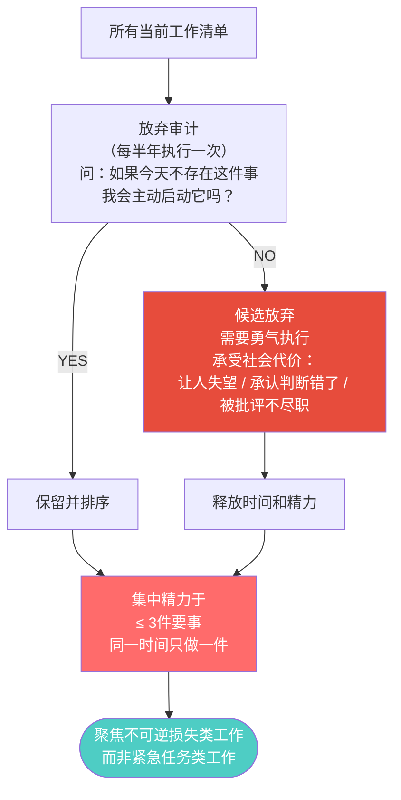
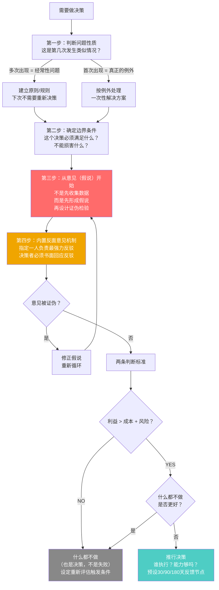
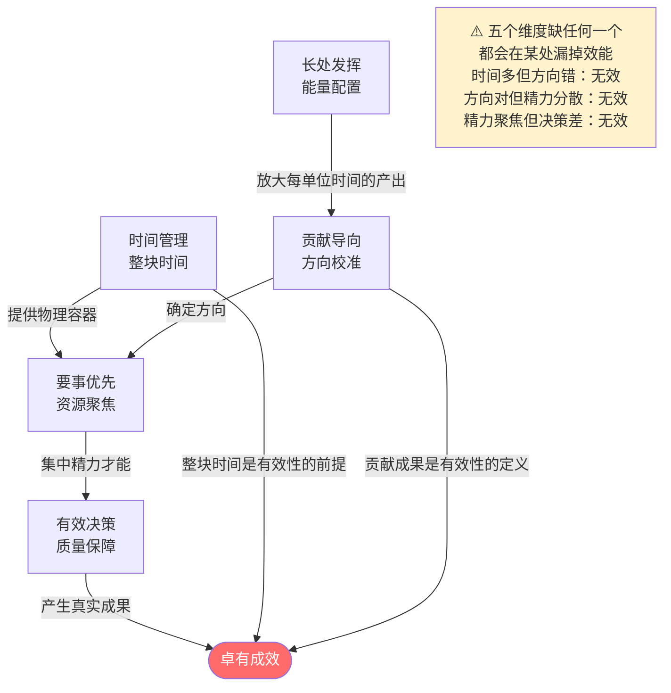
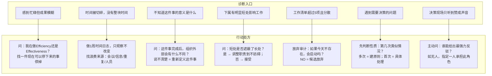
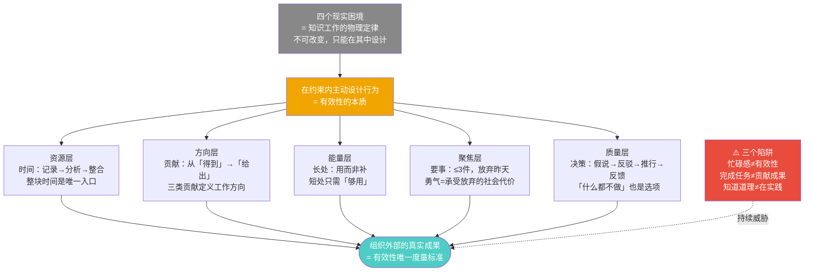

# 《卓有成效的管理者》· 沈老师视角 · 流图
> 彼得·德鲁克 著 · 2026-03-24

---

## 一、全书核心论点流（这本书在说什么）



---

## 二、五个维度的内部结构

### 维度一：掌握时间



**沈老师的接入点**：时间管理 = 资源调度问题。记录是建立基准数据（benchmark），分析是找系统瓶颈（bottleneck），整合是资源重新编排（reallocation）。工程师视角和德鲁克完全同构。

---

### 维度二：聚焦贡献



---

### 维度三：发挥长处



---

### 维度四：要事优先



**沈老师的接入点**：放弃审计 = 技术债清理。积累的旧工作 = 遗留代码。继续维护它们的原因往往是沉没成本谬误，不是真实的系统需求。

---

### 维度五：有效决策



---

## 三、五维度系统图（相互依赖关系）



---

## 四、沈老师视角：跨域结构同构图

> 沈老师的核心能力是"同构识别"——发现不同领域的底层结构是同一种结构。
> 这张图是他读完这本书后，把德鲁克的框架与其他领域对齐的结果。

```mermaid
graph LR
    DRUCKER["德鲁克\n卓有成效的管理者"]

    subgraph 哲学层同构
        STOIC["斯多葛：控制二分法\n四个困境=外部不可控\n五个实践=内部可控\n结构完全一致"]
        POPPER["波普尔：证伪主义\n意见=假说\n事实检验=证伪尝试\n不能被证伪的不是知识"]
    end

    subgraph 工程层同构
        RESOURCE["资源调度\n时间=稀缺资源\n整合=批处理优化\n浪费分析=瓶颈识别"]
        REFACTOR["技术债清理\n放弃昨天=清理遗留系统\n放弃审计=技术债评估\n沉没成本=停止支持原则"]
        SYSTEM["系统设计\n五维度=五个子系统\n依赖关系=接口契约\n有效性=系统输出指标"]
    end

    subgraph 商业层同构
        BUFFETT["巴菲特：专注与放弃\n25个目标写下来\n圈出5个最重要的\n剩下20个是回避清单"]
        JOBS["乔布斯：产品聚焦\n400个产品线→4个\n创新=对1000个好主意说NO\n勇气原则的极端实践"]
        INTEL["格鲁夫：战略转折点\n如果我们被炒，新CEO会做什么\n放弃存储→聚焦微处理器\n放弃昨天的公司级版本"]
    end

    subgraph 互补（填补空缺）
        GTD["GTD（艾伦）\n德鲁克：策略层\nGTD：战术层\n德鲁克告诉你做什么\nGTD告诉你怎么捕获"]
        OKR["OKR框架\n德鲁克：贡献导向\nOKR：落地机制\n德鲁克有方向无工具\nOKR补工具层"]
        PREMORTEM["预演失败（克莱因）\n设想一年后失败，原因是什么\n反面意见机制的具体工具\n补充德鲁克的操作层"]
    end

    subgraph 矛盾（张力区）
        DATA["数据驱动文化\n数据先行 vs 意见先行\n让数据说话 vs 从假说出发\n适用边界：低频高成本决策用德鲁克"]
        ALLOUT["全力以赴文化\n什么都做 vs 聚焦要事\n东亚职场 vs 德鲁克框架\n文化约束 vs 个人有效性"]
        SHORTFIX["补短板主义\n全面素质教育 vs 用长处\n短板决定下限 vs 长处决定上限"]
    end

    DRUCKER -->|同构| STOIC
    DRUCKER -->|同构| POPPER
    DRUCKER -->|同构| RESOURCE
    DRUCKER -->|同构| REFACTOR
    DRUCKER -->|同构| SYSTEM
    DRUCKER -->|同构| BUFFETT
    DRUCKER -->|同构| JOBS
    DRUCKER -->|同构| INTEL
    DRUCKER -->|互补| GTD
    DRUCKER -->|互补| OKR
    DRUCKER -->|互补| PREMORTEM
    DRUCKER -->|矛盾| DATA
    DRUCKER -->|矛盾| ALLOUT
    DRUCKER -->|矛盾| SHORTFIX

    style DRUCKER fill:#ff6b6b,color:#fff
    style DATA fill:#e74c3c,color:#fff
    style ALLOUT fill:#e74c3c,color:#fff
    style SHORTFIX fill:#e74c3c,color:#fff
```

---

## 五、可执行模型（if-then矩阵）

> 沈老师的标准输出格式：结构不是总结，是工具。给一个新情境，能用这个模型得出结论。



---

## 六、全书底层结构（一张图压缩版）



---

## 七、沈老师的三个核心接入点

> 这本书和他已有认知体系的连接不是类比，是结构级别的对应。

### 接入点一：ER建模思维 → 德鲁克的管理者定义

沈老师的信念：理解任何领域，先问"有哪些实体，关系是什么"。
德鲁克的洞见：管理者不是"有下属的人"（职级属性），而是"对组织绩效有贡献责任的知识工作者"（功能属性）。
**结构同构**：两者都在用功能而非形式来定义实体。"管理者"这个实体的核心属性是行为约束（贡献责任），不是组织结构位置。

### 接入点二：瓶颈识别 → 时间管理三步

沈老师的工程背景：系统性能由瓶颈决定，优化要找最卡的地方。
德鲁克的时间管理：不是"怎么把时间安排得更满"，而是"找到是什么在吃掉你的时间"。
**结构同构**：都是先建基准数据（baseline），再做瓶颈分析（bottleneck analysis），再做资源重新分配（reallocation）。时间管理三步 = 系统性能优化三步。

### 接入点三：证伪逻辑 → 有效决策

沈老师的认知原则：概念的真正理解来自能判断"反例"，不是能背出定义。
德鲁克的决策框架：从意见（假说）开始，设计能证伪它的事实检验，内置反面意见机制。
**结构同构**：都以"能被推翻的"作为知识的有效性标准。波普尔的证伪主义、沈老师的裁判循环、德鲁克的反面意见机制——三者是同一个底层结构在不同层面的实例。

---

## 八、这本书对沈老师真正有价值的部分（评估）

| 章节 | 沈老师的已有认知水平 | 这本书的增量 |
|------|------------------|------------|
| 卓有成效的定义 | 有直觉，但边界模糊 | 给出了可操作的三条标准（方向正确/外部成果/持续） |
| 时间管理三步 | 知道要整合，但没有记录习惯 | "先记录再分析"这个顺序是真正的认知增量 |
| 贡献导向 | 在工程决策中实践过，但未意识到这是核心原则 | 把这个原则从工程语境普适化了 |
| 发挥长处 | 对自己执行得好，对下属和上司执行不稳定 | 上司管理（让上司的长处为你服务）是认知盲区 |
| 要事优先 | 有聚焦本能，但没有"放弃昨天"的操作框架 | 放弃审计 + 勇气原则是真正的新工具 |
| 有效决策 | 从意见出发是自然的，但没有制度化反面意见机制 | 反面意见机制的制度设计是最大增量 |

---

*流图完成 · 书是原料，人是工厂 · 理解 = 行为能力，不是语言能力*
