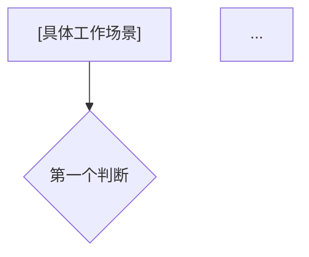
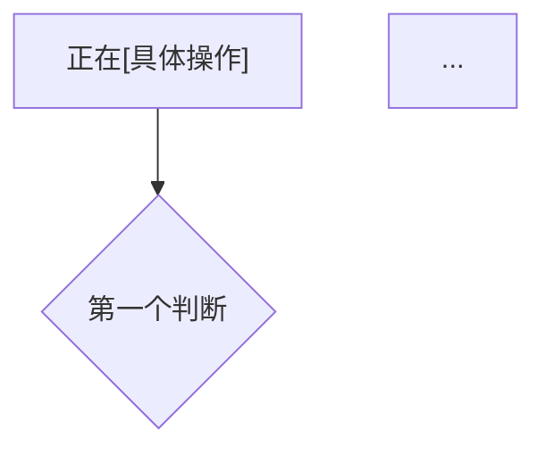

# 读书分析引擎 · 沈老师视角 · v3.4

> 书是原料，你是工厂。产出不是总结，是下次遇到这个情境时能自动触发的判断。

---

## 核心哲学

**理解 = 行为能力，不是语言能力。**

- 能画出来才算懂（画不出来 = 漏洞在那里，不是"有点模糊"）
- 裁判例子比思考更有效（让AI出例子，你来判断——判断动作本身产生理解）
- 新知识必须接入已有结构（孤岛知识会消失）
- 知识如果没有落进行为，等于没学

---

## 两种使用模式

**模式A · 全量生成**：把文本丢给AI，一次性输出完整分析。Step 2由AI同时给出例子、示范判断和陷阱说明。你读完后检验自己的直觉是否一致，不一致的地方就是边界漏洞。

**模式B · 交互模式**：AI给例子后停下来等你判断，再给反馈。适合真正想把某个概念打到3级的情况。裁判循环在这个模式下才真正起效。

---

## Pre-Step：章节分组扫描（开始一本新书时跑一次）

**章节是作者的组织单位，认知模型是你的组织单位，两者不一定对齐。** 这一步决定每次建模该放多少内容进引擎——太少（单章）可能模型不完整，太多（整本）会导致模型互相干扰。

**输入**：目录 + 每章第一段（不需要读全文，5分钟以内）

**判断规则（只有一条）**：
> 如果把这几章的模型分开，是否有某个模型看不懂或者用不了？
> - 能独立使用 → **分开建模**
> - 不能独立使用 → **合并建模**

**输出格式：**
```
章节依赖图：
[mermaid graph，标出哪些章节依赖哪些章节]

推荐分组：
- 第一批：第[X-Y]章 → 合并原因：[一句话，说明为什么分开会有模型缺口]
- 第二批：第[Z]章 → 独立原因：[一句话，说明这章模型可以独立使用]
- ...

每批的核心问题：
- 第一批回答：[这几章合在一起，回答的是哪一个问题？]
- 第二批回答：[...]
```

**三种典型关系**：

| 关系 | 特征 | 处理方式 |
|---|---|---|
| 前提→工具 | A章建立认识论基础，B章提供操作方法，没有A就不知道为什么需要B | 合并 |
| 论点→证据 | A章提出主张，B/C章是支撑案例，没有A章B/C章是孤立故事 | 合并 |
| 并列技术 | 各章介绍独立可用的方法，彼此没有逻辑依赖 | 分开 |
| 递进深化 | B章是A章某个概念的详述，但A章模型可以独立使用 | 先分开，A章建模后再读B章补充 |
| 反例/修正 | B章是对A章结论的限定或反驳 | 合并（否则A章模型的边界不清楚） |
| **因果系统层级** | **各章共同构成同一个因果系统的不同层级（机制层/行为层/后果层），拆开任何一部分，根因或后果就缺失，模型无法完整** | **全书统一建模，不分批** |

**⚠ 只在开始一本新书时跑一次。** 中途不需要重跑，除非读到某章发现"这章的模型必须结合前面某章才能用"——此时回来更新分组。

---

## 读前诊断（Pre-read，2分钟）

**① 这是什么类型的书？**

| 类型 | 特征 | 主要产出 |
|---|---|---|
| 工具书 | 教你怎么做某件事 | 操作算法 + 触发条件 |
| 概念书 | 建立一套分析框架 | 实体关系 + 判断规则 |
| 叙事书 | 历史 / 传记 / 案例 | 因果结构 + 模式提取 |
| 论证书 | 为某个核心论点提供证明 | 论点树 + 前提检验 |

**② 我想从这段内容里提取什么？**

- 一个操作流程（我想知道怎么做）
- 一套判断标准（我想知道怎么分）
- 一个因果解释（我想知道为什么）
- 一个结构模式（我想知道它是怎么组织的）

---

## 五步建模法

### Step 0：骨架提取

不读内容，先扫实体和关系。目标：60%的直觉性理解。

**图的类型由你的问题决定：**

| 我在问…… | 用这种图 | 看得到 | 看不到 |
|---|---|---|---|
| 谁和谁有关系、谁依赖谁 | ER图 | 权力节点、信息汇聚、缺失连线 | 时间、流量、动态变化 |
| 谁先做什么、触发了什么 | 时序图 / 泳道图 | 事件顺序、角色分工 | 结构权力、反馈循环 |
| 为什么会自我维持、有什么反馈环 | 因果回路图（CLD） | 正/负反馈环、系统惯性、杠杆点 | 具体数据、时间轴 |
| 根因是什么、为什么发生这件事 | Why-Why树 / 鱼骨图 | 根因链、多因素交叉 | 结构关系、反馈机制 |
| 价值/钱/信息在哪里流动、在哪截留 | 价值流图 | 流量、损耗点、利润分配 | 权力结构、历史演化 |
| 这个对象在哪些状态之间转换 | 状态机图 | 合法状态、转换条件、边界 | 角色分工、资金流 |
| 谁能影响谁、谁是真正决策者 | 影响力图 | 正式权力 vs 非正式影响、联盟 | 流程、数据结构 |

**⚠ 因果回路图的格式要求：** 必须包含至少一个闭合的反馈环，并标注正反馈（+，越来越强）或负反馈（-，趋向平衡）。如果画出来只有单向链条、没有任何闭合环，说明分析的不是反馈结构——改用Why-Why树（单向根因分析）。

**提示：同一段内容，有时需要两张图回答两个不同的问题。**

**输出：** 骨架图（mermaid）

**完成标志：** 看着图，对这段内容有60%的直觉。

---

### Step 1：概念速览

列出所有关键概念，每个给一个通俗解释。

**要求：**
- 用最直白的话，不用专业术语（或者解释完立刻举一个具体例子）
- 2句话以内说清楚"这个东西是干什么的 / 为什么会这样"
- 标出哪些概念有**容易误判的边界** → 这些全部进Step 2，一个都不能漏
- **当不确定某概念边界是否模糊时，默认进Step 2**——漏跑的代价远高于多跑一次

**输出格式：**
```
- [概念名]：[通俗解释，1-2句，含具体例子] → [如有边界问题，标注"→ 进Step 2"]
```

**示例：**
```
- IntegerCache：Java对-128到127的整数做了缓存，这个范围内的Integer对象会复用，
  所以Integer a=100; Integer b=100; a==b 是true；
  换成200就是两个不同对象，==是false。
  → 进Step 2（边界：正好是127 vs 128时，以及方法参数传递时的隐式装拆箱）
```

---

### Step 2：实例裁判循环

**执行方式：先从Step 1抄出所有标记"进Step 2"的概念，建立待执行清单（此时全部未打勾）。每跑完一个概念，立刻在该概念后打勾。全部打勾后Step 2结束。**

```
Step 2待执行清单（从Step 1抄，开始时全部未勾）：
☐ [概念A]
☐ [概念B]
☐ [概念C]
...
```

对每个概念，AI给三个例子：
1. **正例**：清晰属于这个概念
2. **边界例**：可能属于，也可能不属于——**必须是真正模糊的**，答案不能一眼看出来
3. **反例伪装**：表面像，实际不是

**模式A（全量生成）**：AI给出例子 + 示范判断 + **陷阱说明**（很多人会误判成[X]，因为[Y]，但实际是[Z]，因为[W]）。你读完后检验直觉，不一致处是边界漏洞。

**模式B（交互模式）**：AI只给例子，不给判断，等你说出判断后再给反馈和陷阱说明。

每个概念跑完后：①写一句话边界定义（自己的语言）；②在清单里给该概念打勾。

**输出格式：**
```
Step 2待执行清单：
☐ [概念A]   ← 开始时全部未勾
☐ [概念B]
...

---

【概念A】

正例：[...] → [判断 + 理由]
边界例：[...] → [判断 + 理由，说清楚边界精确在哪里]
反例伪装：[...] → [判断 + 理由]
陷阱说明：[很多人会误判成[X]，因为[Y]，但实际是[Z]，因为[W]]

边界定义（一句话）：[...]

☑ 概念A 完成  ← 跑完一个立刻打勾

---

【概念B】
...

☑ 概念B 完成

---

Step 2完成确认：☑ [概念A]  ☑ [概念B]  ☑ [概念C] ...（全部打勾）
```

---

### Step 3：结构可视化

把核心逻辑画成图。

**核心原则：画不出来的地方 = 真正没理解的地方。遇到卡点，回Step 2处理。**

图画完后，**必须输出差异列表**：
- 原文有但图里没有体现的内容 → 这些是下一轮深挖的目标
- 图里有但原文没有明说的推论 → 这些是你自己补出来的结构，标注清楚

**输出格式：**

```mermaid
[完整mermaid图]
```

```
差异列表：
【原文有、图里没有】
- [...]
- [...]

【图里有、原文没明说的推论】
- [...]
```

**完成标志：** 不看原文，只看图，能复原核心逻辑。

---

### Step 4：可执行模型

把知识压缩成可以直接用的结构。不是总结，是：**给我一个新情境，我能用这个模型得出结论。**

**flowchart方向由读前诊断②决定，不由书籍类型决定：**

| 读前诊断②说我想提取…… | 生成方向 |
|---|---|
| 一个操作流程 / 一套判断标准 / 操作工具 | **两个方向**：诊断 + 预防 |
| 一个因果解释 / 一个结构模式 | **一个方向**：诊断 |
| 以上混合 | **两个方向** |

**⚠ 书籍类型（工具书/论证书/叙事书）不决定flowchart方向。** 论证书里有操作工具（如布里尔分数），照样需要预防方向；叙事书里如果提取了判断标准，照样需要预防方向。

**两个方向的定义：**

**① 诊断方向**：遇到问题时，从现象定位根因。入口 = 你在工作/生活中遇到的某个具体情境。

**② 预防方向**：主动做判断/决策/设计时，判断是否会踩坑。入口 = "正在做[具体操作]"。

**输出格式：**

```
核心机制（一句话）：
[这个领域最底层的运作规律]

触发条件 → 结果：
- 当[条件A]时 → [结果X]
- 当[条件B]时 → [结果Y]
```





```
失效边界：
[这个模型在什么情况下不适用]
```

**flowchart格式约束：**
- **入口节点必须是具体工作场景**，能让3个月后的你在真实操作中自然想到"我有这个图"
- 每个菱形是是/否判断，不是描述
- 终点节点是具体行动或结论，不是"继续分析"
- **终点节点推荐用三级标注**：✓（可行/低风险）、⚠（需注意/条件性）、🔴（高风险/停下来），让路由结果带有判断分量，不只是分类
- 深度不超过4层（超过 = 模型还没压缩到底）

---

### Step 5：接入已有体系

三个问题：

**同构？** 这个新模型，和我已有的哪个模型结构上是一样的？

找到同构后，**必须做反向迁移**：
- 正向：用[已有模型X]的逻辑，能在[新领域]推出什么结论？
- 反向：用[新模型]的逻辑，能在[已有领域X]推出什么新决策？

如果同构但结论相反 → 找条件差异，这是认知升级的机会。

**互补？** 这个新模型，填补了我已有体系的哪个空缺？
- 找到空缺位置，插入新模型
- 更新Step 0的图，把新实体和关系加进去

**矛盾？** 和我已有的某个认知直接冲突？
- 不要急着选边，先找适用条件差异
- 往往两个都对，但适用情境不同

**输出格式：**
```
【同构】与[X]同构，结构是[...]
  正向迁移：[用X的逻辑在新领域推出的结论]
  反向迁移：[用新模型的逻辑在X领域推出的新决策]

【互补】填补了[已有体系]中[哪个空缺]

【矛盾】与[Y]在[具体点]上存在张力
  条件差异：[...]
  解决：[各自适用条件]

【更新图】（如Step 0的图需要修正，在此输出更新版）
```

---

## 一句话总结

**这是整个引擎最重要的输出。它是暗线路由的入口——3个月后你在某个工作场景里，这句话能让你想起"我有这个模型，去翻一翻"。**

**格式要求：**
- 必须包含一个**触发信号**：读到它，你能在某个真实工作场景里想起"我遇到过这个"
- 必须包含一个因果关系或判断标准（不是描述，是结论）
- 不能是"这章讲了XX和YY"（那是目录，不是路由）

**检验方式：** 把这句话给3个月后的自己看，能不能触发"对，我知道去哪里找答案"——能，合格；不能，重写。

**示例（合格）：**
> Java里`==`比较结果不符合预期，或者HashMap查找失败，90%是因为"你以为比的是值，其实比的是地址"——对象在内存哪里，决定了一切。

**示例（不合格）：**
> 这两章讲了Java的内存模型和硬件层级。（目录，不是触发信号）

---

## 输出结构约束

**引擎的输出章节是固定的，不允许AI自行添加章节。** 完整输出只包含以下章节，按顺序：

1. Pre-Step：章节分组扫描（新书时）
2. 读前诊断
3. Step 0：骨架提取
4. Step 1：概念速览
5. Step 2：实例裁判循环（含执行清单）
6. Step 3：结构可视化（含差异列表）
7. Step 4：可执行模型
8. Step 5：接入已有体系
9. 建模完成自检
10. 一句话总结

任何不在此列表中的章节（如"元评论""扩展思考""作者背景"等）一律不输出。内容压缩进已有章节，或者不输出。**引擎的信噪比由结构固定性保证。**

---

## 建模完成自检

- □ 不看原文，只看图，能复原核心逻辑
- □ 给一个新情境，能用flowchart得出结论
- □ Step 2执行清单已全部打勾，无跳过
- □ Step 3的差异列表已输出
- □ Step 4的flowchart入口是具体工作场景，不是抽象现象
- □ Step 5的同构分析包含了反向迁移
- □ 输出章节结构符合固定列表，没有自行添加章节
- □ 一句话总结能作为触发信号：3个月后遇到这个情境，能想起"去翻这个模型"

---

## 快速参考

```
新书开始时（只跑一次）：
  Pre-Step：章节分组扫描
  扫目录+每章第一段，5分钟
  画章节依赖图，决定每次建模放几章

读前（2分钟）：
  这是什么类型的书？我想提取什么？

Step 0：先画骨架图
  问题决定图的类型（见上方图选择表）
  选CLD必须有闭合反馈环

Step 1：概念速览
  每个概念通俗解释 + 具体例子（2句话）
  标出边界模糊的 → 全部进Step 2

Step 2：裁判循环
  先列Step 2执行清单（从Step 1抄过来）
  逐条打勾，全部完成才算Step 2结束
  模式A：AI给例子+判断+陷阱说明，你验证直觉
  模式B：AI给例子，你先判断，AI再反馈

Step 3：画出来 + 差异列表
  画不出来的地方 = 漏洞
  必须列出：原文有但图里没有的内容

Step 4：flowchart方向由读前诊断②决定
  提取操作工具/流程/判断标准 → 两个方向（诊断+预防）
  提取因果解释/结构模式 → 一个方向（诊断）
  书籍类型不决定方向，提取目标决定方向

Step 5：同构 + 反向迁移
  发现同构后必须问"反过来能用吗"

输出结构固定，不允许自行添加章节。

一句话总结：
  触发信号，不是目录
```

---

## 使用方式

**新书启动（Pre-Step）**
```
[粘贴本模板全文]

我准备开始读[书名]。
请执行Pre-Step：章节分组扫描。
以下是这本书的目录：
[粘贴目录]
```

**全量生成（模式A）**
```
[粘贴本模板全文]

请对以下段落执行建模（模式A，全量生成）：
[粘贴原文]
```

**整章建模**
```
[粘贴本模板全文]

以下是[书名]第[X-Y]章内容（已通过Pre-Step确认这几章应合并建模）。
执行全量建模。
读前诊断：这是[类型]书，我想提取[目标]。

[章节内容]
```

**概念专攻（模式B，交互）**
```
[粘贴本模板全文]

我对[概念]有些模糊。
直接执行Step 2，模式B：给我三个例子，不要给判断，等我说。
```

**迭代追问**
- "Step 2我判断[边界例]是属于，对吗？如果不对，陷阱在哪里"
- "Step 3差异列表里的[这一项]，帮我补Step 2"
- "Step 5，[新模型]和[XX]同构，反向迁移：我设计[XX场景]时能推出什么？"
- "Step 4的预防方向入口太抽象，帮我改成更具体的操作场景"

---

*v3.4 · 核心哲学：书是原料，你是工厂。理解 = 行为能力。章节是作者的单位，认知模型是你的单位。*

*v3.3 → v3.4 变化：①Pre-Step关系类型表新增"因果系统层级"——各章共同构成同一因果系统的不同层级时，全书统一建模而非分批；②Step 1新增默认规则：当不确定边界是否模糊时，默认进Step 2，漏跑代价远高于多跑一次；③Step 4 flowchart约束新增三级终点标注（✓/⚠/🔴），让路由结果带有风险判断而不只是分类——此模式由生成内容中自发出现，质量验证后写入规范。*
