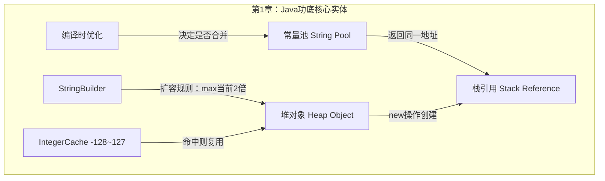
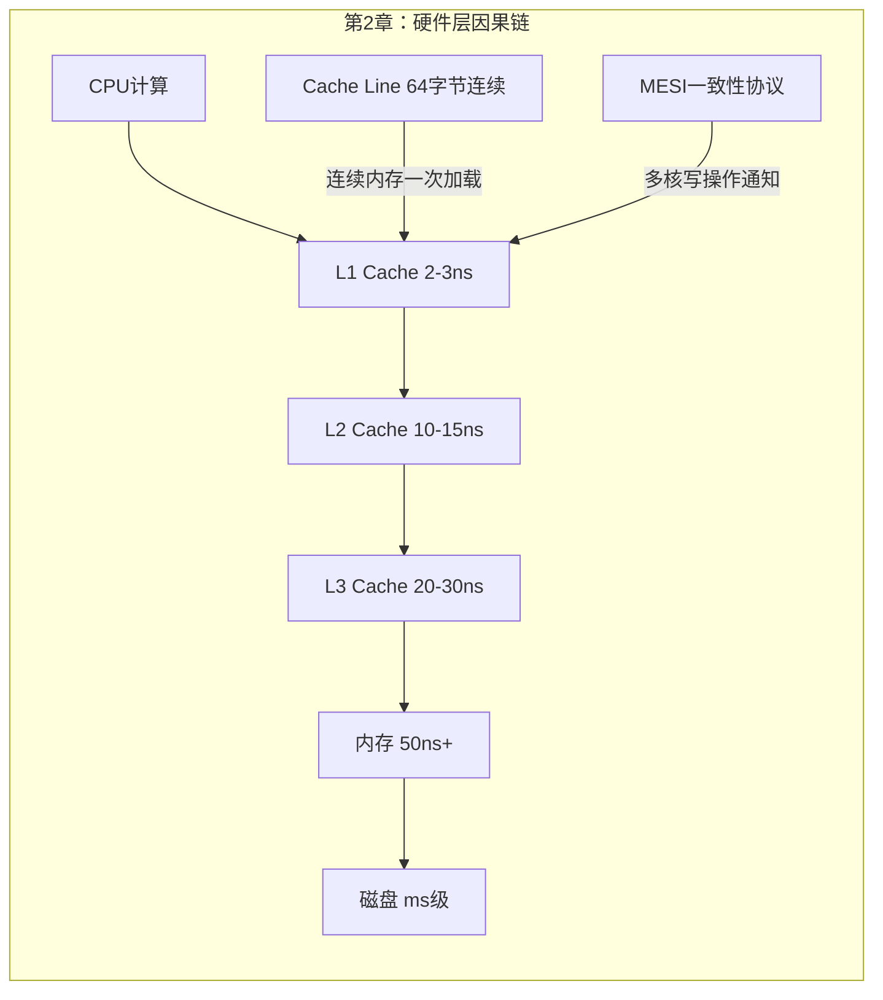
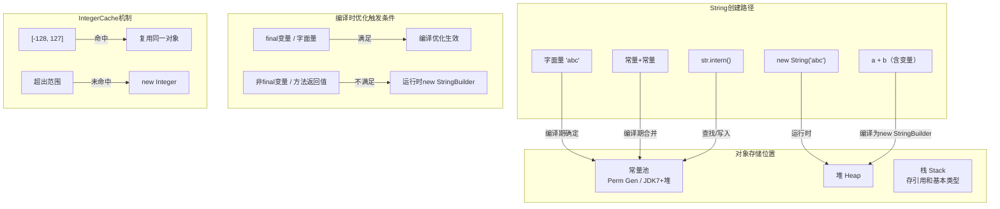
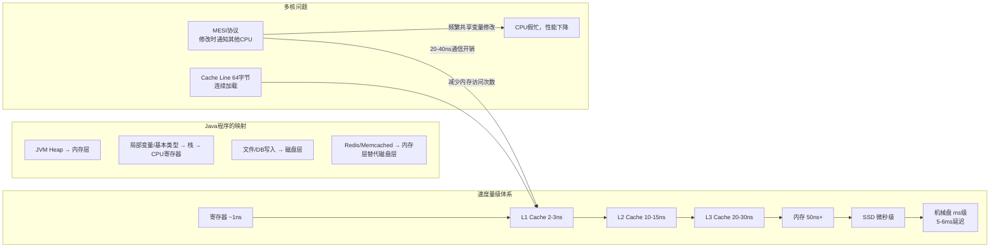

# 《Java特种兵》前两章 · 五步建模

## 读前诊断（Pre-read）

**① 这是什么类型的书？**
→ **工具书 + 概念书混合**。
第1章是通过代码例子建立"功底判断标准"（工具书），第2章是建立计算机工作原理的分析框架（概念书）。
叙事外壳（胖哥的比喻故事）是传播载体，不是结构本体。

**② 我想从这两章提取什么？**
→ **一套判断算法**：遇到Java程序出现意外行为（错误结果、性能下降、OOM），能从"底层数据结构"和"硬件特性"两个维度快速定位原因。

---

## Step 0：骨架提取

**主问题**：这两章的核心实体是什么？它们之间是什么关系？

**图类型选择**：两张图回答两个问题
- 第1章 → ER图（核心对象及其关系）
- 第2章 → 因果回路图（硬件层到Java层的因果传导）





**完成标志**：看图对两章有60%直觉——第1章在讲"Java对象的内存地址游戏"，第2章在讲"数据离CPU越远越慢"。

---

## Step 1：概念自评

| 概念 | 等级 | 备注 |
|---|---|---|
| `==` vs `equals` | 2级 | 能定义，但边界（引用对象时行为）不确定 |
| 常量池 / String intern | 1级 | 听过，说不清楚"谁在常量池里、谁不在" |
| 编译时优化（常量折叠） | 2级 | 知道`final`能触发，但`方法返回值`的边界不清 |
| hashCode与equals的关系 | 2级 | 知道要同步重写，但不知道为什么可以不重写 |
| StringBuilder扩容机制 | 1级 | 知道比`+`快，不知道内存增长数学规律 |
| IntegerCache | 0级 | 第一次看到`-128~127`缓存这个设计 |
| CPU Cache Line | 1级 | 听过缓存，不知道64字节连续加载 |
| MESI缓存一致性协议 | 0级 | 完全陌生 |
| 虚拟内存/页表 | 1级 | 概念知道，Java堆的映射关系不清 |
| IOPS / SSD vs 机械盘 | 2级 | 知道SSD快，不知道具体量级差异 |

**结论**：`常量池`、`编译时优化边界`、`StringBuilder扩容`、`IntegerCache`、`Cache Line`、`MESI` 全部进Step 2。

---

## Step 2：实例裁判循环

### 【概念1】编译时优化（常量折叠）

**正例：**
```java
final String a = "hello";
String b = a + " world";
String c = "hello world";
System.out.println(b == c); // 输出 true
```
→ **属于** 编译时优化。`a`是`final`，编译器在编译阶段能确定`a + " world"`的值，直接合并为常量。

**边界例：**
```java
String a = "hello";  // 非final
String b = a + " world";
String c = "hello world";
System.out.println(b == c); // 输出 false
```
→ **不属于** 编译时优化。`a`没有`final`修饰，编译器无法保证运行时不变（字节码增强技术可能修改它），所以不合并。

**反例伪装：**
```java
private static String getHello() { return "hello"; }
String b = getHello() + " world";
String c = "hello world";
System.out.println(b == c); // 输出 false
```
→ **不属于** 编译时优化。方法返回值在编译阶段无法确定，编译器不会递归展开方法体。

**本轮边界感知**：编译时优化只发生在**编译阶段能100%确定值的表达式**——只有字面量常量和`final`局部变量才满足条件，方法返回值和非`final`变量都不满足。→ 升至3级 ✓

---

### 【概念2】IntegerCache（-128~127缓存）

**正例：**
```java
Integer a = 100;
Integer b = 100;
System.out.println(a == b); // true
```
→ **属于** IntegerCache生效场景。100在`[-128, 127]`范围内，`Integer.valueOf(100)`直接从数组里取同一对象。

**边界例：**
```java
Integer a = 127;
Integer b = 127;
System.out.println(a == b); // true
Integer c = 128;
Integer d = 128;
System.out.println(c == d); // false
```
→ 127是缓存边界，127**属于**，128**不属于**。边界精确在`IntegerCache.high=127`处。

**反例伪装：**
```java
Integer a = -200;
Integer b = -200;
System.out.println(a == b); // false
```
→ **不属于**。`-200 < -128`，超出缓存范围下界，每次`new Integer(-200)`。

**本轮边界感知**：IntegerCache边界是`[-128, 127]`（上界可通过JVM参数`-XX:AutoBoxCacheMax`调整，下界写死）。Boolean全缓存，Byte全缓存，Short/Long同样范围，Float/Double无缓存。→ 升至3级 ✓

---

### 【概念3】StringBuilder扩容触发条件

**正例（会触发OOM的场景）：**
```java
String a = "";
for (int i = 0; i < 1000000; i++) {
    a += "x"; // 每次循环隐式创建新StringBuilder，最终OOM
}
```
→ **属于** 高风险OOM场景。每次循环创建一个`StringBuilder`，旧的`a`不断变大，扩容时需要原空间的3倍暂存，当`a`达到Old区1/4大小时必然OOM。

**边界例：**
```java
String a = "hello";
String b = "world";
String c = a + b; // 单行，只创建一个StringBuilder
```
→ **不属于** 高风险场景。单行`+`操作只创建一个`StringBuilder`执行两次`append`，不存在循环累积问题。

**反例伪装：**
```java
StringBuilder sb = new StringBuilder();
for (int i = 0; i < 1000000; i++) {
    sb.append("x"); // 只有一个StringBuilder对象
}
```
→ **不属于** OOM高风险。只有一个`StringBuilder`，每次扩容是2倍，扩容后有一半空闲空间，远比`String +`稳健。

**本轮边界感知**：触发OOM的是**循环体内每次都隐式新建`StringBuilder`**，不是`append`操作本身。单个`StringBuilder`循环`append`不会有此问题。→ 升至3级 ✓

---

### 【概念4】Cache Line（64字节连续加载）

**正例：**
```java
// 外层循环第一维，内层循环第二维
int[][] a = new int[5][10];
for (int i = 0; i < 5; i++) {
    for (int j = 0; j < 10; j++) {
        sum += a[i][j]; // 顺序访问a[i][0..9]，连续内存，Cache Line命中率高
    }
}
```
→ **属于** Cache Line友好访问。`a[i][0]`到`a[i][9]`是同一数组的连续内存，被一次性加载到Cache。

**边界例：**
```java
// 两层循环交换顺序
for (int j = 0; j < 10; j++) {
    for (int i = 0; i < 5; i++) {
        sum += a[i][j]; // 访问a[0][j], a[1][j]...不同数组
    }
}
```
→ **不属于** Cache Line友好访问。`a[0][j]`和`a[1][j]`在不同数组中，内存不连续，每次需要重新从内存加载。

**反例伪装：**
```java
int[] flat = new int[50]; // 展开的一维数组
for (int i = 0; i < 50; i++) {
    sum += flat[i];
}
```
→ **属于** Cache Line友好（完全连续，比二维数组更优）。

**本轮边界感知**：Cache Line友好的判断标准是**内层循环访问的内存是否连续（同一数组）**。Java二维数组是"数组的数组"，不同第一维子数组在内存中不连续。→ 升至3级 ✓

---

## Step 3：结构可视化

**第1章：Java对象内存行为完整图**



**第2章：硬件层→Java性能的因果传导图**



---

## Step 4：可执行模型

### 【第1章】Java功底可执行模型

**核心机制（一句话）**：
Java对象的行为取决于它在内存里的位置（常量池/堆）和引用来源（编译期确定/运行时创建），同一"值"可能指向不同地址。

**判断算法：**

```
遇到Java对象行为怪异，先问：

1. 用==比较时出了问题？
   → 是基本类型？直接比值，没有陷阱。
   → 是引用类型？比的是栈上地址，不是值。
   → 特别注意：Integer/Long等包装类在[-128,127]外会有两个不同对象。

2. String比较结果不符合预期？
   → 字面量/final拼接 → 常量池（编译期合并）→ ==可以
   → 有非final变量参与 → 堆上new StringBuilder → ==不行，用equals
   → 用了intern() → 回到常量池，地址相同 → ==可以

3. 内存使用过高/OOM？
   → String "+"在循环里 → 每次创建新StringBuilder，内存指数增长 → 替换为单个StringBuilder
   → 临界：Old区1/3大小时（使用单个StringBuilder）、Old区1/4时（String+循环）必然OOM

4. equals重写了但HashMap/HashSet查找失败？
   → 检查：hashCode是否同步重写？
   → 原因：HashMap先用hashCode定位桶，再用equals比较；两者必须同步。
```

**触发条件 → 结果：**
- `final`变量参与字符串拼接 → 编译期合并，常量池同一对象
- 非final变量参与字符串拼接 → 运行时new，堆上不同对象
- Integer赋值在[-128, 127] → 缓存命中，同一对象（==为true）
- 大量循环String"+" → OOM风险极高，禁止使用
- equals重写但hashCode未重写 → HashMap行为不可预期

**失效边界：**
- JDK7以后String pool从PermGen移到堆，intern()行为略有变化
- JVM参数`-XX:AutoBoxCacheMax`能扩展IntegerCache上界

---

### 【第2章】计算机原理可执行模型

**核心机制（一句话）**：
数据距离CPU越远，访问延迟越高（量级差别极大：寄存器<纳秒，内存=50ns，磁盘=毫秒）；所有性能优化本质上是"让数据靠近CPU"。

**延迟量级速查表：**
| 存储层 | 延迟量级 | Java对应 |
|---|---|---|
| 寄存器/L1 Cache | 1-3ns | 局部变量，基本类型 |
| L2 Cache | 10-15ns | 热点对象（JIT优化后） |
| L3 Cache | 20-30ns | 共享缓存 |
| 内存 | 50ns+ | JVM Heap |
| SSD | 微秒级 | 文件I/O（SSD） |
| 机械盘 | 5-6ms | 文件I/O（HDD），IOPS≈60-120 |

**判断算法：**

```
遇到Java程序性能问题，按层次定位：

1. CPU层（代码密集型，CPU使用率高）
   → 多核共享变量频繁写 → MESI协议开销 → CPU"假忙"
   → 二维数组遍历顺序错误 → Cache Line未命中 → 优化：外层遍历第一维
   → 判断：htop显示CPU高但吞吐量低 → 很可能是缓存一致性问题

2. 内存层（GC频繁，Heap不够）
   → JVM Heap是向OS申请的连续虚拟地址
   → 32位系统堆不超过1.5GB（地址空间限制）
   → -Xms立即占用物理内存，-Xmx可超过物理内存（虚拟地址）

3. 磁盘层（I/O等待，响应慢）
   → 机械盘：5-6ms延迟，IOPS≈60-120，瓶颈在随机I/O
   → SSD：IOPS高100倍以上，随机I/O不再是瓶颈
   → 优化策略：Buffer写日志，将随机I/O合并为顺序I/O

4. 是否需要缓存（判断适用性）
   → 读/写比 > 10:1 → 适合缓存
   → 数据一致性要求绝对实时 → 不适合
   → 集群环境 → 用分布式缓存（Redis），不用本地缓存
   → 缓存命中率 > 95% → 缓存策略成功
```

**失效边界：**
- 数据量/访问量极小（如"几十万数据，每天几千次访问"）→ 所有优化都没必要
- 写操作比读操作多 → 缓存反而增加开销（写缓存+写DB双倍开销）
- SSD已普及的今天，许多针对机械盘的优化经验已过时（IOPS不再是主要瓶颈）

---

## Step 5：接入已有体系

**同构？**
这两章的结构与**软件架构中的"多级缓存"**完全同构：
- CPU三级缓存 = 微服务架构的本地缓存→Redis→数据库
- Cache Line一次加载64字节 = 批量接口设计（一次查N条比N次查一条效率高）
- MESI协议通信开销 = 分布式锁开销（协调成本远高于实际工作量）

可以互借案例：Redis为什么快？→ 因为数据在内存（50ns）而不在磁盘（5ms），本质和CPU Cache原理相同。

**互补？**
这两章填补了"Java代码行为的底层解释系统"这个空缺：
- 之前知道"==不能比较对象值"，现在知道原因：比较的是栈上的引用地址
- 之前知道"SSD比机械盘快"，现在知道量级：IOPS差100倍，延迟从ms到微秒级
- 新增连接：`volatile`关键字（第5章将出现）→ 底层就是绕过CPU Cache直接写内存（MESI协议的上层封装）

**矛盾？**
书中建议`StringBuilder > String "+"`，但这个结论有条件限制：
- 循环内大量拼接 → StringBuilder绝对优势
- 少量/全常量拼接 → String "+"经编译优化后更快（不需要创建StringBuilder）

不是矛盾，是适用条件不同。判断标准：**是否在循环内 + 是否有变量参与**。

---

## 建模完成自检

- ✅ 不看原文，只看图，能复原两章核心逻辑
- ✅ 给一个新情境能用模型得出结论（如：`Integer a = 300; Integer b = 300; a==b` → false，超出缓存范围）
- ✅ 所有关键概念已升至3级（编译时优化、IntegerCache、StringBuilder扩容、Cache Line）
- ✅ 新模型已接入已有体系（映射到多级缓存架构、批量操作设计原则）

---

## 一句话总结

> **Java程序的"意外行为"和"性能问题"，90%可以用两个问题回答：这个对象在内存的哪里？这个操作离CPU有多远？**
