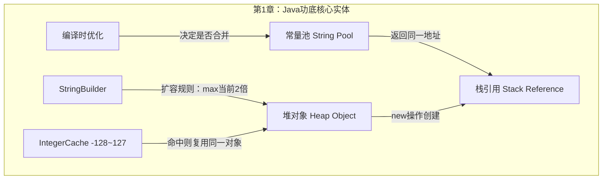
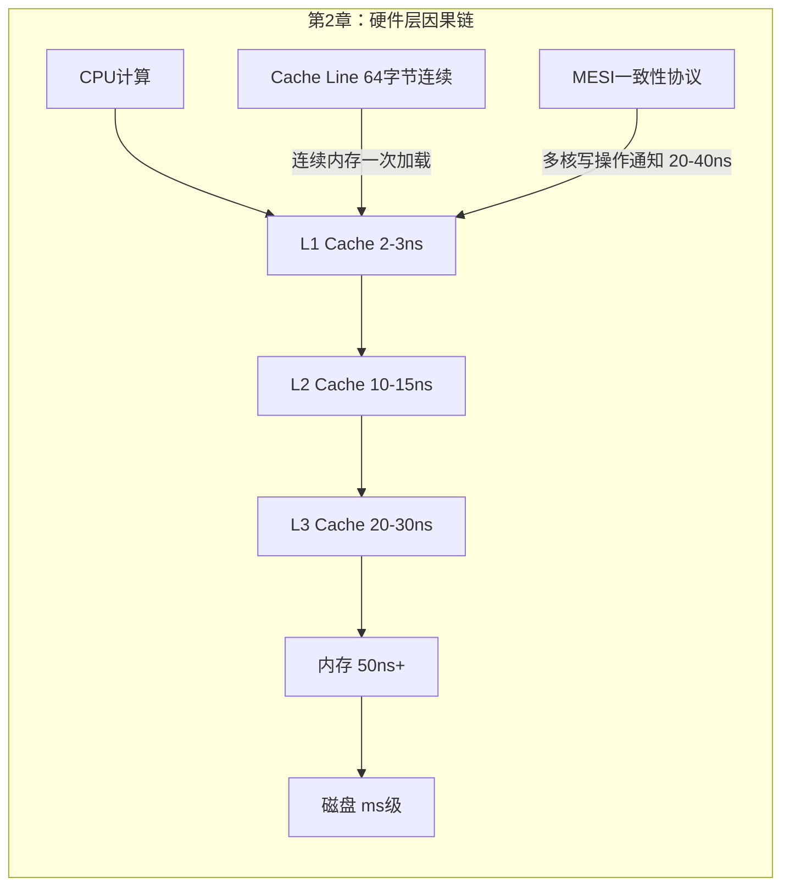
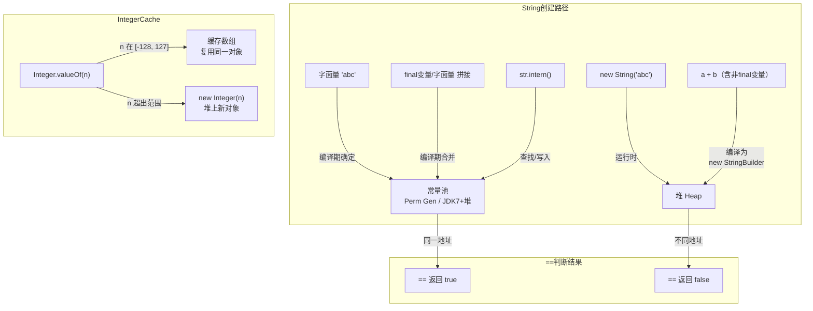
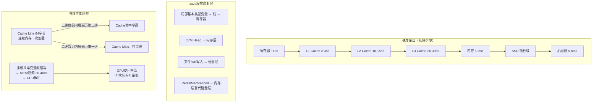
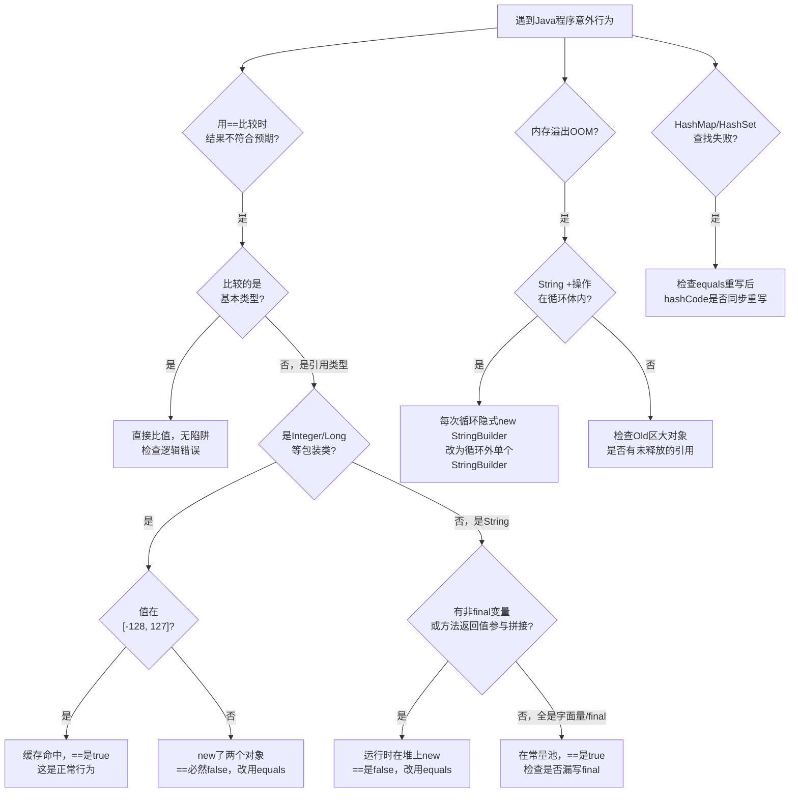
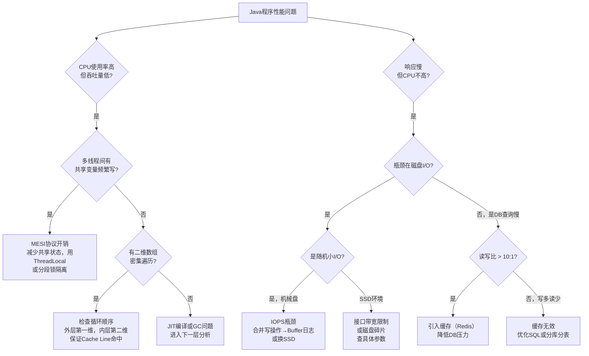

# 《Java特种兵》前两章 · 五步建模 · v2.1

> 使用框架：shen_reading_v2.1 · 模式A（全量生成）

---

## 读前诊断（Pre-read）

**① 这是什么类型的书？**
→ **工具书 + 概念书混合**。第1章通过代码例子建立"功底判断标准"（工具书），第2章建立计算机工作原理的分析框架（概念书）。叙事外壳（胖哥的比喻故事）是传播载体，不是结构本体。

**② 我想从这两章提取什么？**
→ **一套判断算法**：遇到Java程序出现意外行为（错误结果、性能下降、OOM），能从"底层数据结构"和"硬件特性"两个维度快速定位原因。

---

## Step 0：骨架提取

**主问题**：两章各自的核心实体和关系是什么？

**图类型选择**：
- 第1章 → ER图（"谁和谁有关系，谁依赖谁"）
- 第2章 → 因果回路图（"为什么会这样，什么在驱动系统"）





**完成标志**：第1章在讲"Java对象的内存地址游戏"，第2章在讲"数据离CPU越远越慢"。

---

## Step 1：概念速览

### 第1章概念

- **`==` vs `equals`**：`==`比的是内存地址（是不是同一个对象），`equals`比的是值（内容是否相同）。字符串用`==`经常出错，因为两个值相同的字符串可能是内存里两个不同的对象。

- **常量池（String Pool）**：JVM维护的一块特殊内存，用来复用相同的字符串。字面量`"abc"`会自动进常量池；`new String("abc")`不会，它在堆上另开一块空间。`intern()`方法可以强制把一个字符串注册到常量池并返回常量池里的引用。

- **编译时优化（常量折叠）**：编译器在编译阶段如果能确定表达式的值（比如`"a" + "b"` 或 `final String a = "x"; a + "y"`），就直接把结果算好写进去，不等运行时再算。效果是：这类拼接结果直接在常量池，和字面量`"ab"`是同一个对象。→ **进Step 2**（边界：哪些情况能触发，哪些不能）

- **hashCode 与 equals**：`hashCode`把对象压缩成一个数字，用于HashMap/HashSet快速定位"桶"；`equals`做精确比较。两个必须同步：如果你重写了`equals`但没重写`hashCode`，HashMap会找不到你的对象，因为它先用`hashCode`定位桶，再用`equals`确认。

- **StringBuilder 扩容机制**：`StringBuilder`内部是一个`char[]`数组，初始长度16。每次`append`超出容量时，按`max(当前长度×2, 当前count+新增长度)`扩容。扩容时旧数组暂时不能释放，所以峰值内存是新旧数组之和。→ **进Step 2**（边界：循环里用`String +`为什么会OOM，而单个`StringBuilder`不会）

- **IntegerCache（-128~127缓存）**：`Integer.valueOf(n)`在`n`属于[-128, 127]时直接从缓存数组里返回同一个对象，不新建；超出范围才`new Integer(n)`。所以`Integer a=100; Integer b=100; a==b`是`true`，换成200就是`false`。→ **进Step 2**（边界：127 vs 128，以及方法参数传递时的隐式装拆箱）

- **JVM栈 vs 堆**：方法的局部变量（基本类型的值 + 对象引用的地址）在栈上，实际对象在堆上。栈空间由OS管理，方法结束自动释放；堆由JVM的GC管理。

### 第2章概念

- **CPU缓存层级（L1/L2/L3）**：CPU离内存太远（50ns+），所以CPU旁边放了几层越来越大但越来越慢的缓存（L1最快2-3ns，L3最慢20-30ns）。程序跑得快不快，关键看数据能不能留在L1/L2里。

- **Cache Line（64字节连续加载）**：CPU每次从内存取数据，不是只取你要的那一个，而是把相邻的64字节一整块取回来。所以访问连续内存比跳跃访问快很多——前者只需要加载一次，后者每次都要重新去内存取。→ **进Step 2**（边界：Java二维数组按哪个方向遍历更快）

- **MESI缓存一致性协议**：多核CPU时，同一块数据可能被多个CPU各自缓存了一份。MESI协议规定：任何一个CPU修改了这块数据，要通过总线广播通知其他CPU"你们的拷贝失效了"。这个通知有20-40ns的开销。频繁修改共享变量会导致CPU一直在处理这些通知，看起来很忙但没干多少活。→ **进Step 2**（边界：什么情况下会触发MESI的性能问题）

- **虚拟内存/页表**：OS给每个进程分配的是"虚拟地址"而不是实际物理内存。进程看到的内存是连续的，但物理内存里是分散的，靠页表做映射。JVM的`-Xmx`设的是虚拟地址大小（可以超过物理内存），`-Xms`是立即占用的物理内存。

- **IOPS / 机械盘 vs SSD**：机械盘每秒能做60-120次随机读写（IOPS），每次有5-6ms的寻道+旋转延迟；SSD的IOPS是机械盘的100倍以上，延迟到微秒级。内存的延迟是ns级，比机械盘快100万倍以上。

- **缓存（相对性）**：缓存不是一个特定技术，而是一个"就近原则"——把数据放到离使用者更近的地方。CPU L1是缓存，Redis是缓存，浏览器本地存储也是缓存，逻辑相同。适用场景：读多写少 + 允许轻微的数据不一致。

---

## Step 2：实例裁判循环（模式A）

### 【编译时优化：哪些情况能触发】

**正例：**
```java
final String prefix = "hello_";
String key = prefix + "world";
String expected = "hello_world";
System.out.println(key == expected); // true
```
→ **属于编译时优化**。`prefix`是`final`局部变量，编译器在编译阶段能确定其值不可变，所以`prefix + "world"`直接被编译为字面量`"hello_world"`，和`expected`指向常量池同一地址。

**边界例：**
```java
String prefix = "hello_";       // 没有 final
String key = prefix + "world";
String expected = "hello_world";
System.out.println(key == expected); // false
```
→ **不属于编译时优化**。虽然`prefix`在这段代码里确实不会变，但没有`final`约束，编译器无法保证运行时这个引用不被修改（字节码增强技术可以在运行时切入改变它），所以不优化，运行时创建`new StringBuilder().append(prefix).append("world").toString()`，结果在堆上是新对象。**边界精确在`final`关键字的有无**。

**反例伪装：**
```java
private static final String getPrefix() { return "hello_"; }
String key = getPrefix() + "world";
String expected = "hello_world";
System.out.println(key == expected); // false
```
→ **不属于编译时优化**，尽管方法是`static final`的。**看起来像**，因为方法是`final`的，但编译器不会递归展开方法体（方法可能有多个返回路径，甚至被字节码增强拦截），方法返回值在编译期无法确定，所以不触发优化。

**边界定义（一句话）**：编译时优化只触发于**值在编译阶段100%确定的表达式**：字面量常量 + `final`局部变量；方法返回值无论如何声明都不触发。

---

### 【StringBuilder扩容：循环String+为什么比单个StringBuilder危险】

**正例（高危场景）：**
```java
String log = "";
for (int i = 0; i < 1_000_000; i++) {
    log += "line" + i + "\n"; // 每次循环隐式 new StringBuilder
}
```
→ **属于高OOM风险**。每次`+=`都创建新的`StringBuilder`，当`log`增长到Old区1/4大小时，这一次`+=`需要：新`StringBuilder`的初始空间 + `append(log)`时发现空间不够触发扩容 + `toString()`新建一个同等大小的`String`，三者加起来超过Old区容量，**必然OOM**。

**边界例：**
```java
StringBuilder sb = new StringBuilder();
for (int i = 0; i < 1_000_000; i++) {
    sb.append("line").append(i).append("\n");
}
String result = sb.toString();
```
→ **不属于高OOM风险**。整个循环只有一个`StringBuilder`对象，扩容是2倍增长且扩容后保留一半空闲空间，不会每次循环都触发扩容。最坏情况是`sb`接近Old区1/3时扩容触发OOM，但这是一次性事件，不是每次循环都发生的必然结果。

**反例伪装：**
```java
String a = "prefix_" + "middle_" + "suffix"; // 三个字面量拼接
```
→ **完全不属于性能问题**，尽管看起来用了`+`。三个全是字面量，编译器在编译阶段直接合并为`"prefix_middle_suffix"`，运行时连`StringBuilder`都不创建。

**边界定义（一句话）**：危险的是**在循环体内每次都隐式新建`StringBuilder`（即`String +=`变量）**，危险不在于`+`操作本身；单个`StringBuilder`在循环外创建则安全。

---

### 【Cache Line：Java二维数组按哪个方向遍历更快】

**正例（Cache友好）：**
```java
int[][] matrix = new int[1000][1000];
long sum = 0;
for (int i = 0; i < 1000; i++) {
    for (int j = 0; j < 1000; j++) {
        sum += matrix[i][j]; // 外层i，内层j
    }
}
```
→ **属于Cache友好访问**。`matrix[i]`是一个`int[]`数组，`matrix[i][0]`到`matrix[i][999]`在内存中连续。访问`matrix[i][0]`时，CPU把`matrix[i][0..15]`（64字节）全部加载进Cache，后面15次访问直接命中Cache，不再回内存。

**边界例：**
```java
for (int j = 0; j < 1000; j++) {
    for (int i = 0; i < 1000; i++) {
        sum += matrix[i][j]; // 外层j，内层i —— 跳跃访问
    }
}
```
→ **不属于Cache友好访问**。`matrix[0][j]`和`matrix[1][j]`是两个不同数组，在内存中不连续（两个数组头部之间还有对象头和其他数据）。每次`i`递增时就是一次Cache Miss，需要重新从内存加载64字节，但其中只用了4字节（一个int），Cache利用率极低。**循环顺序错了就会触发这个问题**。

**反例伪装：**
```java
int[] flat = new int[1_000_000]; // 展开的"一维"模拟二维
for (int i = 0; i < 1000; i++) {
    for (int j = 0; j < 1000; j++) {
        sum += flat[i * 1000 + j];
    }
}
```
→ **完全是Cache友好的**，虽然用的是手动计算下标的"模拟二维数组"。`flat`是真正的一维连续数组，所有元素在内存中完全连续，比Java的二维数组（"数组的数组"）更Cache友好，没有任何子数组头部的碎片化。

**边界定义（一句话）**：判断Cache是否友好，看的是**内层循环访问的内存是否连续**；Java二维数组的第二维是连续的，第一维之间不连续，所以外层循环第一维 + 内层循环第二维才是正确姿势。

---

## Step 3：结构可视化

**第1章：Java对象内存行为完整图**



**第2章：硬件层→Java性能因果传导图**



---

## Step 4：可执行模型

### 【第1章】Java意外行为定位 flowchart



**失效边界：**
- JDK版本影响：JDK7以后String pool从PermGen移到堆，`intern()`行为有细微差异
- `IntegerCache`上界可通过`-XX:AutoBoxCacheMax`参数调大

---

### 【第2章】Java性能问题按硬件层定位 flowchart



**延迟量级速查（判断时用）：**
| 层次 | 延迟 | 比值 |
|---|---|---|
| L1 Cache | 2-3ns | 基准 |
| 内存 | 50ns+ | 约20倍 |
| SSD | 微秒级 | 约500倍 |
| 机械盘 | 5-6ms | 约100万倍 |

**失效边界：**
- 数据量极小（几十万条，每天几千次访问）→ 所有层次的优化都没必要，先排查代码逻辑
- SSD已普及的环境下，很多针对机械盘IOPS的优化策略已经过时

---

## Step 5：接入已有体系

**【同构】**
这两章的结构与**软件架构中的"多级缓存设计"**完全同构：

| Java/硬件层 | 软件架构层 | 同构关系 |
|---|---|---|
| CPU三级缓存 | 本地缓存→Redis→MySQL | 离使用者越近越快，越近容量越小 |
| Cache Line 64字节批量加载 | 批量接口设计（一次查N条） | 一次搬运比N次搬运效率高 |
| MESI协议开销 | 分布式锁的协调成本 | 协调本身比干活更贵 |
| 机械盘随机I/O→顺序I/O合并 | 消息队列批量消费 | 化零为整降低寻址次数 |

可互借案例：Redis为什么比MySQL快？→ 不是因为Redis聪明，是因为数据在内存（50ns）而不在磁盘（5ms），和CPU Cache比内存快是同一个道理。

**【互补】**
这两章填补了"Java代码行为的底层解释"这个空缺：
- 之前知道"==不能比较对象值"，现在有了根因：== 比的是栈上的引用地址，两个"相同的值"可以是堆上两个不同的对象
- 之前知道"SSD比机械盘快"，现在有了量级感：IOPS差100倍，延迟差1000倍以上
- 新增连接点：第5章的`volatile`关键字 → 底层就是绕过CPU Cache直接操作内存，是MESI协议在Java层的暴露开关

**【矛盾】**
书中暗示`StringBuilder`一定比`String +`快 → **有条件**：

| 场景 | 谁快 | 原因 |
|---|---|---|
| 循环内大量拼接变量 | StringBuilder | 只有一个对象，扩容次数少 |
| 全常量/final变量拼接 | String + | 编译期合并，根本不创建StringBuilder |
| 少量（3-5个）变量拼接，不在循环内 | 差别不大 | 两者开销在同一量级 |

**解决**：判断标准是"是否在循环内 + 是否有非final变量参与"，不是"String+永远慢"。

---

## 一句话总结

> Java程序里的**意外行为**（`==`判断错、缓存陷阱）根源是"值相同但地址不同"，**性能问题**根源是"操作的数据层级太远"——这两类问题都可以用一张图解释：对象在内存哪里、数据到CPU有多远。

---

## 建模完成自检

- ✅ 不看原文，只看图，能复原两章核心逻辑
- ✅ 给一个新情境能用flowchart得出结论（如：`Integer a = 300; Integer b = 300; a==b` → 超出[-128,127] → false）
- ✅ 所有关键概念边界已清晰（编译时优化触发条件、StringBuilder循环陷阱、Cache Line遍历方向）
- ✅ 新模型已接入已有体系（多级缓存架构、批量操作设计）
- ✅ 一句话总结包含因果关系，不是目录
